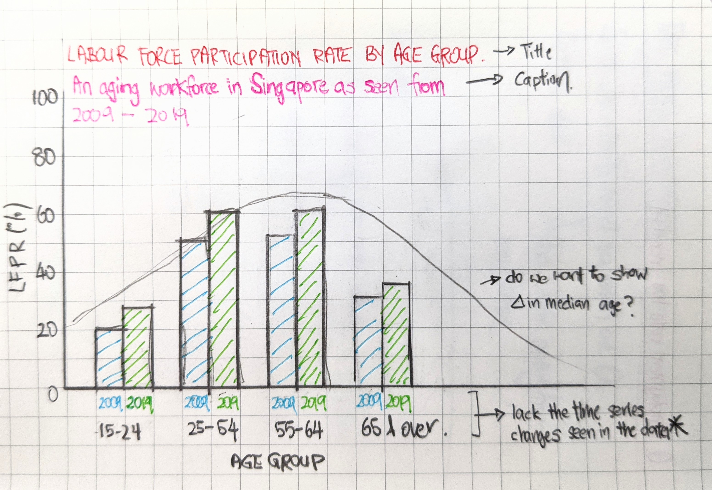

```{r setup, include=FALSE}
knitr::opts_chunk$set(echo = FALSE)
```
# Overview

The [Labour Force in Singapore 2019](https://stats.mom.gov.sg/Pages/Labour-Force-In-Singapore-2019.aspx) is an annual report on Singapore’s labour market produced by the Manpower Research and Statistics Department. As part of the assignment, we will attempt to _'makeover'_ a chart depicting the resident labour force by age. The following sections of this makeover attempt can be found below:   

- #1 Assessment of visualisation based on clarity and aesthetics 
- #2 Sketch of alternate design
- #3 Proposed visualisation in Tableau 
- #4 Step-by-step guide 
- #5 Insights from the visualisation  


# #1 Asessment of visualisation based on clarity and aesthetics


_"With population ageing and sustained rise in LFPR of older residents, the share of residents aged 55 & over in the labour force rose substantially from 16% in 2009 to 25% in 2019. Meanwhile, the share of resident labour force aged 25 to 54 declined from 75% to 67% even as their LFPR increased, as the population cohorts moving into these age bands were smaller than those who moved out due to lower birth rates. As a result the median age of residents in the labour force rose from 41 years in 2009 to 44 years in 2019."_

Without the context of the primary communication intent of the above chart, it is difficult to provide an assessment of how it can be improved. As such,the critique below will be based solely on the rubrics of _clarity_ and _aesthetics_. 

## 1.1 Clarity 

### 1.1.1 Annotations do not match the data presented in the table 
•	The selected age bands grouped in the annotations are not shown in the visual data - it is hence difficult to match the description with the visual. (e.g. 16% in 2009 = 8+4.6+1.8+1.2 = 15.6) and (25% in 2019 = 2019 10.2+7.3+4.5+2.7=24.7).

•	The current data or visualisation does not show the LFPR increase for the resident labour force aged 25 to 54 described in the annotation. 

### 1.1.2 Which dataset is the visualisation referring to? 
•	The annotations describe Labour Force Participation rate - however the data in the visualisation demonstrates data relating to resident labour force. This makes it difficult to follow the description.

•	As the data only shows proportion of the labour force, it is not possible to determine the total volume of the labor force - to see if it has grown or shrunk from 2009 to 2019.

### 1.1.3 The main objective of the visualisation is not clear
•	If the main aim is to demonstrate a) aging labor force, and b) increase in LBFR for 55 and over, the current chart does not show the movement across the decade. 

•	May be able to do bracketing to show the movement within the age groups.

## 1.2 Aesthetics 

### 1.2.1 Labelling of Figure titles and captions 
•	The chart adopts a 538 style of visuals, with the the chart's Title and Subtitle nested in the top left corner of the visualisation. While it is a trendy style to imitate, it is not executed well here as it the caption 'per cent' describes neither the title nor the graphic. 

•	Instead, the subtitle 'per cent' could be moved closer to the table, so as to more clearly indicate that the data in the table are percentages. 

•	The caption could then be changed to indicate that the graphic is intended to present the key point in the annotation - which is the shift in labour force demographic from 2009 to 2019.

•	The median of the graphic uses a continuous representation whereas the x axis is based on a categorical variable. This conflation is technically inaccurate and may make it confusing for the reader.

### 1.2.2 Not ideal for readers with Colour-Vision Deficiencies (CVD)
•	In terms of aesthetics, the colour choice of grey and blue may be difficult to distinguish, especially for those with colour-vision deficiency (deuteranomaly). 

•	It would be more helpful to refer to CVD safe colour scales so as to reach out to a wider group of readers. CVD simulators can be found [online](https://www.color-blindness.com/coblis-color-blindness-simulator/.

•	However, there is a lot of restraint in the terms of the use of colours, and this helps keep clutter to a minimum. This is generally good practice as it allows the reader to easily discern the main points. 

### 1.2.3 Directing focus with highlights 
•	There are two vertical reference lines to show the change in the median age from 41 years old to 44 years old. A visual cue could have been added to show the shift. This can be done in the form of a small arrow.

•	It also does not show the largest changes in each cohort (ie. 15-19 remained the same).

•	At the same time, within each cohort, changes could be made to show whether the cohort witnessed an increase or decrease. 

# #2 Sketch of Alternate Design 



The sketch above highlights the three key proposals for change from the original visualisation: 

•	The first is to improve the layout of titles and labels on the axis. The intent to provide clear text labels while keeping the visualisation clutter-free by reducing duplication or irrelevant information.

•	Secondly, as the main objective is to demonstrate the key shifts from 2009 2019, a decision was made to select LFPR only. 

•	Lastly, we intend to include a time series – since the data is provide by MOM – in order to identify if the shifts in LFPR can be attributed to key events during that decade. 

# #3 Proposed Visualisation in Tableau  

```{r, echo=FALSE, out.width="75%", fig.cap="Data Re-presented.",layout="l-page", fig.width=14, fig.height=10}
knitr::include_graphics("images/week1/final5.png")
```


The [visualisation](https://public.tableau.com/profile/atticusfoo#!/vizhome/Assignment1v1_16117701737610/Dashboard1) was built using Tableau Desktop Professional Edition 2020.40.

The key change made in the data visualisation is to include key events and its possible impact on LFPR. This means utilising a time series instead of just comparing two points of data, 2019 and 2009. Based timeline, it is likely policy changes have directly led to changes in LFPR. 

In addition, a feature that was integrated into the LFPR dataset was the gender demographic as we wanted to examine if policy shifts had an impact on male and female workers in the population. 

Lastly, visual changes were made to ensure consistency and clarity when comparing LBFR. A greyscale was also adopted for the demographic age groups, in order to suggest Singapore’s aging labour force.


# #4 Step-by-step guide 
The following steps will provide a brief overview of how the visualisation was completed.

### Data Preparation 

The data used for the visualisations were taken from the Ministry of Manpower's website - [Resident Labour Force Participation Rate by Age and Sex 2009 - 2019 June](https://stats.mom.gov.sg/iMAS_Tables1/LabourForce/LabourForce_2019/mrsd_2019LabourForce_T5.xlsx).


Steps | Data Preparation
------------- | -------------
Data in excel was imported via Tableau | {width=75%}
Data was examined using Tableau's data viewer. As only certain age groups was needed, these were selected and filtered out for export. | {width=75%}
Data was then exported to Excel and manually adjusted. This is because we intended to use gender as an additional category. As such, data in the other sheets were merged together to form a combined worksheet. | {width=75%}
Lastly, the adjusted Excel document was imported again in Tableau. The data fields was cleaned to ensure that the values were accurately represented | {width=75%}

### Charting Visualisation  

Next, with the data prepared, Tableau's Polaris was used to visualise the worksheet

Steps | Charting Visualisation
------------- | -------------
After adding age group and year to columns and LFPR and it's duplicate to rows, you should get a graph that looks like this | {width=75%}
Right click on the graph and select dual axis to combine both charts. Now syncrhonise and edit the axis | {width=75%}
An important step is to ensure that the axis were fixed - as there are null values inserted to create a separate category (total & gender) | {width=75%}
Add gender to the color filter to adjust the graph's colour palette | {width=75%}
Add annotations to highlight key events in the timeline | {width=75%}
We added a reference line in order to add visual cues to the change in female worker (55 - 64) | {width=75%}
Finally, edit the caption below the X axis to credit source | {width=75%}

# #5 Insights from the visualisation 

```{r, echo=FALSE, out.width="75%", fig.cap="Data Re-presented.",layout="l-page", fig.width=12, fig.height=6}
knitr::include_graphics("images/week1/final5.png")
```

## 5.1 Aging Labour Force in Singapore  
•	There is an observe shift in Singapore’s LFPR, with more elderly workers from the ages of 55 and above remaining active in the population’s labour force. 

•	This shift is most observable in the age groups of 55 – 64 with an increase in 9.3 percentage points from 2009 and 65 and over with an increase in 11.5 percentage points in the same period.

•	This is likely to increase in the next decade, especially with proposed changes to retirement age (raise from 62 to 65 by 2030) and re-employment age (raise from 67 to 70 by 2030) 


## 5.2 Government Policy has an impact on LFPR 
•	Government policy introduced in the last decade has allowed Singapore’s aging population provide more protections to older workers. 

•	This is necessary to protect our aging workforce, by legislating that companies extend their retirement and re-employment age, to ensure that older workers in Singapore can continue to work and support themselves in old age. 

•	As there was intense debate in 2013 regarding Singapore’s Population White Paper, it would be interesting to integrate foreign worker data to understand better how Government measures have protected Singaporean workers – whilst ensuring a viable labour force in Singapore.

## 5.3 Dramatic shifts in gender demographic between 2009 and 2019 
•	Based on the visualisation, the most dramatic changes from 2009 to 2019 is the increase in female workers in the LBFR across three different age groups from 25 years upwards. 

•	This could be attributed to the trend of dual income families from the turn of the century. More recently, these changes could be attributed to changes to improve protections to female workers following the CEDAW report in 2011. Changes to protect working mothers was also introduced together with the Employment Act amendments in 2013. 

•	Of note, is the largest increase in the older female demographic (as high as 15.6 percentage pts), likely due to protections made for older workers guaranteeing their employment past the ages of 62.  


Thank you for reading up to this point! 

_This blog is a data visualisation assignment for the MITB programme at the Singapore Management University._


