```{r setup, include=FALSE}
knitr::opts_chunk$set(echo = TRUE)
```

# **1. Introduction**


Data collected by the Department of Statistics Singapore in the past 10 years (2009-2019) highlight a potential problem in our current society. It is revealed that Singapore’s population has begun to age, due to declining birth rates since 2010 . This correlates to having an aging working population where the labour force consists of a higher proportion of workers in the 50 and over age band as evident in the figure below.

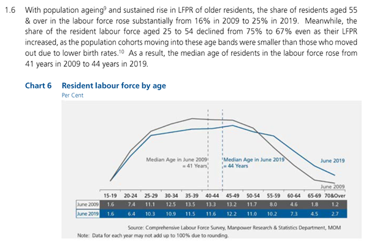

In the context of Singapore, our labour force comprises of people above the age of 15 years old who are working or seeking work (regardless of employment status or citizenship). Using the dataset, Figure 1 was visualised by the Ministry of Manpower (MOM), Manpower Research and Statistics Department.
The purpose of the document explores how a makeover on the exact same dataset would allow for an alternative graphical representation and the advantageousness of said work.

***
# **2. Critque on Clarity and Aesthetics**


Clarity | Aesthetics
------------- | -------------
Data presented does not match storytelling. (16% in 2009 and 25% in 2019 represents a summation of the percentages values for age bands of 55 and above) | Colour scheme is dull and is not impactful to the reader.
No y-axis presented; reader has to refer to table values to determine that the y-axis represents the percentage of labour force. | Horizontal reference lines looks similar to a bar, this may mislead the reader to place emphasis on the age band 40-44.
No annotation for values in table. Reader is unable to tell if they represent absolute values or a percentage.  | No ‘spikes’. A bar chart might be better to visually represent the ‘small’ changes in percentage values.
Age bands mentioned are not visually shown. | 
__Labour Force Participation Rate (LFPR)__ increase not shown visually |
Title depicts the graph as the proportion of labour force by age, thus it is unable to show change in LFPR as stated.|

## **2.1 Proposed Design**

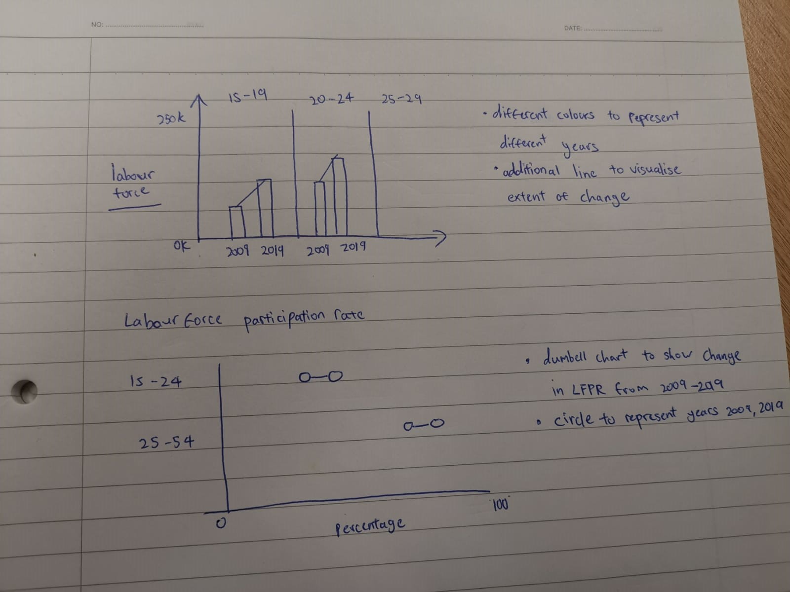

***

# **3. Preparation **

Visualisation for Figure 1 uses derived values from [Table 7: Resident Labour Force Aged Fifteen Years And Over By Age And Sex, 2009 - 2019 (June).](https://stats.mom.gov.sg/iMAS_Tables1/LabourForce/LabourForce_2019/mrsd_2019LabourForce_T7.xlsx)
For the makeover, we are tasked to use [Table 5:Resident Labour Force Participation Rate by Age and Sex 2009 - 2019 (June).](https://stats.mom.gov.sg/iMAS_Tables1/LabourForce/LabourForce_2019/mrsd_2019LabourForce_T5.xlsx)


Steps | Data Preparation
------------- | -------------
Data in excel was cleaned by removing unecessary data rows and formatting issues | 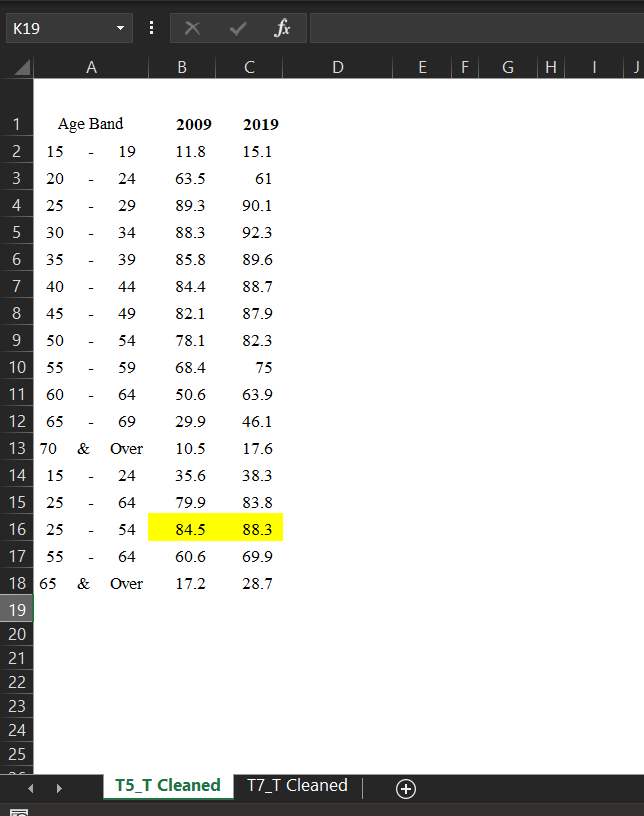{width=75%}
Data was examined using Tableau's data viewer after arranging data in proposed visualisation. This step is repeated twice for both files. Data view was exported to .csv format | 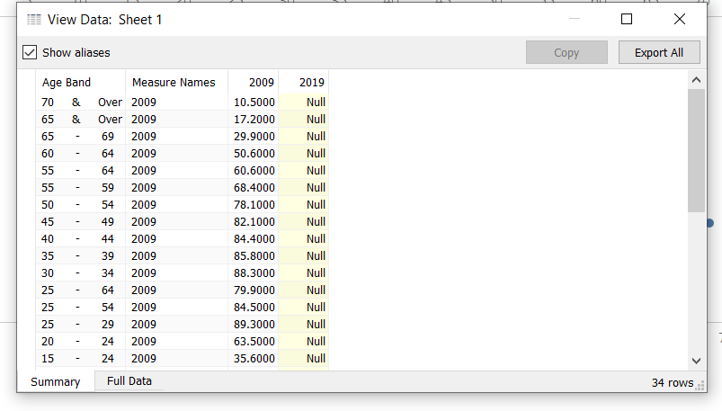{width=75%}
After checking both files, a new excel (final.xlsx) was created containing the pivoted versions of the Labour force and LFPR |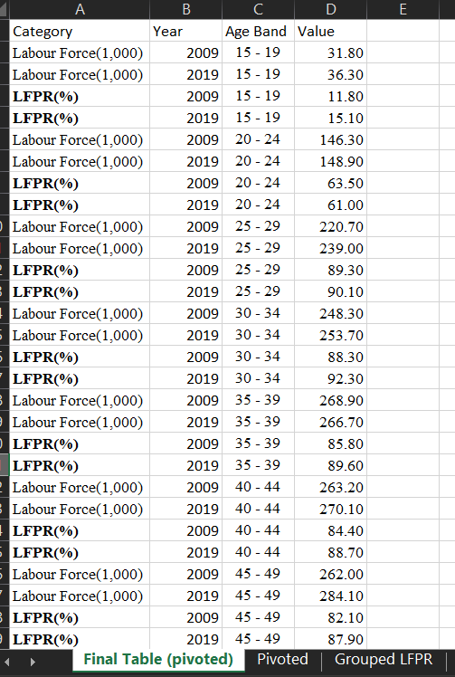{width=75%}


Visualisation Process in Tableau is listed in the following section

Steps | Visualisation
------------- | -------------
Data was imported into Tableau | 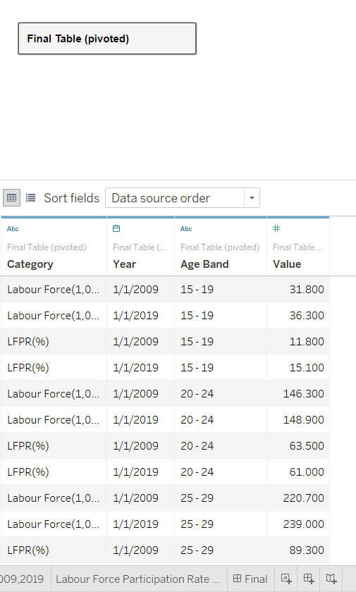{width=75%}
For the first bar chart titled 'Labour Force by Years 2009,2019', Category,Age Band and Year were placed into Columns while sum(value) was placed into rows. Bars were coloured according to Year Values | 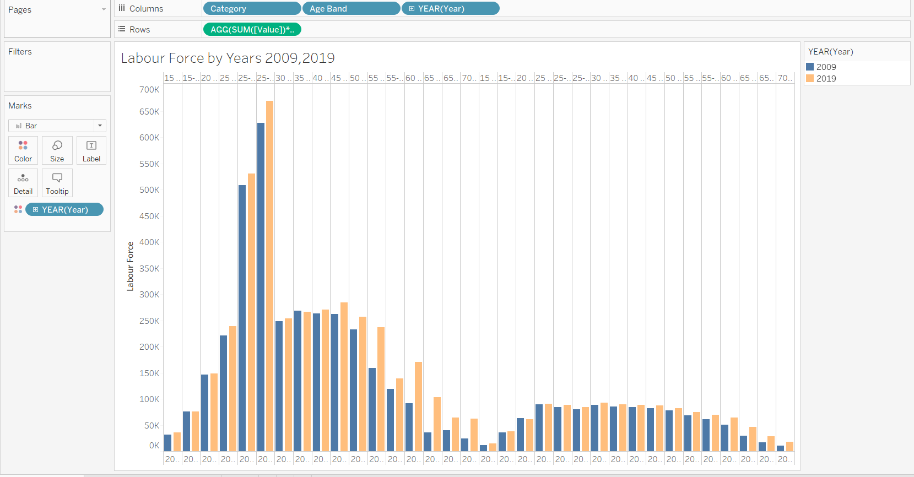{width=75%}
Next, to hide unnecessary data, Category and Age Band was placed into filters to display current visualisation |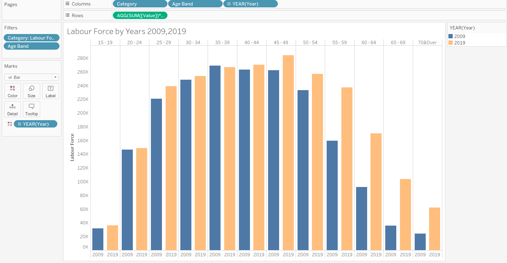{width=75%}
To highlight the change between the 2 years, a line chart was added, this was done by placing sum(value) in Row and creating a dual axis.Plot was coloured by sum(value), to make the line bar a single color, I edit the color values to be a 2-step color band and changed the minimum value to allow the bar to be colored dark red |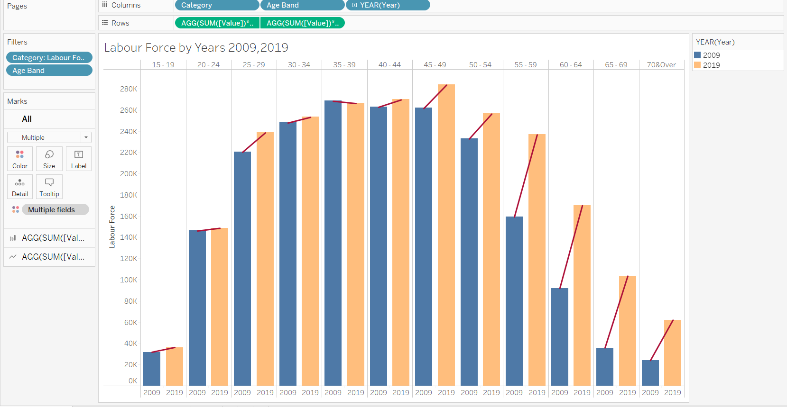{width=75%}
Finally, annotations were added to highlight derived insights. |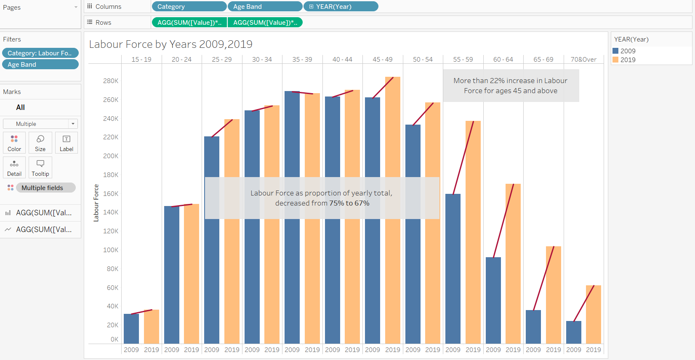{width=75%}
For the dumb bell chart, similar steps was used as above, the main difference is that the circle option was selected for the visualisation.|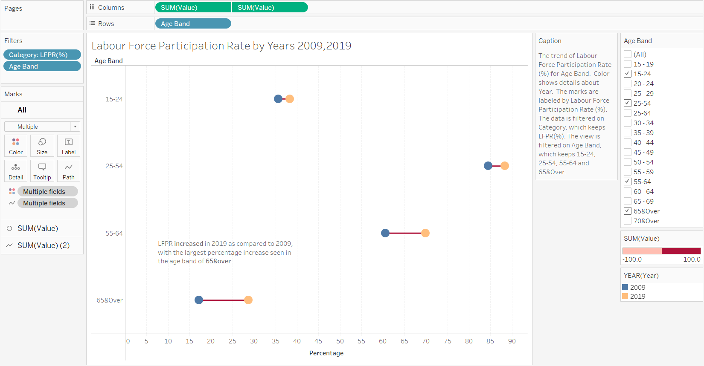{width=75%}


***

# **4. Observations from Makeover Visualisation **

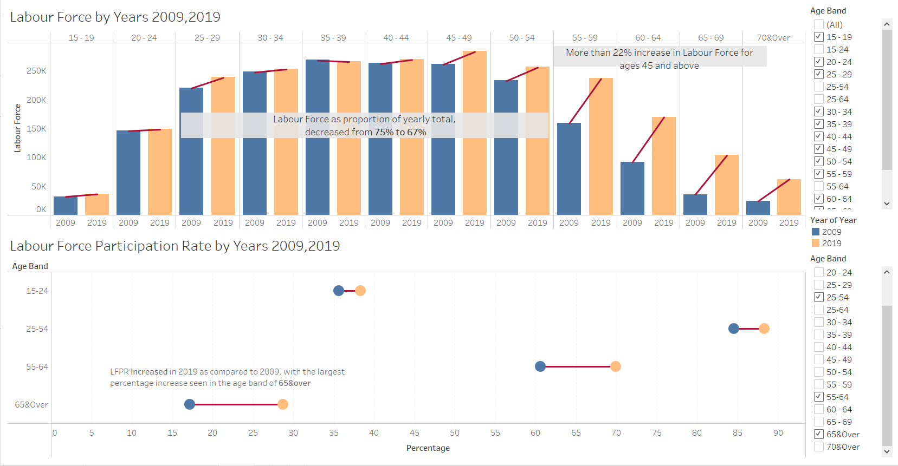

From the makeover done on the visualisation. We can derive clearer insights compared to the original graph.

* From the Labour Force by Years 2009,2019 Plot, there is a >22% increase in labour force aged 45&above when comparing 2019 with 2009. At a glance, this conveys to the audience the presence of an aging population in singapore.

* From the Labour Force Participation Rate by Years 2009,2019 Plot, the largest % increase in labour force participation rate was seen in the residents aged 65&over. This could be attirbuted to the increase of the retirement age from 65 to 67 in 2017 (Source: https://www.mom.gov.sg/employment-practices/retirement)

* Both the 15-24 and 25-54 age bands show lesser increases in LFPR, this signifies that there could be low birth rates within the span of 10 years as the changes are not as significant compared to older workers