```{r setup, include=FALSE}
knitr::opts_chunk$set(echo = FALSE)
```

Distill is a publication format for scientific and technical writing, native to the web.

Learn more about using Distill at <https://rstudio.github.io/distill>.


---

```{r setup, include=FALSE}
knitr::opts_chunk$set(echo = FALSE)
```

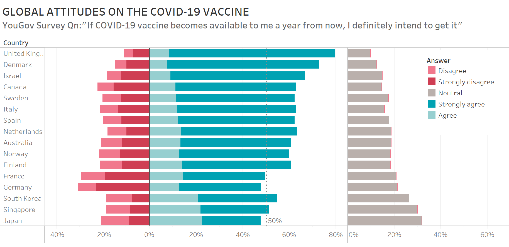

# Overview

As COVID-19 vaccines roll-out across the globe, the actual vaccination rates can vary due to various reasons including political ones. For the purposes of this data-makeover, we will focus on the opinions and attitudes of respondents towards COVID-19 and the vaccination around the world. Data is taken from the Imperial College London YouGov Covid 19 Behaviour Tracker Data Hub [here](https://github.com/YouGov-Data/covid-19-tracker).

This post will attempt to re-present (makeover) the chart found in the next section, applying techniques learned in Professor Kam’s [class](https://wiki.smu.edu.sg/2021t2isss608/DataViz) on visualising uncertainty, as well as Steve Wexler’s extensive thoughts on [presenting ‘neutral’ values](https://www.datarevelations.com/visualizing-survey-data/#scale). The following sections can be found below: 

-	#1 Assessment of visualisation based on clarity and aesthetics
-	#2 Sketch of alternate design
-	#3 Proposed visualisation in Tableau
-	#4 Step-by-step guide
-	#5 Insights from the visualisation

# #1 Asessment of visualisation based on clarity and aesthetics

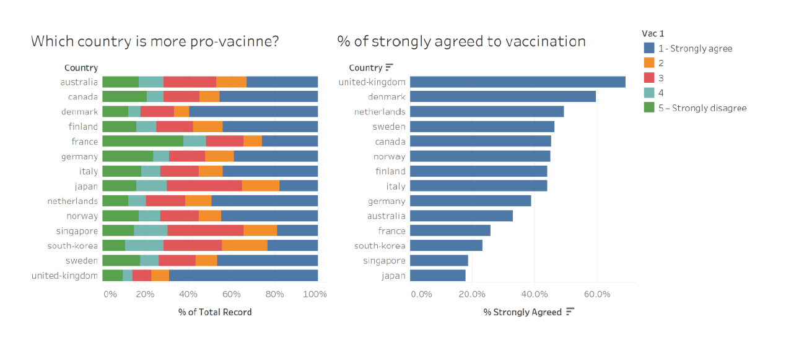

Without the context of the primary communication intent of the above chart, it is difficult to provide an assessment of how it can be improved. As such,the critique below will be based solely on the rubrics of _clarity_ and _aesthetics_. 

## 1.1 Clarity 

### 1.1.1 Titles and legends have not been edited  
•	The current titles are not the most intuitive – as the corresponding charts do not convey the intended message. For instance, the first chart is labelled ‘which country is more pro-vaccine’, but the corresponding chart is a representation of how respondents in respective countries voted on a scale of 1 to 5.  As such, it is not very clear how the first chart conveys the intended message, as the chart on the right would suffice. There is also a small typographical error in the title of the first chart.

•	The subtitles of both charts % of Total Record and % Strongly Agreed, should be edited. 

### 1.1.2 Visualising uncertainty 
•	As data in the charts are represented as percentages, it is not possible to get a sense of the proportion of respondents from each country. As such, readers would assume that the values presented in the charts are equal and consistently reproducible to the same degree. Survey data can be impacted by various factors such as the number of respondents involved (thus affecting Confidence Intervals). 

### 1.1.3 Juxtaposition of different types of bar charts 
•	The use of a 100% stacked bar chart on the left helps readers to easily compare values easily as they have a common baseline in 0% and 100%. However, in terms of clarity, the use of different bar charts (stacked bar chart on the left and horizontal bar chart on the right) may detract as the same value will appear visually different. This is not helped by the different treatment of the X-axis in both charts, with the first chart using 0 to 100% and the second chart ending at 60%. As a result, the value of ‘strongly agree’ on the left would look different from the one on the right even though they are of the same value.  

### 1.1.4 Axis values not sorted 
•	The Y-axis of the chart on the left is sorted alphabetically while the chart on the right is sorted in descending order. As the categories in the y-axis of both charts are the same (countries), they should be sorted for visual clarity and allow readers to more easily reference both charts at once. This can be sorted by volume of those who are more agreeable to vaccination – to reflect the crux of message found in the chart title. 

•	Additionally, as both charts will have the same Y-axis, the country labels on the second chart can be removed to reduce visual clutter. 

## 1.2 Aesthetics

### 1.2.1 Use of colours
•	The choice of colours is good as it is contrasty and is generally able to help readers discern the differences between the discrete categories found in the chart. Further improvements could be made if the choice of colours were more deliberate. For instance, the current selection of red to represent value 3 (neutral) could be replaced with grey, a colour that is more universally accepted as neutral.  

•	This is similar for the selection of green which is generally associated with ‘agree’ or ‘positive’ rather than its current representation which is ‘strongly disagree’.  This is repeated in the choice of orange, which is placed beside red/neutral, but actually reflects ‘agree’.

•	As the categories selected are on a Likert scale, dual colours with variances could have been employed in order to highlight the differences in choices along the scale. 

### 1.2.2 Legends 
•	In terms of placement, the colour legend on the right could be placed nearer to the chart on the left for easier visual reference. It also assumes that readers have prior knowledge as to what the categorical values 2, 3 and 4 mean as they are currently unlabelled. It is also unclear what ‘Vac 1’ means. 

•	In terms of order, the order of the colours for legend could be reversed so that it matches the chart on the left where the colours go from green to blue, instead of the current order which is blue to green. 
### 1.2.3 Gridlines
•	The use of gridlines in the second chart help to negate the use of value labels which would add to clutter and distract from the overall presentation of the chat. This can be improved by using narrow bands for the tick-marks as the current 20% increment is quite wide, making it difficult to visualise accurately. This is not helped by the fact that most of the values fall between 20% to 45%. 

# #2 Sketch of alternate design 

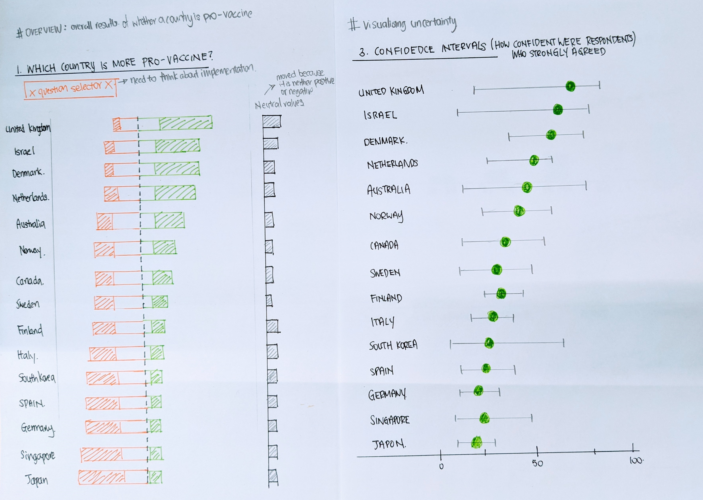

The sketch above shows a diverging bar chart with the neutrals placed to the side. This is because we want to give stronger emphasis to the stronger views by placing them in the center of the chart.


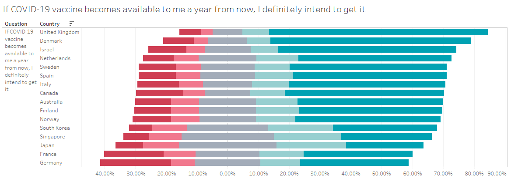
When the neutrals were placed in the center of the chart, it makes it difficult for the reader to compare the strongest values taken from the survey. 


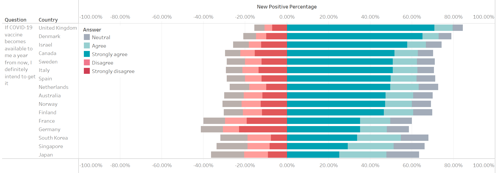

Initially, we wanted to place the neutrals on the outside but this would mean artificially splitting the neutrals. This was not ideal as the neutral value was neither positive nor negative. As such, we would attempt to place the data to the side. 

In terms of colours, we re-arranged the values according to colour temperature as well as contrast. We will also sort the countries (Y-Axis) so that both axis are consistent for easier visual referencing. 
In terms of visualising uncertainty, we want to add a confidence interval, to suggest the range of values that the respondents of the respective country were most likely to select. This would be marked at the 95% interval.

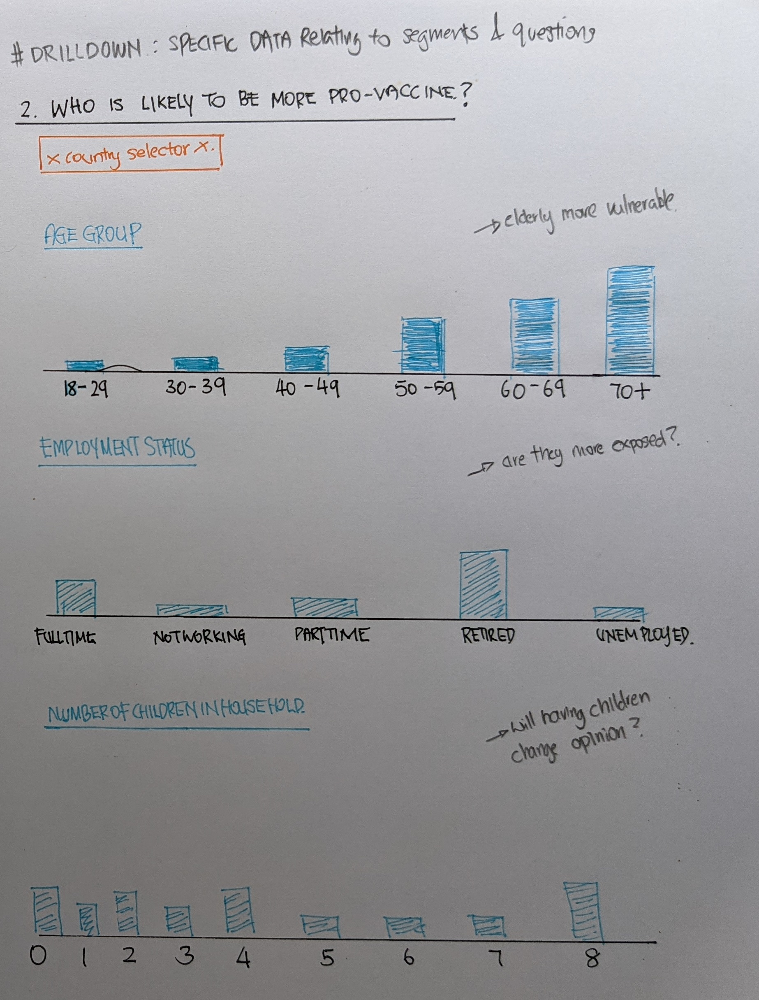

As there is a lot useful demographic data collected by You Gov, we wanted to see if we could apply this to the dashboard in the form of an interactive tool-tip – and to see if any discernible findings could be made. 

# #3 PROPOSED VISUALISATION IN TABLEAU 

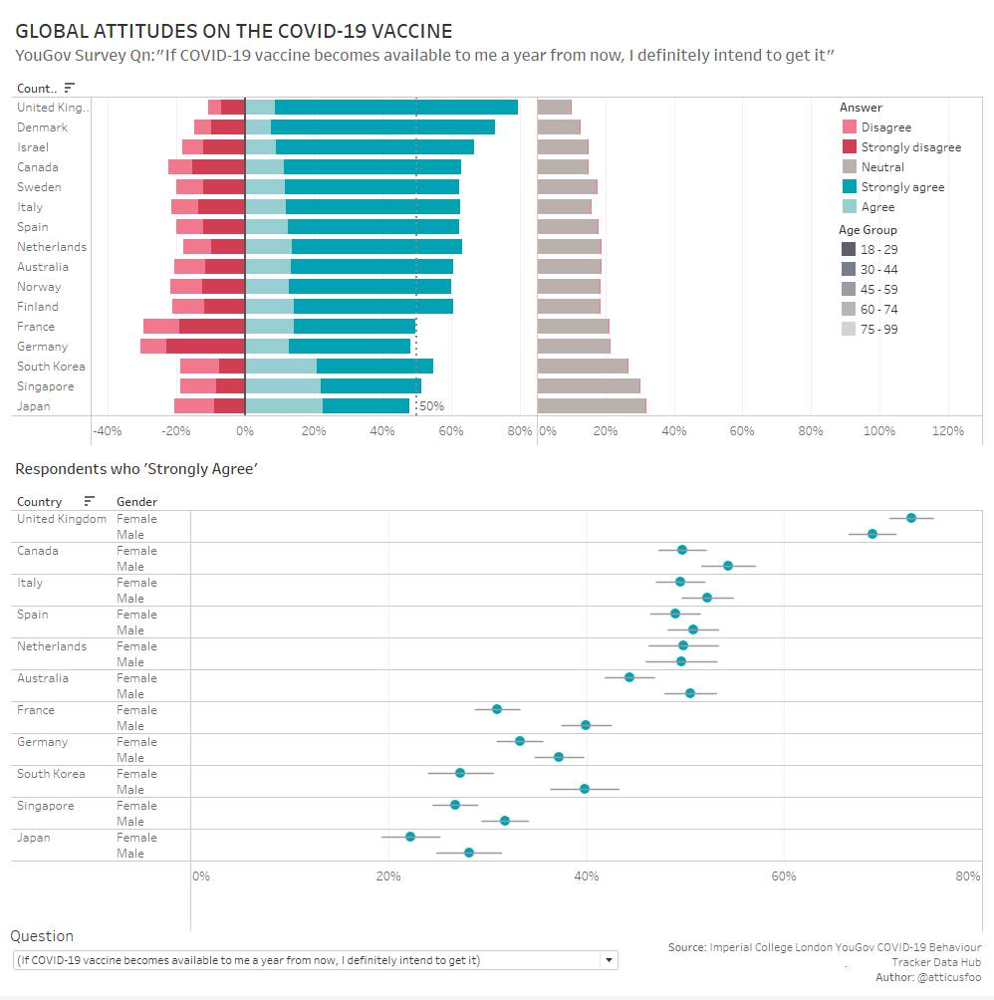

This visualisation was built using Tableau Desktop Professional Edition 2020.40. 

The key changes made in the data visualisation is explained and outlined in the paper sketch above. The Likert Scale used in the YouGov survey has been reproduced in a diverging stacked bar chart with the neutral values at the side.

Instead of a bar chart on the right, we have adopted the line and dot chart in order to present the range of values that more likely to occur for the response ‘Strongly Agree’. More granularity is also added – so as to present differences between male and female responses (if any).

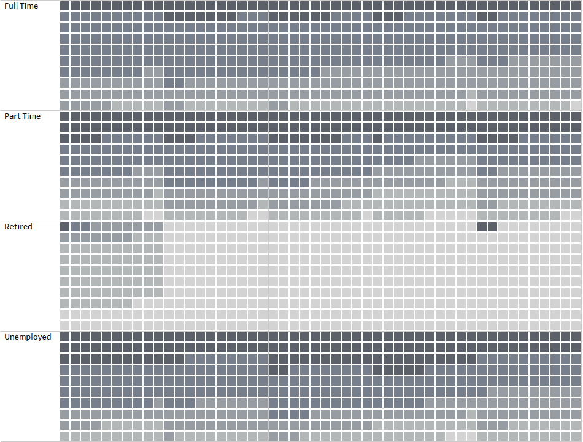

For the tool tip, we experimented with the waffle chart (since it was more space efficient) to visualise demographic data (age groups and employment status). However, this implementation was not ideal and can be improved in further iterations. Finally A series of five questions can be selected with the data applying to both charts at once. 


# #4 Step-by-step guide 
The following steps will provide a brief overview of how the visualisation was completed.

### Data Preparation 
The data used for the visualisations were taken from the Imperial College London YouGov Covid 19 Behaviour Tracker Data Hub [here](https://github.com/YouGov-Data/covid-19-tracker).

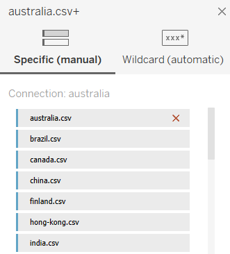

As the data is separated in different countries, the different csv files have to be extracted. Using Tableau’s union function, we be able to join the files together. 

We will need to hide unnecessary fields – such as demographic data or other health related questions. This is because we want to focus specifically on questions related to vaccination. We can do this by clicking “Manage Metadata” and then hiding the selected fields. 

The fields we want to retain are country, age, gender, household size, number of children in household, employment status and questions related to the vaccine (vac2_1, vac2_2, vac2_3, vac2_6 and vac3). 

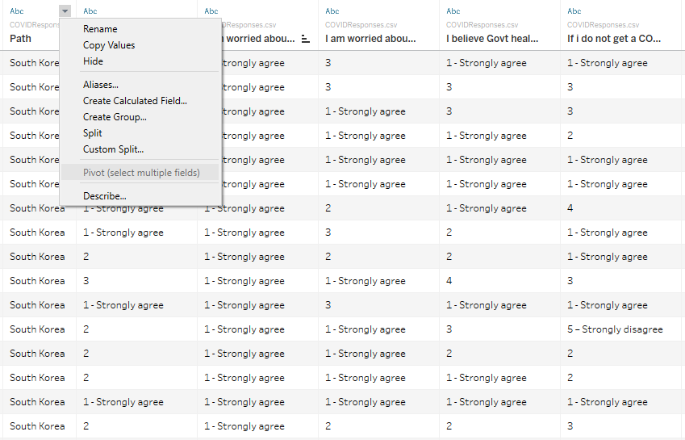

After checking the field names using Tableau’s Data Prep to ensure that they are accurately categorised (e.g. numeric and string), we want to select all the question fields and pivot the values as seen in the photo above.  

Next we want create additional fields for QuestionID as well as Answers and Scores The latter two categories are to create string and integer values for the responses. The screenshots including the codes can be found in the photos below. 

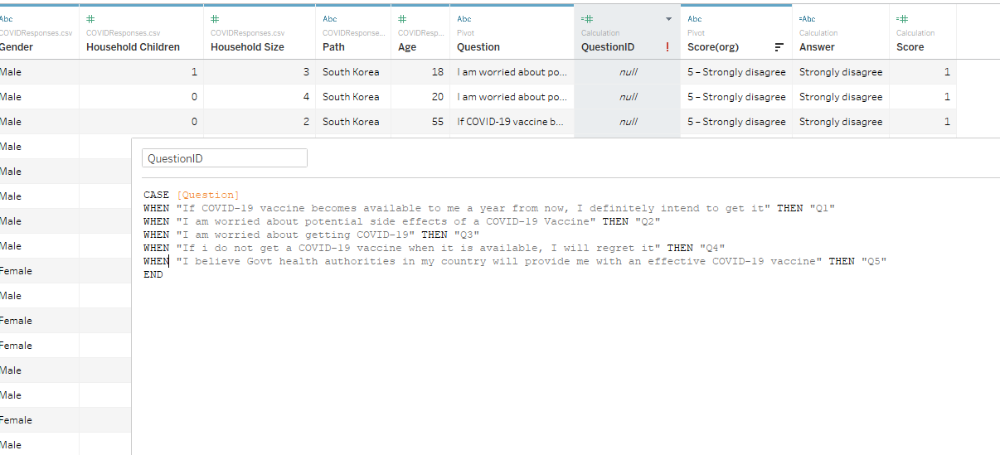
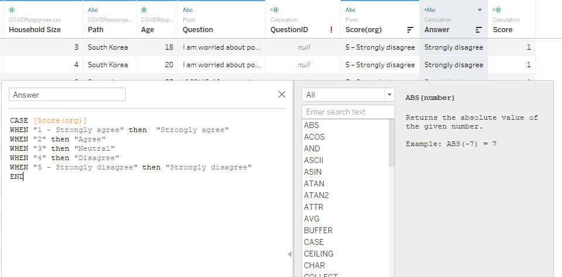
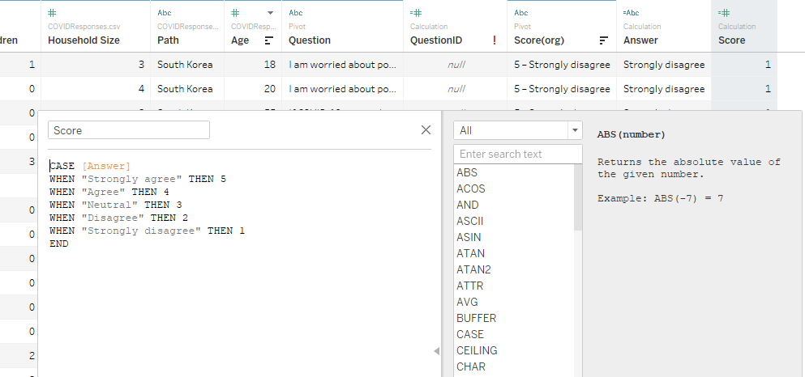


### Plotting the Diverging Bar Chart with Neutrals Aside 
With the data prepared, we can begin plotting the first chart – which is the diverging bar chart. To do this, we will need to prepare the data by sorting the responses (strongly disagree, disagree, neutral, agree, strongly agree) into proportions (percentages). To do this, we will first create a ‘dummy’ field called Number of Records Ref before we can start preparing the calculated fields. 

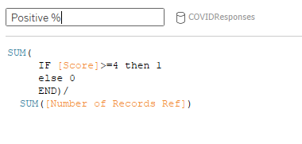

As seen in the photo above, the field [Positive %] is defined as: SUM(IF [Score]>=4 then 1, else 0 END)/ SUM([Number of Records Ref]). This calculates the sum of both agree and strongly agree responses divided by the total number of responses. Repeat this to get the percentage for negative as well as neutral (neutral = 3) responses as seen in the screenshot below. 

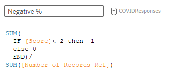

In order to show the 4 levels of sentiment, we will need to need to create another calculated field [POSNEG]. The exclude statement ensures that Tableau doesn’t double count each of the 5 levels of sentiment. 

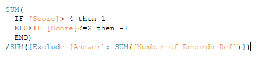

To plot this chart, we will need to place the calculated field [POSNEG] and [Neutral %] into the columns section and [Question] and [Country] into rows as seen in the screenshot below. This will create a dual axis chart that will keep the neutral values separate.

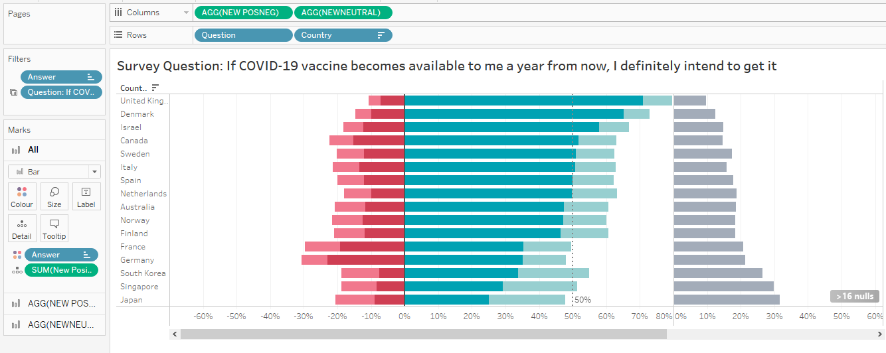

We will need to filter by [Answers] so as to remove all the null values – these are incomplete responses and hence should be removed from the findings as they would affect the percentages. At the same time, we will add [QUESTION] to the filter and select ‘show’. This will allow you to select the difference questions on the right – and the chart will respond dynamically to the selections. You can edit the appearance of the filter by choosing a drop down menu or a multi-select option.


 

In order to sort the countries by descending order to give a better visual representation, right click [Country] and select sort ‘Field’. Choose descending order, the appropriate field name (in your case [Positive %] and aggregation by ‘Average’. 

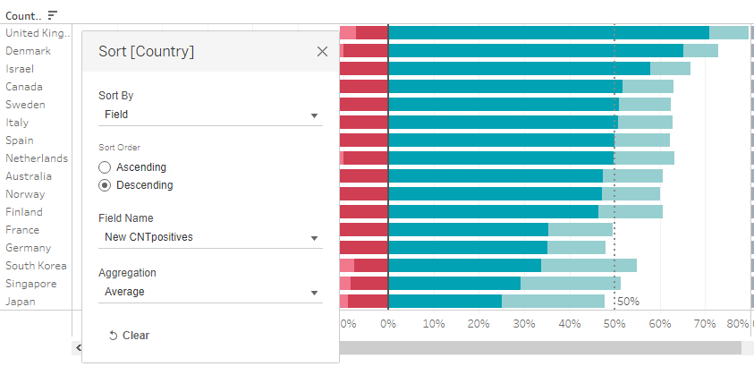

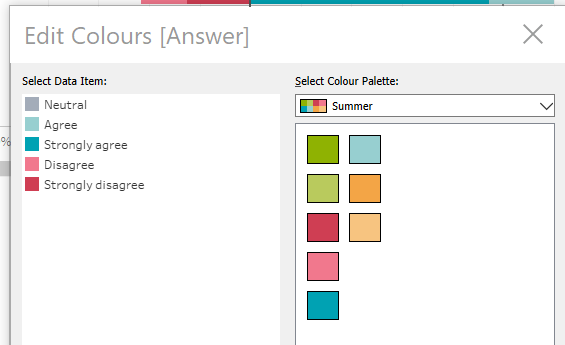

Lastly to complete this chart, we would want to improve the colour scheme by clicking on the ‘Colour’ icon. This will allow you to adjust the colours of the values. We have gone with the colour scheme seen in the screenshot below to give a more association towards similar values and darker colours to represent stronger opinions (agree or disagree). 

### Creating the Error Bar on Dot Plot 

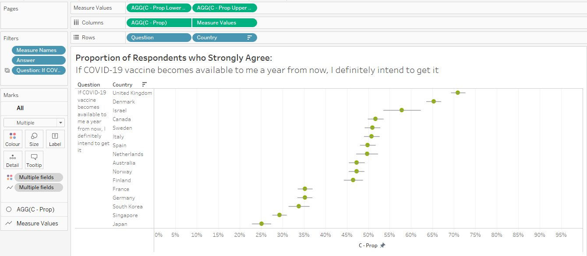

Next to create the error bar on dot plot for ‘Strongly Agree’ responses, we would have to create a few calculated fields in order to identify the lower and upper limit for confidence intervals at 95 and 99%. 
We can first do this by creating calculated fields for Z-scores of 95 and 99  as seen in the screen shot below. 

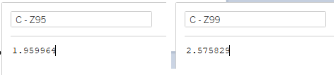

To calculate the proportion of ‘Strongly agree’ responses, we will create a calculate field [C – Strongly Agree] using the formula “IF [Score]=5 THEN 1, ELSE 0”.  

Using this we can identify the percentage proportion by using the next calculated field formulate “SUM([C - Strong Agree ])/SUM({Exclude [Answer]: SUM([Number of Records Ref])})”. Next we can create the [C – Prop_SE], [C-Prop Margin 99] and [C – Prop Margin 95] using the calculated fields seen in the screenshot below to identify lower and upper limit. 

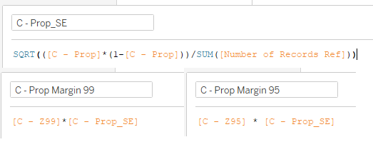

The final 2 calculated fields we want to create for this step is the lower and upper bounds of the 95 confidence interval – so that we can create a line across the bubble plot to demonstrate the interval. We can do this by simply using the codes “[C - Prop] - [C - Prop Margin 95]” and “[C - Prop] + [C - Prop Margin 95]. 

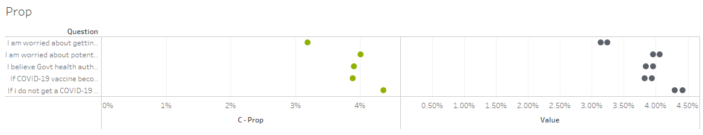

To plot the error bar, we will need to create a dual axis chart. We do this by moving the [C-Prop], [C-upper] and [C-lower] fields create earlier into the columns section and [Question] into rows. 

Similar to the steps for the diverging bar chart, we will want to filter by [Question] and [Answer]. The dual axis chart will look similar to the screenshot above. 

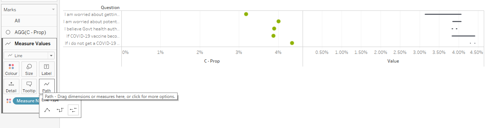

In order to change the lower and upper limits into a line bar, we can click on “Measure Values” and select the line chart option. We will also need to click on “Path” and select the third option for “Line Type” in order to obtain the line bar as seen in the photo above. 

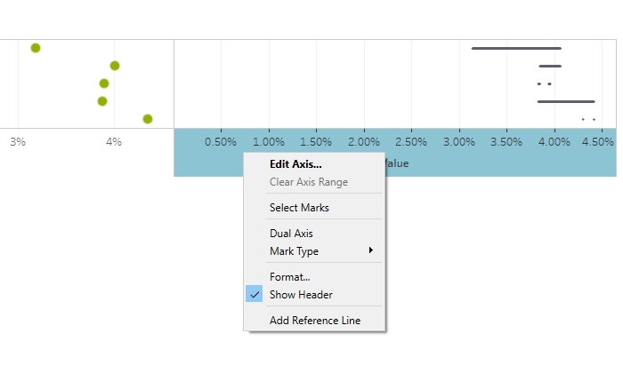

Next, right click on the axis on the second chart and select ‘Dual Axis’ in order to combine both charts. Effectively, these collapses both charts and overlays both the dot plot and line bar on top of each other. 

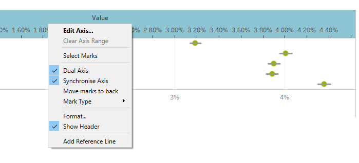

Right click on the same x-axis again and select synchronise axis in order to ensure that the charts are not distorted due to a difference in dimensions on the axis. The error bar on dot plot will not be complete. 

### Creating the Waffle Chart 

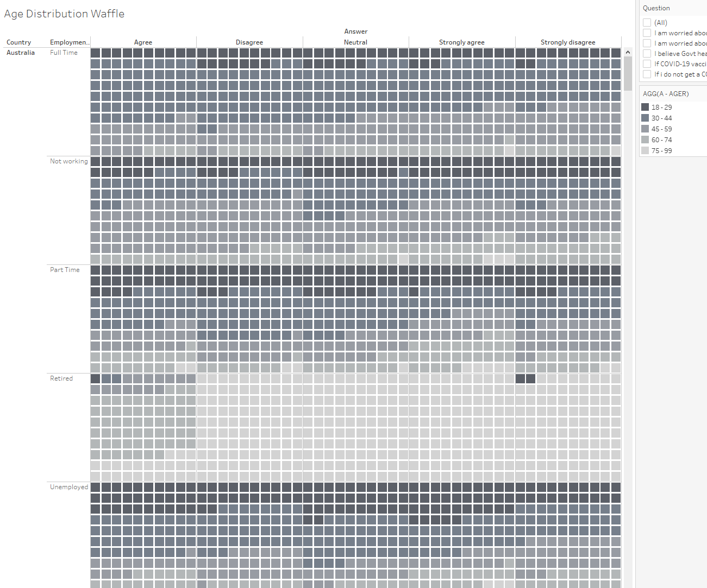

The additional waffle chart created for this visualisation is intended to provided additional demographic data in the tool tip – and serve as an alternative to to the typical bar chart which takes up more space as seen below.  

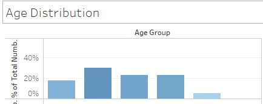

In order to crate the waffle chart, we will first need to create a 10x10 template in an excel file. It should look like the screenshot below. Add this new data source. Once it is added, convert “Column” and “Row” to “Dimension” by right clicking on each.  

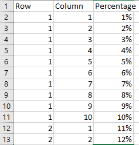

Next we will have to build the skeleton of the waffle chart by dragging the dimensions “Column” to column and “Rows” to rows. Select the “Square” chart in mark type and adjust the size by using the slider and dragging the bottom and right axis to resize. 

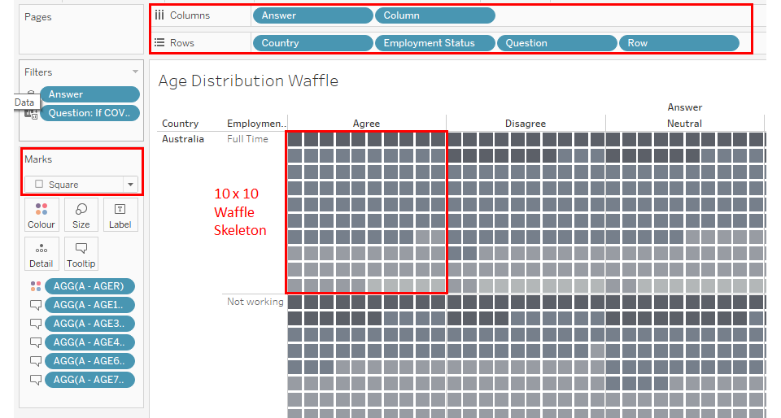

Next we need to prepare calculated fields for all the age groups. To do this we need to bin the different age groups by using the formula in the screenshot below. Repeat this for the other age groups (depending on the range you prefer). 

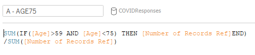

We can now create a calculated field to calculate how much each proportion of the age group [A – AGER] is using the formula in the screen shot below. 

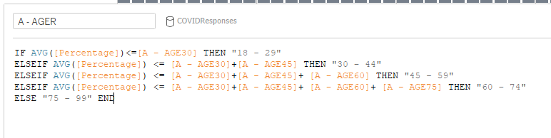

To plot the chart, drag [A – AGER] to “Colour”, “Country”, “Employment Status” and “Question” to Column and “Answer” to Row. Similar to previous steps, use the filter option on “Answer” and “Question” in order to remove null values and reflect the desired data relating to the target question. Edit the colours of the Waffle Chart using the option found in Marks. We have opted to use a greyscale to reflect the different age groups. 

### Creating the Dashboard 

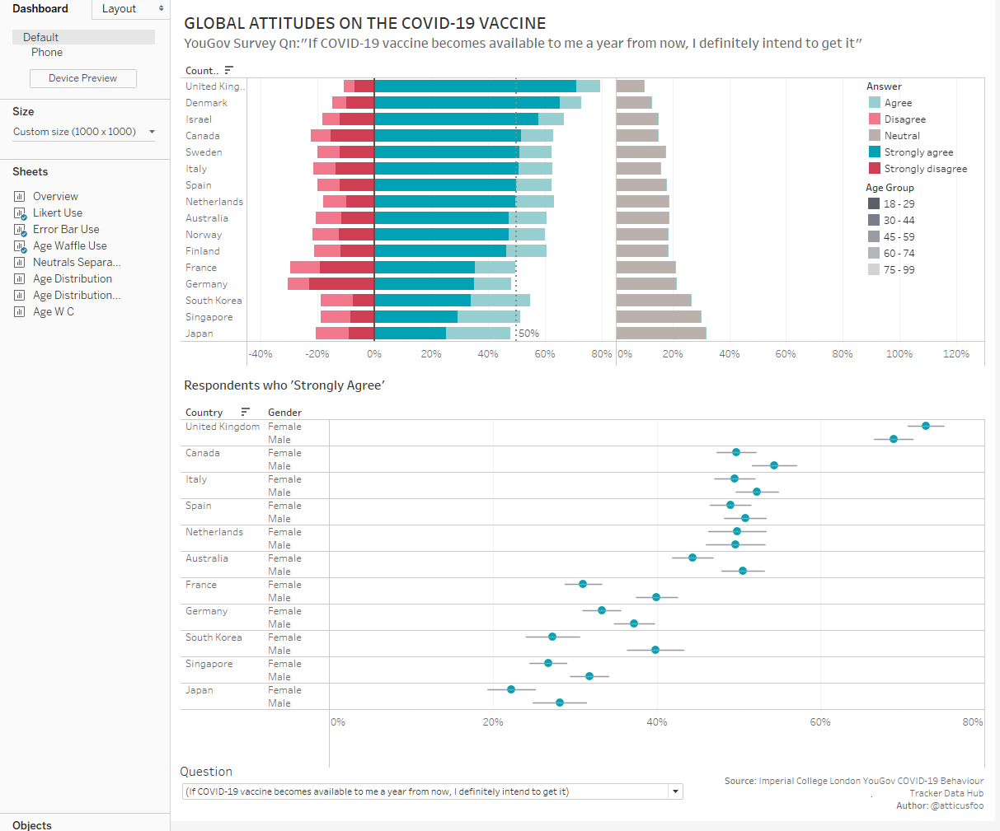

Finally, to plot the dashboard, select “New Dashboard” and set resolution to Custom Size (1000 x 1000). We will be adding three worksheets (Diverging Bar Chart, Error Bar and Waffle) to the dashboard. 

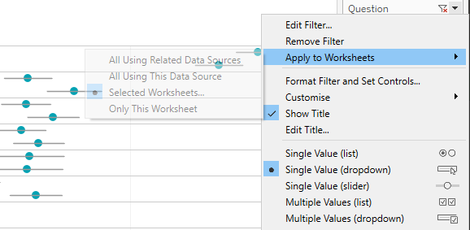

An important step to make is to ensure that all the worksheets are linked so that all charts reflect the data relating to the question selected. This is important because the results used in the second chart is derived from the first. To do this, right click on the filter and apply the data sets to the selected worksheets as seen in the screenshot below.  

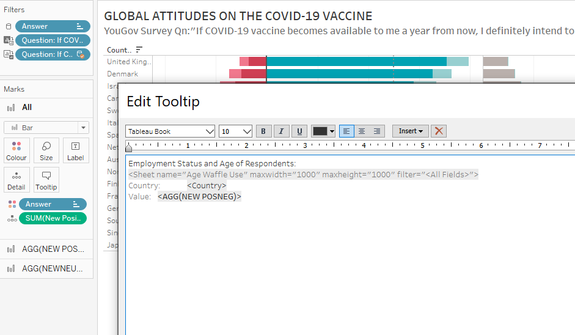

We will also need to add a tooltip in order for the waffled chart to be displayed when the reader hovers over the Diverging Bar Chart. To do this, navigate back to the first worksheet and click on the Tooltip selection in Marks. Insert the worksheet which the Waffle Chart is named in order to create the tooltip. 
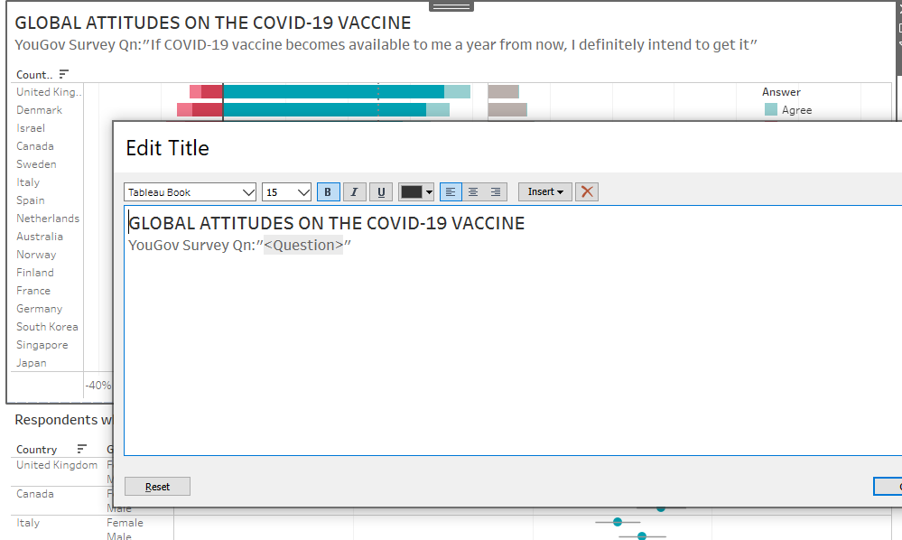

Lastly, layout the charts onto the dashboard as seen the screenshot above. We have chosen put both charts on top of each other instead of side-by-side due to the wider aspect of dual-axis charts. From here, cosmetic changes can be made to the titles and axis titles / legends by double-clicking on them. 


# #5 Analysis 

## 5.1 Asian Countries, South Korea, Singapore and Japan less pro-COVID-19 vaccine? 

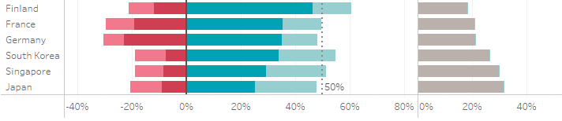

Asian countries like South Korea, Singapore and Japan appeared to be less pro vaccine, with 34, 29 and 25% of their respondents stating that they would strongly agree to taking the vaccine within a year from now, if it becomes available to them. 

While they felt less strongly towards the vaccine, they were also less likely to disagree with the vaccine (Singapore’s 8% strongly disagreeing compared to Germany’s 23%). At the same time, there is a greater proportion of neutral respondents from these countries, suggesting that they could be persuaded if circumstances change or if there was a greater public communications drive to do so.  Comparatively, countries with high number of cases and death rates have greater responses. 


## 5.2 Worried about the potential side-effects of the vaccine. 

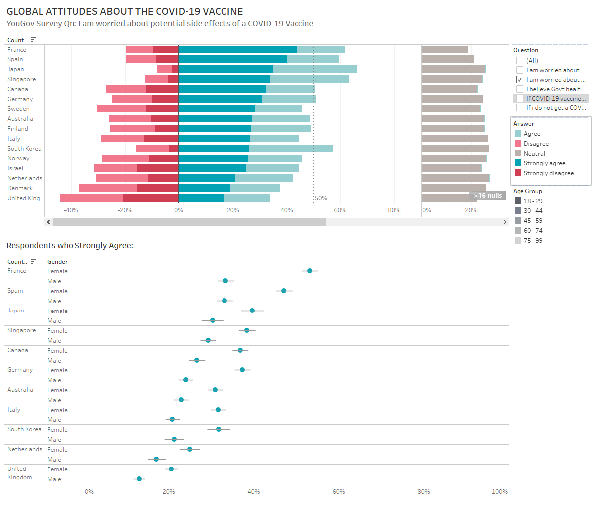

Respondents France, Spain, Japan and Singapore were the top countries in terms of those who were most worried about the potential side effects of the vaccine. 

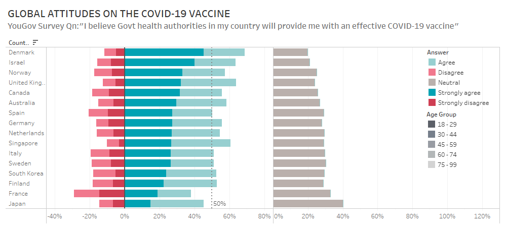

This is interesting as more than 60% of Singaporeans agreed that the Government would provide them with an effective COVID-19 vaccine (with less than 10% disagreeing otherwise).


Additionally, female respondents tended to respond strongly to agree that they were worried about than male respondents the potential side effects of the vaccine. This is tracked at the 95% CI limits as seen in the chart above. 

## 5.3 Older Singaporeand who are unemployed may be at risk 

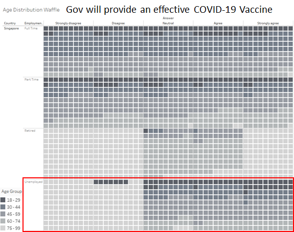

Based on the waffle chart, the proportion of older Singaporeans in Singapore who were unemployed were more likely to strongly disagree that the Government would provide them with an effective COVID-19 vaccine. 

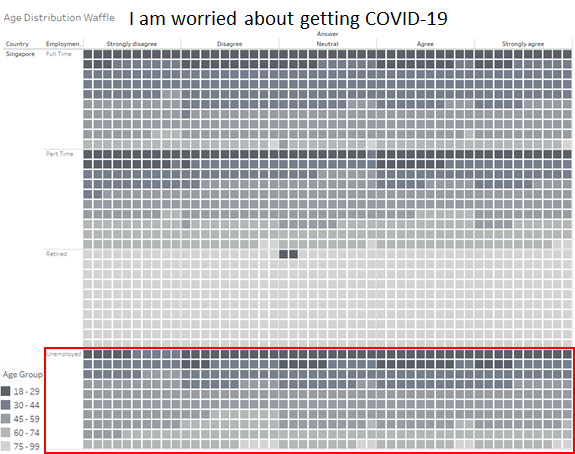

They were also more likely to strongly agree about the side effects of the COVID-19 vaccine and they strongly disagreed with getting vaccinated if it were available to them within a year.  


Conversely the proportion of respondents who were younger Singaporeans who were also unemployed were more worried about getting COVID-19. 


# #References: 
Rethinking the divergent stacked bar chart – placing the stronger views in the [centre](https://www.datarevelations.com/resources/rethinkingdivergent/) 
Tableau Playbook – [Waffle Chart](https://www.pluralsight.com/guides/tableau-playbook-waffle-chart) 


Thank you for reading up to this point! 

_This blog is a data visualisation assignment for the MITB programme at the Singapore Management University._


