```{r setup, include=FALSE}
knitr::opts_chunk$set(echo = TRUE)
```

# **1. Introduction**


In 2020,  British international Internet-based market research and data analytics firm, YouGov partnered with the Institute of Global Health Innovation (IGHI) at Imperial College London to gather insights on people’s behaviours in response to COVID-19. To date,their research has covered 30 countries. From the publicly available data, A research team is currently conducting a study to understand the willingness of the public on Covid-19 vaccination.


Based on the above visualisations, the task is to make a critque on the Clarity and Aesthetics of the charts, providing an alternative visualisation and listing down the steps to ensure repoducibility. 

***
# **2. Critque on Clarity and Aesthetics**


Clarity | Aesthetics
------------- | -------------
No clear distinction that the chart on the right is a subset of the left. Difficult to visualise the number of responses because this will have an impact on the reproducibility of this result in the survey. | Blue Colour used for both charts to might be confusing to the reader.
Y-axis of both charts do not match due to different sort order. This confuses the reader as they are placed side by side. | Color scheme is confusing. Red is mainly used to denote negative performance values, while blue or green is used to denote positive performance values.
Stacked bar chart shows proportion of response within countries well, however since the size of each bar is not properly aligned, it is difficult to compare down the table(between countries).  | Color legend placed next to horizontal bar that is completely blue in color. May mislead people as reader might expect the colors to be visually represented in that graph when it actually denotes the responses in the left chart.
X-axis of both charts are not standardised. Chart on left has no decimal places and ends at 100% while chart on right has axis labels in 1 decimal place and ends at 60.0%, this is misleading to the reader as they may percieve the importance of the message the chart is trying to convey. | Color Legend is not properly labeled, the reader is unable to interpret what the values of 2, 3 and 4 represent.
Lack of labels on left chart to show exact proportion or count of responses, reader would need to infer from the X-axis and the part-to-whole relationship. | Sweden,Canada,Norway,Finland have similar percentage values that responded 'Strongly Agree'. This is hard for the reader to determine the eaxct proportion values as the x-axis interval increases by 20%. A smaller interval and gridline would help to make this information more distinct.


## **2.1 Proposed Design**

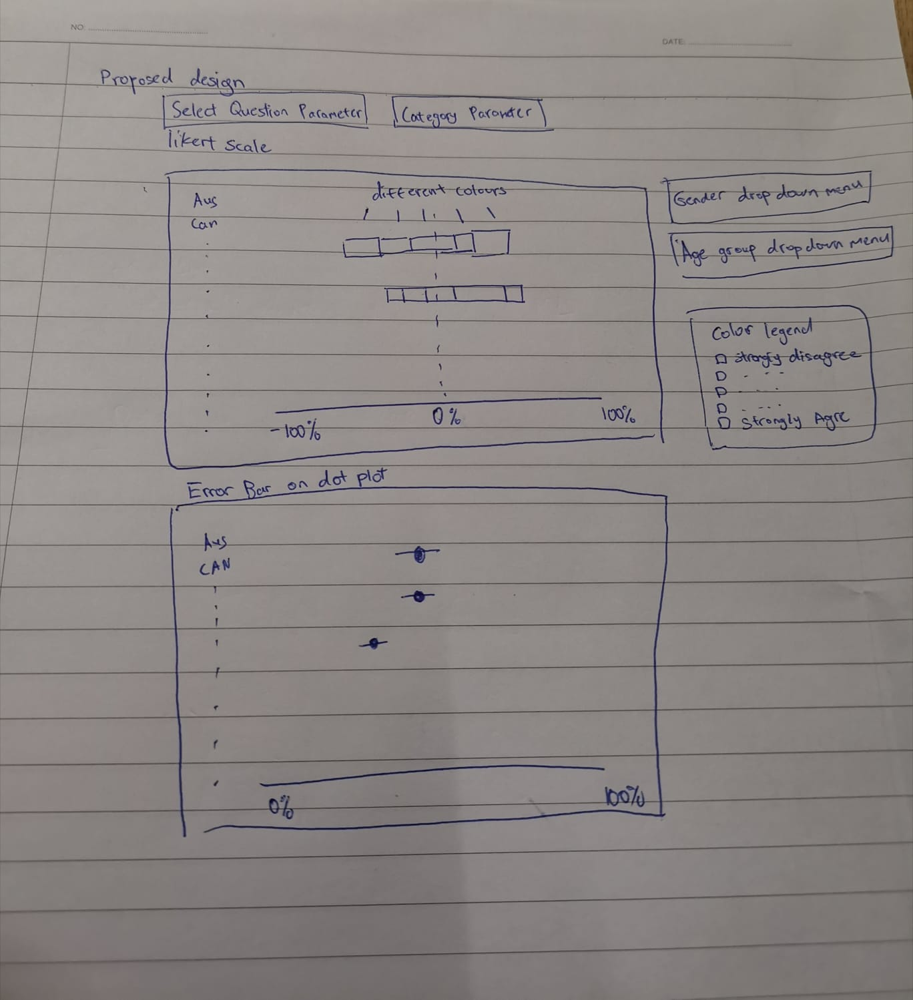

A likert scale chart is used to represent the diverging responses. This more clearly represents the proportions and visual scale of the differing opinions of different countries.

The colour selection: red tones for negative responses, blue tones for positive responses and grey for neutral response.To prevent looking like a 'traffic light' as compared to prior visualisation. With a proper colour legend.

Properly spelled titles to give readers a sense of confidence in the researcher who prepared the presentation.

Parameter added to control the change of category, allowing readers to view data based on specific category.

Filters added, giving the reader a choice on what data he/she would like to exclude for analysis.


# **3. Preparation **
The original source of the data can be found at [Imperial College London YouGov Covid 19 Behaviour Tracker Data Hub](https://github.com/YouGov-Data/covid-19-tracker)


Steps | Data Preparation
------------- | -------------
After downloading covid-19-tracker-master, check if contents of folder tallies with description found on github | {width=75%}
Within data folder contains zipped folders by country. Extract all folders and placed individual csv files into covid-19-tracker-master/data | 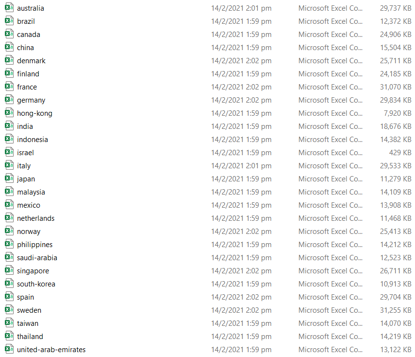{width=75%}
After opening Tableau,drag and drop any of the csv files (I used data from 'Israel' due to its small file size for quicker load times). Create a union with the current data source. Using the union by Wildcard, the 'include' field is left blank. This option creates a union of the current data source with all files located in the same folder|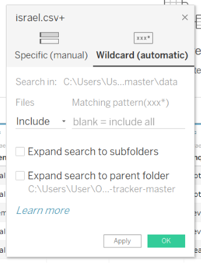{width=75%}
After the union, a column called 'path' is created which is populated by the file name the data originated from.Aliases were created to change the displayed values to its Country name.|{width=75%}
Since not all columns are useful for analysis, click on manage metadata button to display column headers in a list view. Selected columns unnecessary for analysis will be hidden|{width=75%}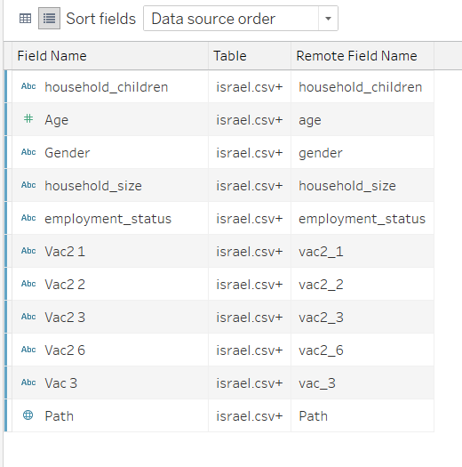{width=75%}
After the above steps, the cleaned dataset was extracted and renamed 'Cleaned' before reconnecting to Tableau|{width=75%}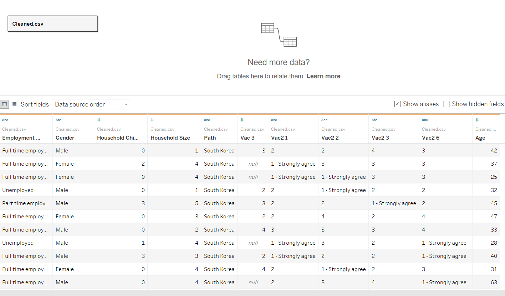{width=75%}
For Columns Vac2_1,Vac2_2,Vac2_3,Vac2_6,Vac 3, their columns were renamed according to the values found in 'codebook.xlsx'|{width=75%}
Because the age bands would be required for visualising the age-sex Pyramid, values were grouped together in bands of 5 years|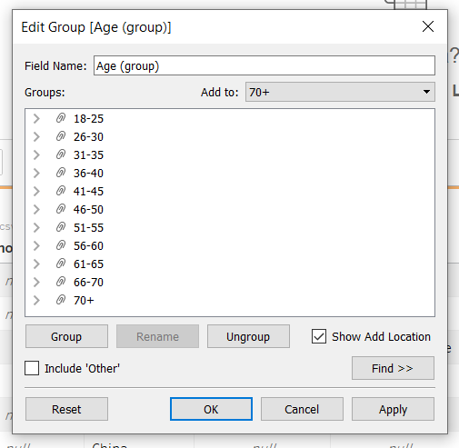{width=75%}
Columns were created by pivoting the selected columns Vac2_1,Vac2_2,Vac2_3,Vac2_6,Vac 3(already renamed) into 'pivot field name' and 'pivot field value'. They were renamed 'Question' and 'Score' for visualisation|{width=75%}
Aliases were created for 'Score' to display interger values|{width=75%}
I also grouped the employment status to 3 different groups namely, Available income source, No income source and NA (Null and other responses were placed here as it is unclear if they responded or the value of other)|{width=75%}
After the above steps, the 'Score' column was filtered to remove the 'null' values as we would not be able to derive any insights for analysis.The final data set was exported for use to prepare the visualisations|{width=75%}


## **3.1 World Map **
Steps | Visualisation for World Map
------------- | -------------
For the world map,This column is renamed 'Country' and assigned geographic role as Country/Region. |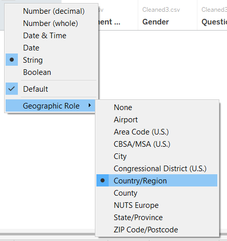{width=75%}
Longitude and Latitude calculated fields are auto generated in Tableau due to their assigned geographic role. Together with the count of row values in the csv. They will be used to visualise the map.|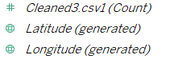{width=75%}
Latitude values are placed in Column and Longitude Values placed in Row. From the 'Show Me' tab, select the only available map visualisation|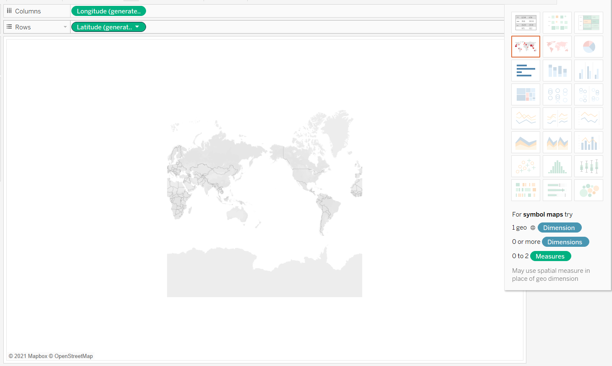{width=75%}
To populate the map with color and labels, the count of all records are added. The country field is added into the detail button to visualise the map shapes.The legend display is display the Color to represent the number of respondants|{width=75%}{width=75%}
The title of the legend is corrected to display 'Number of Participants'. Since the colours do no start from 0 due to number of participants, the color is edited to start the color gradient from 0.The color of choice would be orange so as not to conflict with the blue that will be used in the likert scale|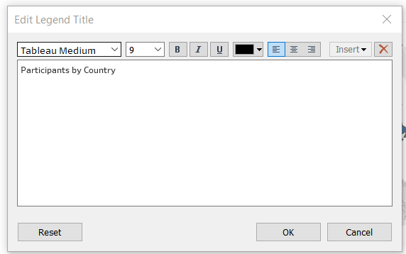{width=75%}{width=75%}

The World Map is finally visualised as seen here. 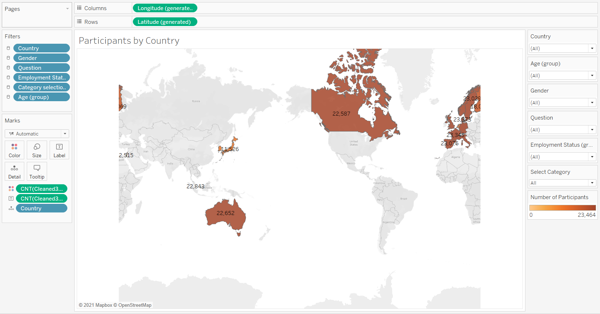


## **3.2 Likert Scale **

Based on the task requirements, we need select how we would like to display the data based on the demographic category.Thus we would need select parameters for the visualisation.

Steps | Parameter Creation for breaking down information by Category
------------- | -------------
From a new sheet, we create a parameter called 'Select Category' using 'create Parameter' function. By using the formula as shown on the right. This would help map the ‘Score’ values to the associated Sentiment.|{width=75%}
Based on the selected parameter, we need to create a calculated field for each case within the 'Select Category' field.|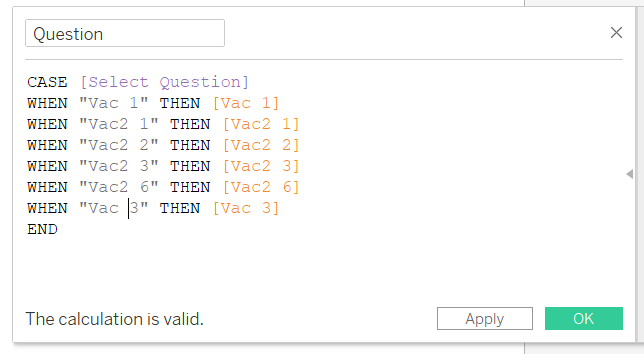{width=75%}

We are ready to make a likert scale to easily visualise the results of the survey. To evaluate the proportion of respondents easily, we can divide axes and compare them across positive and negative responses.

Steps | Visualisation for Likert Scale
------------- | -------------
We create 'Response' field using 'create calculated field' function. By using the formula as shown on the right. This would help map the ‘Score’ values to the associated Sentiment.|{width=75%}
Next, we create ‘No of Records (Ref)’ field using ‘created calculated field’ function. This would be a reference field to for future formulas and references.|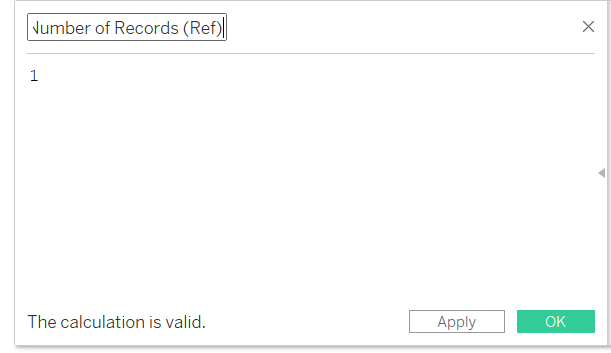{width=75%} 
‘Total count’ field is created to evaluate the total count. Note that this field is evaluated using the ‘Response’ field created in step 1 of this table.|{width=75%}
‘Count of Negative’ field is created to evaluate the negative scores which are 4 and 5.|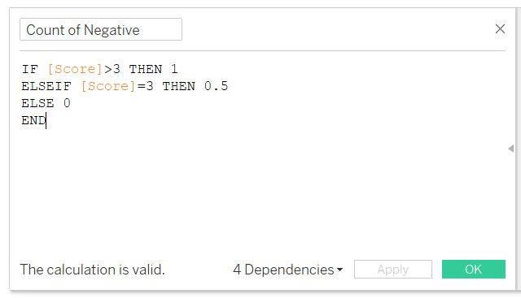{width=75%}
Create ‘Total Count of Negative’ field using “created calculated field” function. Note that this field is evaluated using the ‘Response’ field. |{width=75%}
Create ‘Gantt Start’ field using ‘created calculated field’ function.|{width=75%}
Create ‘Percentage’ field using ‘created calculated field’ function to visualise the size of the bar within the likert scale.|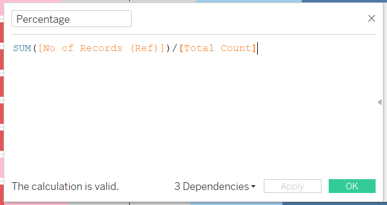{width=75%}
Create ‘Gantt Percent’ field.Note that this field is evaluated using the ‘Response’ field. |{width=75%}
Drag and drop ‘Gantt Percent’ field into Columns, ’Country’ and ‘Country’ ’Category Selection’ into Rows. Drag and drop ‘Response’ into the color mark, ‘Percentage into ‘Size’ Mark. Change the display of the visualisation to ‘Gantt Bar’.|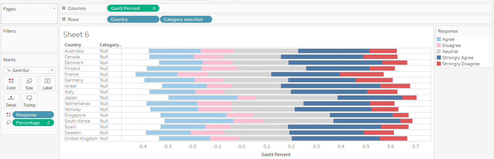{width=75%}
From the ‘Response’ in the color mark, we do manual sorting of the response. From our axis, the left side denotes negative responses, thus it will be sorted according to the order shown in the screenshot. |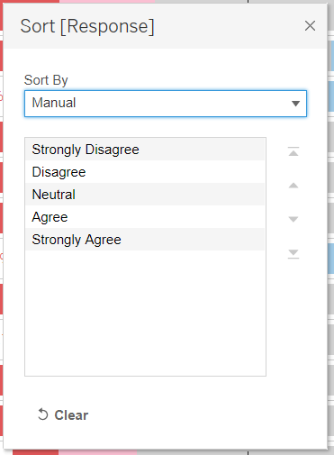{width=75%}
From the ‘Response’ color legend in the color mark, we manual chose the color scheme to represent the responses. I chose red tones for negative responses, blue tones for positive responses and grey for neutral response.|{width=75%}
Drag and drop ‘Percentage’ field into the Label button to display the percentages of the gantt bar.|{width=75%}
Drag and drop fields ‘Country’,’Gender’,‘Question’,’Employment Status (group)’,’Category Selection’ and ‘Age (group) into ‘Filter’ pane. These filters are applied through all worksheets using this data source for linking the different sheets together. |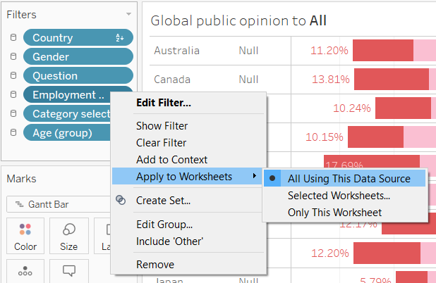{width=75%}


The Likert scale is finally visualised as seen here. 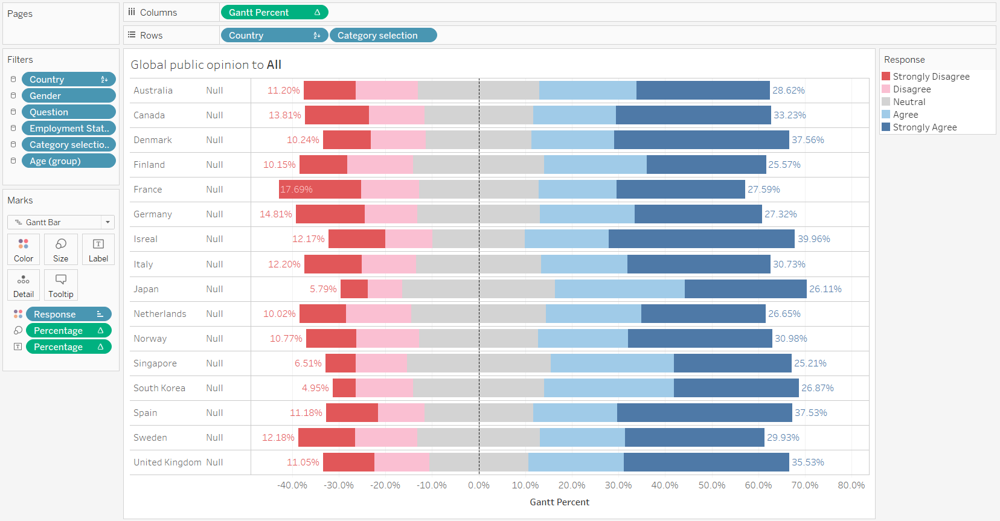

## **3.3 Error Bar on Dot plot **

Visualising uncertainty 

If the same survey with the same questions and responses options was conducted at a different time frame, are we likely to see the same proportion of respondents from each country? we are unable to tell based on the likert scale alone. As such, we would need to set a confidence interval to find out whether 95% of the time, the participants who responded with 'Strongly Agree' fall within the mean.

Thus we shall visualise the response data using a Error bar on dot plot

Steps | Visualisation for Error Bar on Dot plot
------------- | -------------
First we create calculated field labeled 'Proportion that Strongly Agree'.|{width=75%}
Next we create calculated field labeled 'Proportion (Pro-Vaccine)'.|{width=75%}
Next we create calculated field labeled 'Proportion_SE (Pro-Vaccine)'.|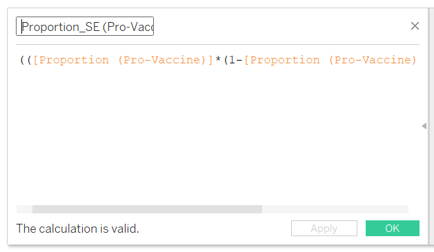{width=75%}
Since we are using a 95% confidence interval, the Z-value is placed into a calculated field labeled 'Z_95%'.|{width=75%}
Next we create calculated field labeled 'Prop Margin of Error 95%'.|{width=75%}
Finally, we create the Upper and lower limits of error.|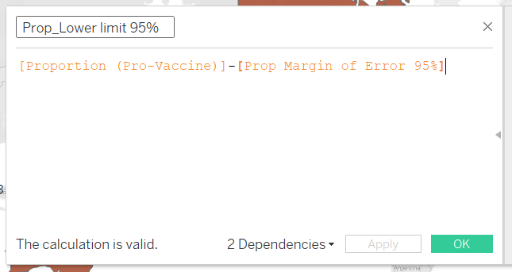{width=75%}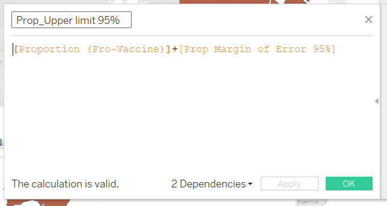{width=75%}
We drag and drop 'Measure Values' and 'Proportion (Pro-Vaccine)' into column and 'Country' into rows.|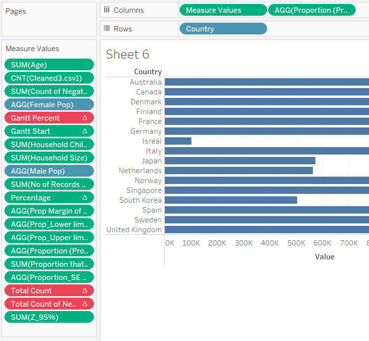{width=75%}
From 'Measure Values' card, we remove all other field except upper and lower limits.|{width=75%}
Since the Columns have 2 field values, we place them in the same graph using dual axis and syncrhonise them|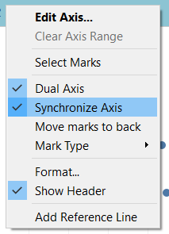{width=75%}
In the 'Measure Values' mark, we change the option to display as a line.Then, we drag measure names into the path button.Next We filter out all other fields except Prop_Upper limit 95% and Prop_Lower Limit 95%|{width=75%}
In the 'Proportion (Pro-Vaccine)' mark, we change the display to display as a circle and attach 'Measure Name' to color so we can change the plot and its color to not clash with the likert scale.|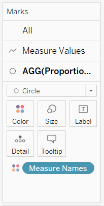{width=75%}
We Next add the 'Category Selection' Field into Rows.|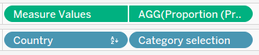{width=75%}

The Error Bar on Dot plot is finally visualised as seen here. 

## **3.4 Dashboard **

We are now ready to create our dashboard for analysis.

Steps | Dashboard Creation
------------- | -------------
Within, the sheets used for the dashboard, we display all filters and parameters used. Since they are linked to multiple sheets. It will help in our analysis of the data set.|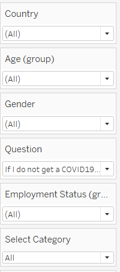{width=75%}
In the Dashboard sheet, we drag and drop the likert scale and error bar on dot plot.|{width=75%}
Next we rearrange the filters and parameters to be displayed at the top.|{width=75%}

The Dashboard is finally visualised as seen here. 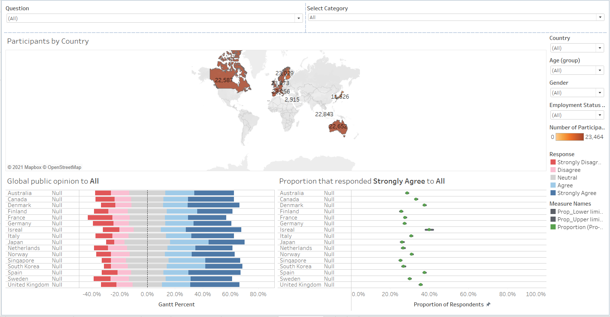

***

# **4. Observations from Makeover Visualisation **


From the above graph, Countries Japan, South Korea, Spain and Singapore had higher percentage of respondents who 'agree' or 'Strongly agreed' to to being worried about getting the Virus. Where as the remaining countries seem to be 'split 50-50' on their opinion.


France and Germany are shown to have high proportion (19.26% and 22.97%) of strongly disagree to taking the vaccine if it was offered in a years time.


UK and Denmark are shown to have higher proportion (48.44% and 50.20%) of respondants who would regret not getting the vaccine. On the other end France has the highest proportion who strongly disagree to this


Within all Countries, there is a higher proprotion of females compared to males who strongly agree that there are potential side effects to the vaccine


