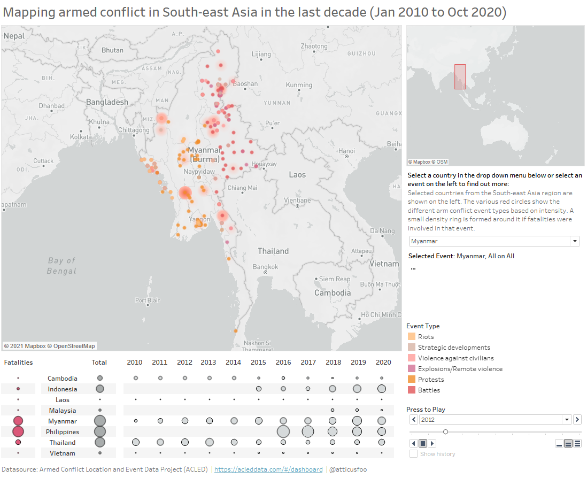

# Overview 
    
For the purposes of this data-makeover, we will focus on mapping the geo-spatial patterns of armed conflict in South-east Asia countries between 2015 and 2020. Data is taken from The Armed Conflict Location & Event Data Project (ACLED) using the Data Export Tool provided. The tableau dashboard can be found [here](https://public.tableau.com/profile/atticusfoo#!/vizhome/Datamakeover3ACLEDArmedConflictinSouth-eastAsia/Main).

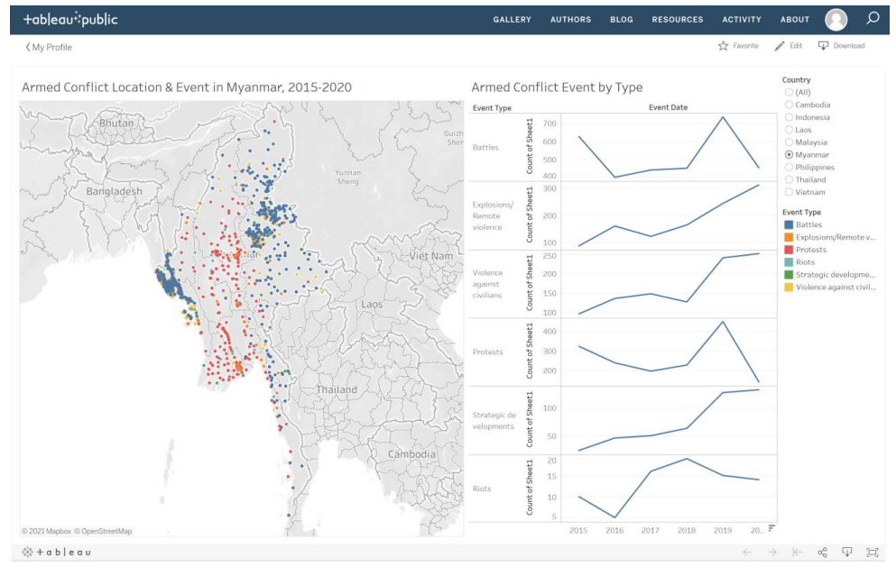

This blogpost will attempt to re-present (makeover) the interactive [visualisation](https://public.tableau.com/profile/tskam#!/vizhome/South-eastAsiaArmedConflictAnalysis/South-eastAsiaArmedConflictAnalysis) as seen in the screenshot above, applying techniques learned in Professor Kam’s class on geo-spatial visualisations. The following sections can be found below:   

•	1 Assessment of visualisation based on clarity, aesthetics and interactivity 
•	2 Sketch of alternate design 
•	 3 Proposed visualisation in Tableau 
•	 4 Step-by-step guide 
•	 5 Insights from the visualisation 

# #1 Assessment of visualisation based on clarity, aesthetics and interactivity 

Without the context of the original communication intent of the above chart, it is difficult to provide a good assessment on how it can be improved. As such, the critique below will be based solely on the rubrics of clarity, aesthetics and interactivity. 

## 1.1 Clarity 
In this segment, we will explore ways we can improve the visual clarity of this visualisation. 

### 1.1.1 Ensuring Y-axis are consistent when comparing multiple charts of similar type

•	The Y-axis on the chart on the right is not synchronized and may mislead. This is because they all count incident occurrence but they do not all start at zero and do not have the same ranges. This may lead (for instance) some readers to believe, at first glance, that the number of riots in 2018 was higher than the number of battles in the same year. As such, this affects the visual clarity of the charts when describing the number of “Armed Conflict Events by Type”. 

### 1.1.2 Each event occurrence represented by a single dot 

•	While this method of visualizing each discrete incident is the most faithful representation of the data, it may not provide the most visual clarity. This is because many incidents can occur at the same location over time, and this would leave to the dots either overlapping on top of each other or being covered entirely. Placing the dots side-by-side may help if the density is not high, but is not an accurate representation of where the incident first occurred. 

•	This can be using a heat-density plot / proportional symbol map or other similar plots in order to reflect volume of the event type in a certain geographic region. This can help readers to clearly assess if an event has tended to occur in the same location. 

### 1.1.3 Unable to tell when the event occurred on the map 

•	The data contains events of armed conflict between 2015 to 2020, but readers are unable to tell when each event took place. As such, this does not allow for a temporal analysis unless a filter is added in.  

### 1.1.4 Unable to determine the intensity related to the event type 

•	As this is a visualisation that aims to present armed conflicts that occurs across South-east Asia, more information can be presented (if available) in order to contextualize the event occurrence. This can related to information to fatalities, length of time of an event, or population density in the geographical region, and help readers better understand the possible reasons for a conflict in that area. 

•	It is also important to the note that the date for 2020 is not complete – and should be indicated in the visualisation so that readers are clear that the dataset is not complete, least they get the wrong impression of the number of armed conflicts in 2020. 

## 1.2 Aesthetic 

Under this segment, we will look at two main subtypes and the accompany areas that can be possibly improved.

### 1.2.1 Cohesiveness 

•	For greater visual cohesiveness, the line charts on the right can also be colour coded in a similar fashion to the chart on the left. This is because they represent the same event types. Readers will be able to quickly adapt to the information on the chart if the colour styles were consistently used. 

### 1.2.2 Clean-up to remove visual clutter.

•	Aesthetically, the graphic could have done with minor touch-ups to remove the clutter in order to improve aesthetics. For instance. The Y-Axis contains fields from the data-sheet, ‘Count of Sheet1’. This should be removed as it does not add anything to the Event Type which already describes the characteristics of the line chart. 

•	Other minor ‘clean-ups’ can be done to ensure that the boundary of the selected country – in this instance, Myanmar, can be more clearly seen. This can be useful in assessing if the conflict events have taken place near a country’s border – hence signifying that the conflict has occurred across borders.  
As there multiple bar charts stacked together, it may be beneficial including grid lines in order for viewers to track the datapoints along the x and y axis. 

•	Lastly, the ‘Event Type’ legend can be improved as readers are unable to read the longer phrases in the legend. This may hamper their understanding of the visualisation – if they have no access to the codebook. 

### 1.2.3 Proportion of visualisation 

•	At the moment, the map shares the same valuable horizontal real-estate as the time series charts. Visually, it would be more comfortable reading the map if it were allowed to be wider. The time-series charts can be moved down and will too benefit from a wider presentation as the x-axis would represent the different years across time.  

## 1.3 Interactivity 

In terms of interactivity, more can have been done to take advantage of Tableau’s features to demonstrate geo-spatial patterns of armed conflict in South-east Asia countries. 

### 1.3.1 Filtering the relevant event types 

•	The current chart does not allow you to filter by event types. This is important because the scale and intensity of each event type can differ greatly and it may not be useful to view everything at once. As such, it may be more useful to allow users to pick the different event types they are keen on exploring. 

### 1.3.2 Filtering time or showing chronology of events 

•	As described above, the current presentation of events is across 2010 to 2020. This makes it difficult to understand if armed conflict had decrease or increased in a region. Interactive features can be in-built for readers to filter out events perhaps by year. This can also be improved if they were allowed to see the events in a chronological fashion – so as to understand the developments in the region / country across time. 

•	For the above two sections, if would be best if the data in the chart on the right can be synchronized to the one on the left. This would help with visual clarity and consistency. 

### 1.3.3 Comparing Countries 

•	Perhaps due to space constraints, it is difficult to see the visualization of more than one country. If it is possible to make country and country (within South-east Asia) comparisons, this may improve the value of the presentation and the use of South-east Asia data. 

# #2 Sketch of alternate design
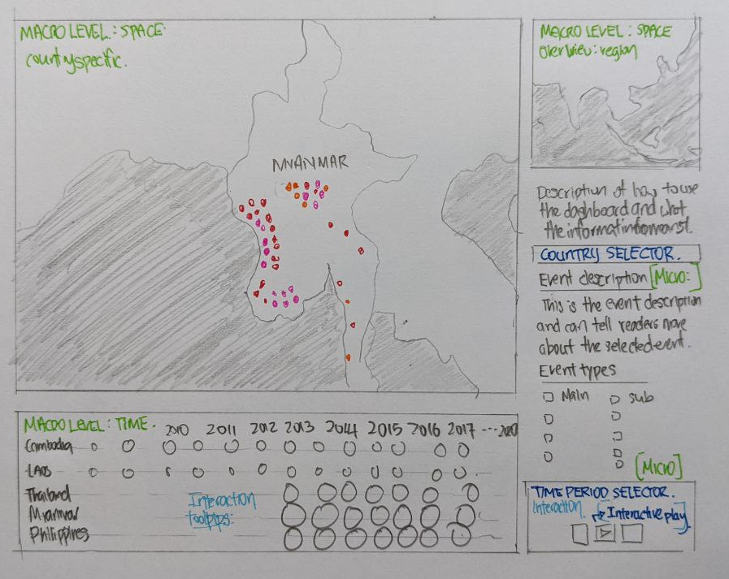

As the main feature of the visualisation is the geospatial map of armed conflict across South-east asia, we wanted to give more real-estate to the map for the reader to be able to better visualize the events (of armed conflict) across the region. This is why the proposed sketch features the map heavily. 
As such, details the types of armed conflict and the volume is shifted below and contextualized in a way that aims to give you a good overview of the development not only across the region but also across time. 
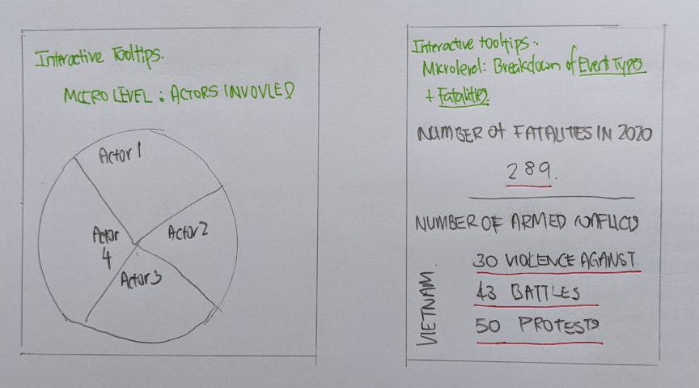

Ideally, we will also integrate interactive tool-tips in order to save ‘space’. This will allow readers to find additional information when they mouse-over relevant information, such as the main actors involved in armed conflict in each region. 

Lastly, as the treatment of the topic (of armed conflict in the region) is a serious one, we will be making use of the fatalities dataset (to show consequence), and using a somber monochromatic color theme with conflict and fatalities shown in various shades of red. 

# #3 Proposed Visualisation in Tableau 

The visualisation was built using Tableau Desktop Professional Edition 2020.40 and can be found [here](https://public.tableau.com/profile/atticusfoo#!/vizhome/Datamakeover3ACLEDArmedConflictinSouth-eastAsia/Main).

The key changes made in the data visualisation is outlined in the paper sketch in the above section. The main intent was to help the readers view events of armed conflict in the region across time and space, as well as to provide them useful contextual information so as to aid their understanding of developments in the past decade.  

## 3.1 Visualising Time: 

Readers are able to better understand where the incidents took place over space and time in the region as they are able to play an animation of the events through time. A time series chart is also located at the bottom, in order to provide useful information about the volume of armed conflicts over time. Interactive tooltips provide information on the actors involved as well as the detailed breakdown on the types of arms conflicts in the region. 

## 3.2 Visualising Space: 

At the macro level, readers may be able to visualize the geographic location of the country in the region through the bounding box map in the top right. We have also adopted the use of a style map from Mapbox in order to show a more details on road networks and administrative buildings, in order to better understand if events have taken place due to geographical factors. 
Lastly, to better understand an event type, readers are able to click on the event to read up notes about the event.  

# #4 Step-by-step guide 

The following steps will provide an overview of how the visualisation was completed using the data extracted from ACLED and Tableau Desktop.

## 4.1 Data Preparation 
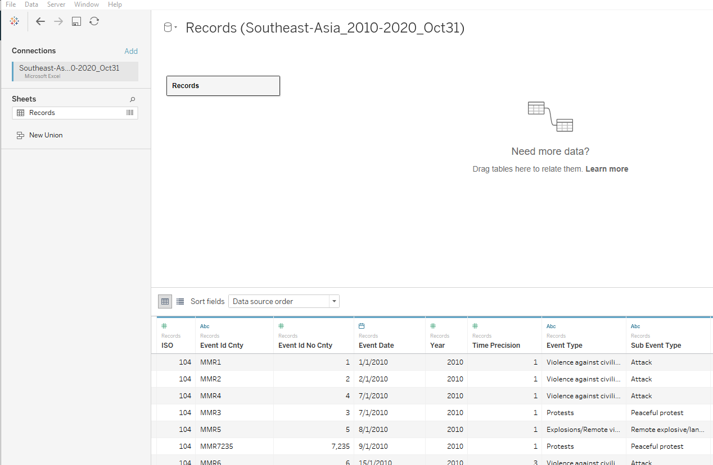

The data use for the visualisation was extracted from ACLED using their data export tool [here](https://acleddata.com/data-export-tool/). As seen in the screenshot below, you should be able to check the data fields using Tableaus data prep feature. We will also need to refer to the ACLED codebook in order to understand the features in the dataset. The ACLED codebook can be found [here](https://acleddata.com/acleddatanew/wp-content/uploads/dlm_uploads/2019/04/General-User-Guide_FINAL-1.pdf)

We will now outline the few changes we made as part of data preparation. 
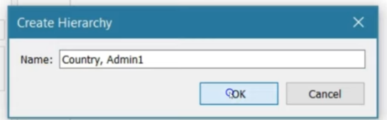

First, based on the codebook, the field Admin1 contains info on the state/provinces. It will be useful to create a hierarchy by dragging Admin 1 under the Country field in order create the hierarchy. You can also rename Admin1 to State / Province as we have for ease of reference later. 

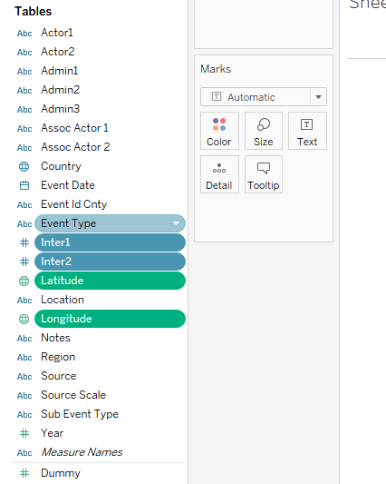

Next, we will have to change Inter1 and Inter 2 from measures to dimensions. This is because while both fields contain integers 1 to 8, they are categorical data as they reflect actor types instead. As such, they can be changed to correctly reflect discrete categories. 

Lastly we will want to ensure that longitudes and latitudes are not unnecessarily aggregated by changing them from Measures to Dimensions. (i.e. This is because a longitude of -5 is not less than a longitude of 5). 

## 4.2 Preparing the Map  

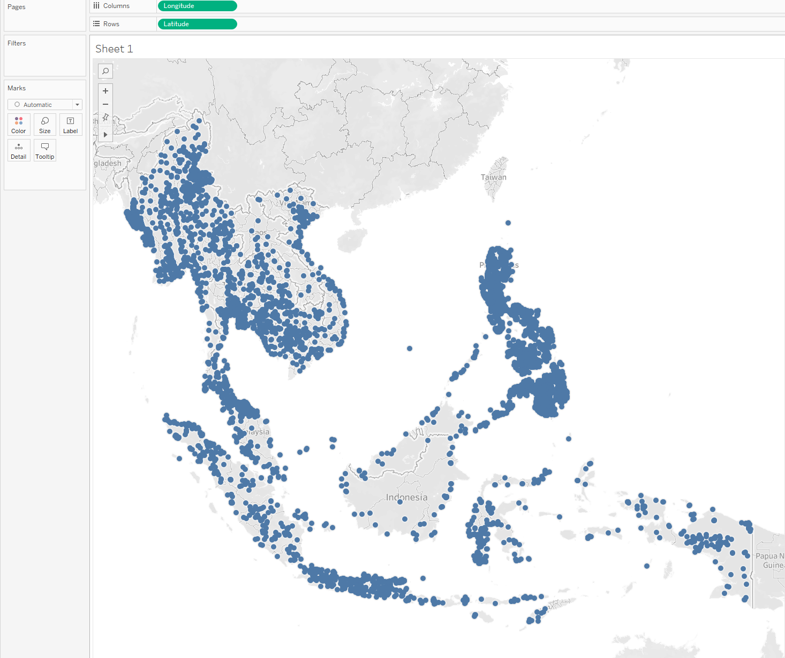

We can now start to prepare the map visualisation. First drag longitude to colums and latitude to rows. A map of South-east Asia should appear in the worksheet below. 
We can now drag Event Type to ‘colours’ in the Marks card and select ‘Circle’ in order to create a plot chart.

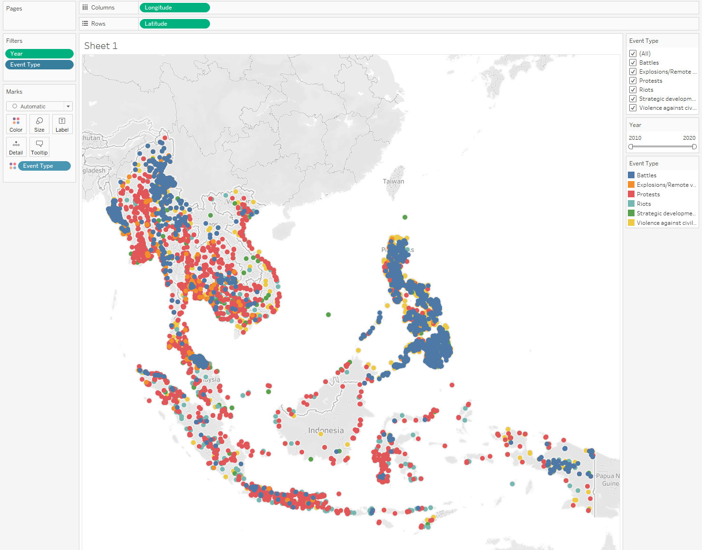

At the same time, we want to be able to visually identify and filter out the different regions, time period as well as event types. To do this, drag the measures, Country, Event Type and Year to Filters. Right click on these measures in the Filters section and select ‘Show Filter’. You should be able to now select the types of filters you. 

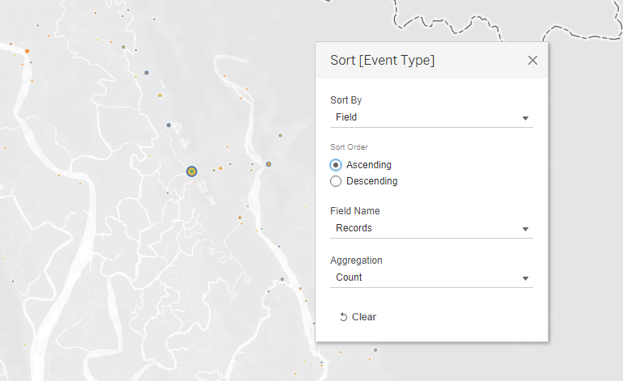

If you want aggregated circle plots, so as not to overcrowd the map, you can also drag Event Types to Size in the Marks card. This will allow you to aggregate all the events that have taken place in the selected time frame. However, as some event types may overlap others (that have smaller values), you will need to sort the event types (as seen in the screenshot above) by ascending order in order for the smaller event types to be above larger event types on the map so that they can be visibly spotted. 

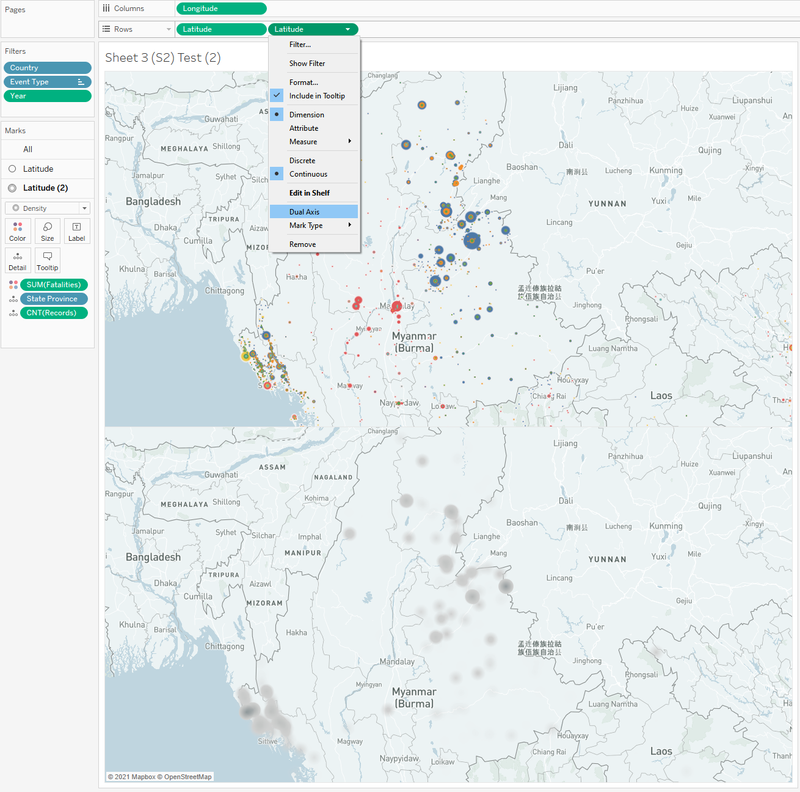

As we want to also provide data of fatalities on the map, we will have to create a dual axis chart. We can do this by holding the ctrl button while clicking on the ‘Latitude’ measure in ‘Rows’ in order to duplicate it. 

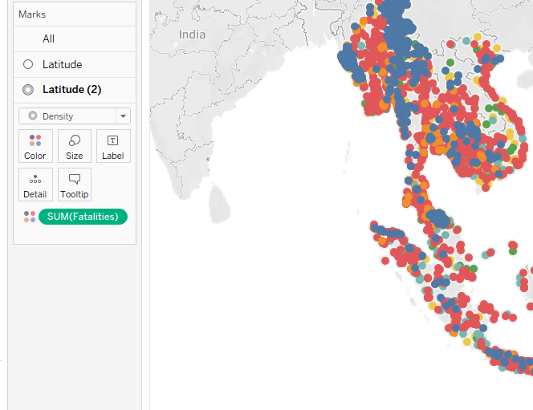

When this is done, you can drag the Fatalities measure to size and select density under the Marks card in order to change the fatalities sum to a density plot on the map.  

To complete the map, right click on the Latitude measure in Row and select dual axis.

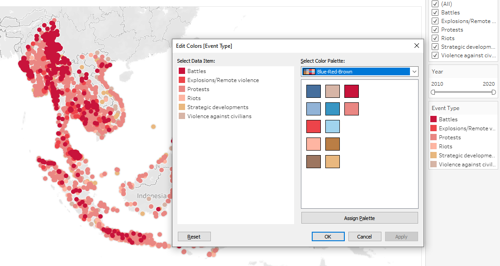

You will also want to take this opportunity to change the colors of the Event Types and Density plot so that they are visible or match the colour scheme you have in mind.

## 4.3 Using Mapbox 

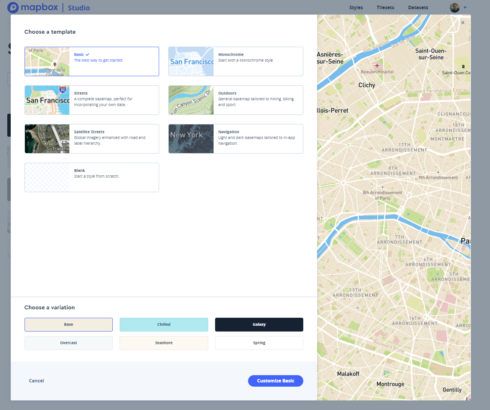

For this makeover, we wanted a monochromatic color scheme for the map, that still provided details on road networks. This was not an option within Tableau. As such, we utilized a third party app, Mapbox (mapbox.com) for this.  

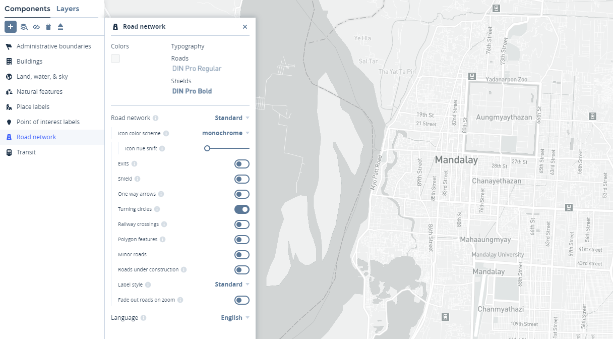

To do this, we will first need to create an account on MapBox. You will be able to create a free one at the link above. MapBox provides several different custom styles that are already available. In Mapbox studio, I am able to add the different details (such as transport nodes, administrative buildings, landcover etc.) to the map based on the style we prefer. We will also able to edit the colors and fonts of the icons and features on the map as see in the screenshot above. 

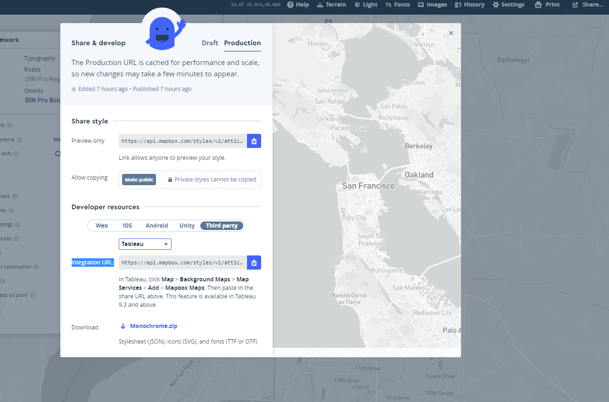

Once done, click on ‘share’ to find a link you can use for integration with Tableau. Copy the API code so that you can use this in Tableau later. 

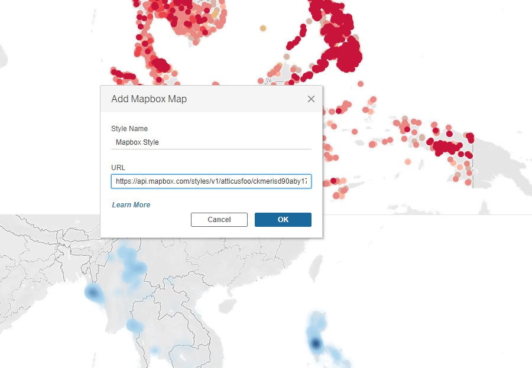

Back in Tableau, click on Map and then Background Maps and then Add Mapbox Map. As seen in the screenshot above, you can give the Mapbox a title. Paste the link you copied earlier in order to import the background Map from Mapbox Studio to your Tableau visualisation. 

## 4.4 Using bounding box for an overview map 

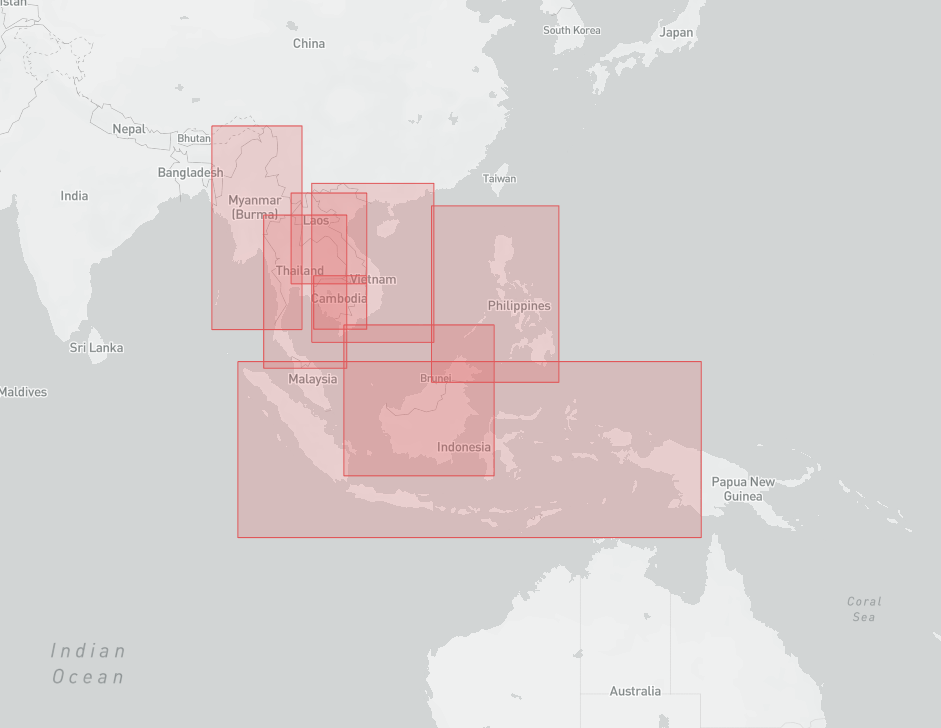

For this visualisation, we wanted o create a tiny overview map which is highlighting the selected country with a ‘bounding box’. We relied on Klaus Schulte’s very helpful tutorial found [here](https://co-data.de/2018/08/23/bounding-boxes-in-tableau). The main intend behind the overview map is to give readers more context on where the selected country was situated in the region – as this could give clues as to the reasons for armed conflict in the region (e.g. whether the country was landlocked / or shared borders). 

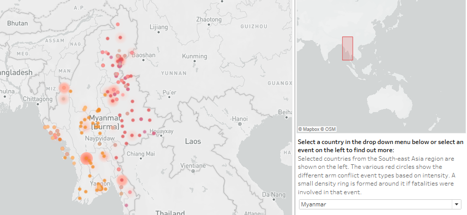

As seen the completed visualization, the overview map can give readers a better idea as to where Myanmar was located in South-east Asia. This is not easily possible by looking at the main map alone. The basic idea of a bounding box is to identify the ranges of latitudes and longitudes of the selected country so as to ‘bound’ the country’ in a rectangle. To do this, we will need to figure out the minimum and maximum longitude of the countries. 

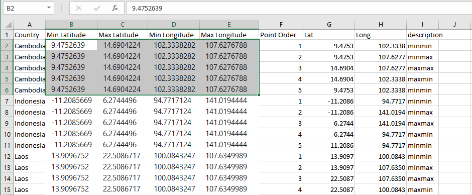

Data was imported in excel and prepared there as seen in the screenshot above. Data was extracted from Github here https://gist.github.com/graydon/11198540#file-country-bounding-boxes-py. 

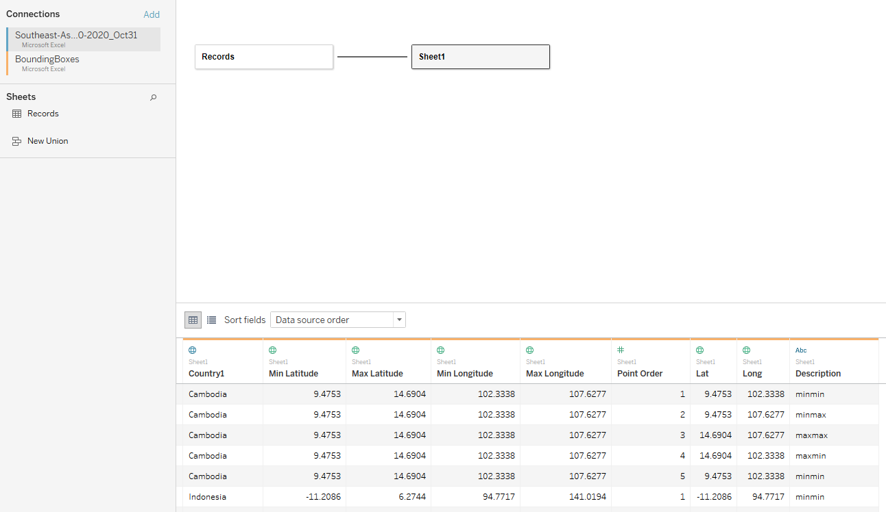

This excel was later imported into Tableau using Tableaus join feature. This can be done easily using the Country field. 

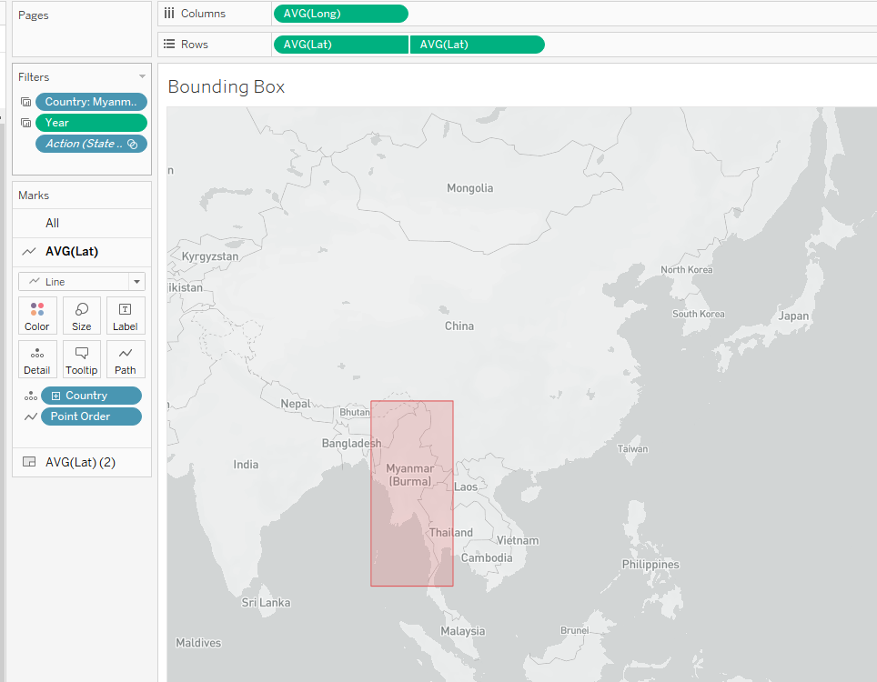

To create the bounding boxes, simply drag longitude to columns and latitude to rows and point order to Path in the Line Marks card. 

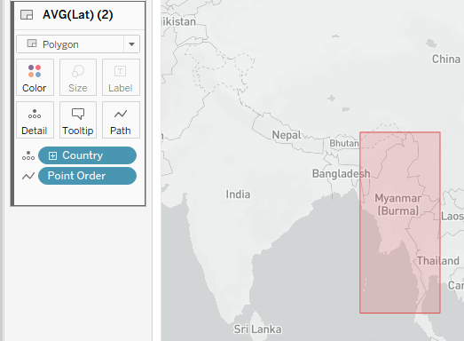

This will simply create only a rectangle that is not coloured. To fill the rectangle, create a dual axis chart by repeating the same method above. This time, however, select Polygon under the Marks card in order to create a rectangle that is filled. Select dual-axis in order to overlap the two charts. 

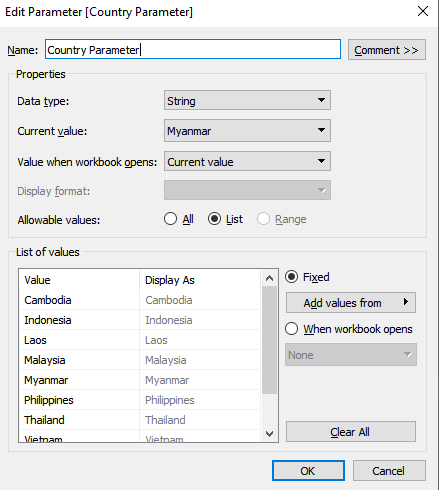

To complete the bounding box overview map, you will need to create a parameter “[Country]=[Country Parameter]” as seen in the screenshot above in other to filter the countries in the detailed map. Lastly edit the colors of both the polygon and rectangle border as you see fit. We picked red and set opacity to 30%. 

## 4.5 using interactive animation for timeline 
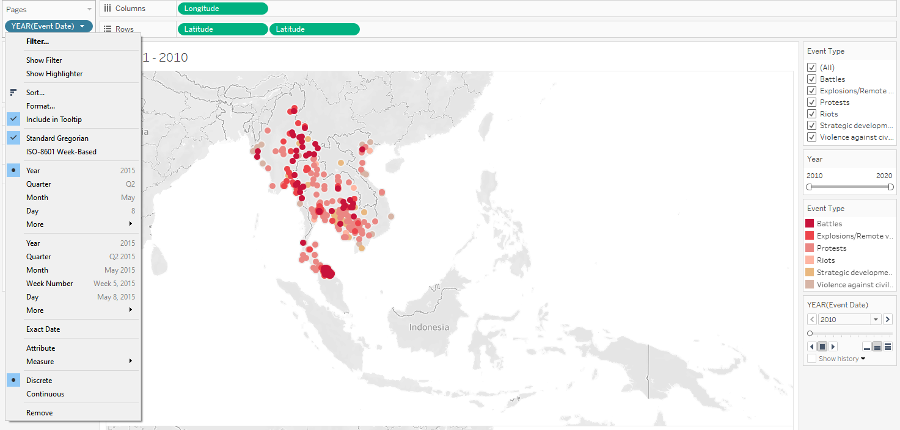

To create an interactive timeline, simply drag the measure Event Date to the Pages section. You can find this in the screenshot above. A filter will appear on the right, allow you to play the timeline of events chronologically. 

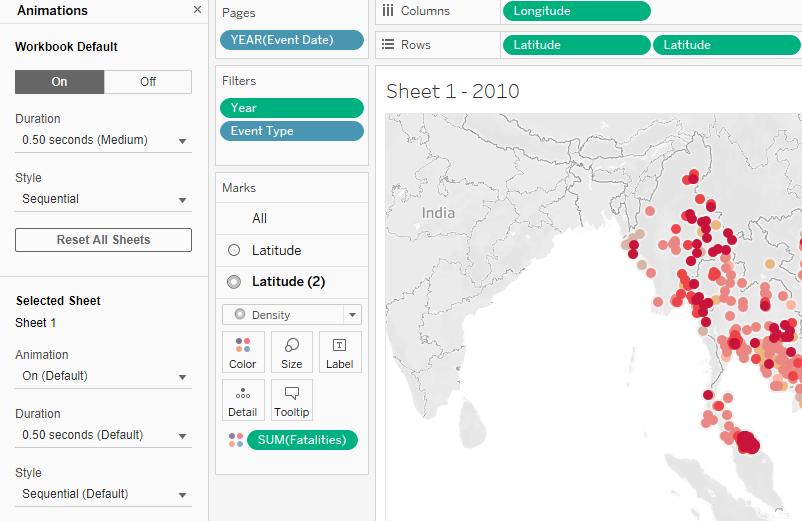

You are also able to format the settings for this animation. To do this, select Format from the toolbar and then Animation. You should be able to then customize the settings for the timeline animation. We have set this to 0.5 seconds and for the style to be ‘Sequential’. 

## 4.6 time series circle chart 

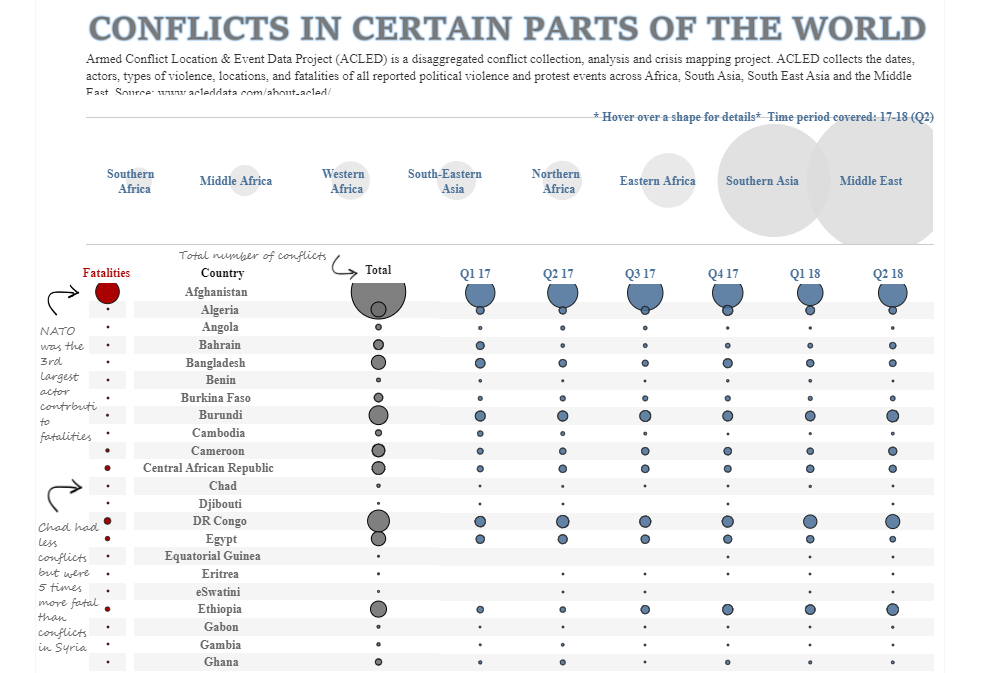

This section is inspired by the work of [Zunaira Rasheed](https://public.tableau.com/profile/zunaira.rasheed#!/vizhome/ArmedConflictLocationEventDataProject-MakeOverMondayW34/Conflicts?publish=yes). The intent of this chart is to demonstrate the total number of cases and fatalities in each country. This same data should also be presented across a span of time, in order for readers tell how much armed conflict has occurred in that country in the last decade. Tooltips will also provide more information on the type of events, the number of fatalities as well as the actors involved. 

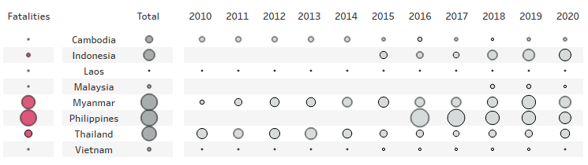

This time series is actually made up of three different circle charts as well as three different tooltips. 

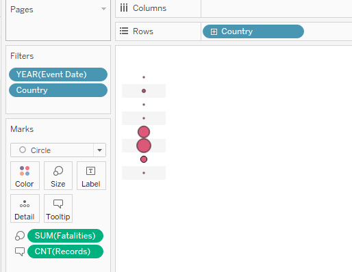

First to create the Fatalities circle chart, we will drag the Country measure to Rows, as well as Country and Year to Filters. Next, add Fatalities as well as Records to the size section in Marks and Tooltip respectively.

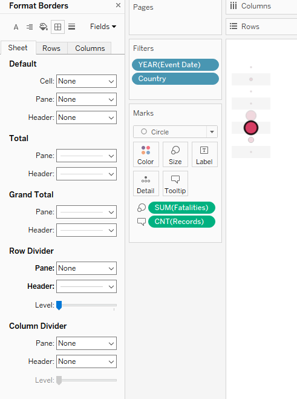

In order to create a clean looking chart when integrated, we removed the header as well as the borders as seen in the screenshot above. The colour for the circle was set to red with a black border and 80% opacity in the event the circles overlapped. 

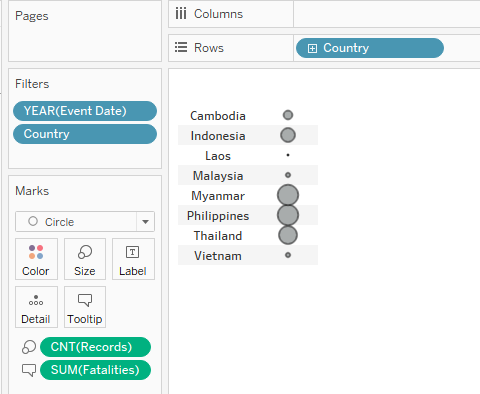

This was repeated for the country column, except the colours chosen was now grew. 

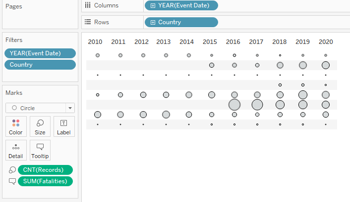

And then again for the columns for the rest of the corresponding years. 
We will now have to create the corresponding tooltips for each of the sections. 

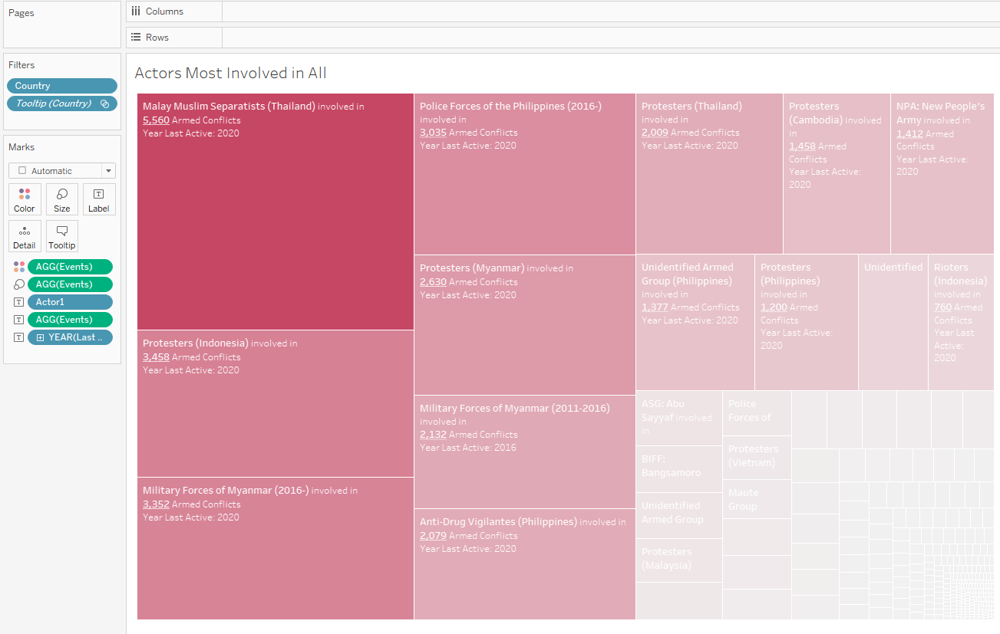

The first tool tip is intended to convey the actors that was most involved in armed conflict in the region. To create this chart, drag Events as Aggregate measures to Colour and Size in the marks section. Also drag Country to the Filters section. Now, drag Actor1, Events and Year to the Label section. This will allow you to label the different part of the chart as seen in the screenshot above. Once again, change the colors as you see fit. We have chosen a red to match the consistency of the colour palette selected for this visualisastion.

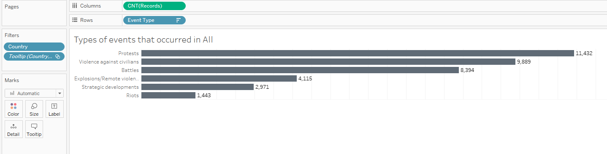

The next tooltip, we want to chart all the events that have occurred in the country based on the filters. To do this, drag country to Filters. At the same time the measure Records to Columns and Event Type to Rows. We also changed the colours to gray and select ‘Always Mark’ for the labels in order to indicate the number of events at the end of the horizontal bar charts. 

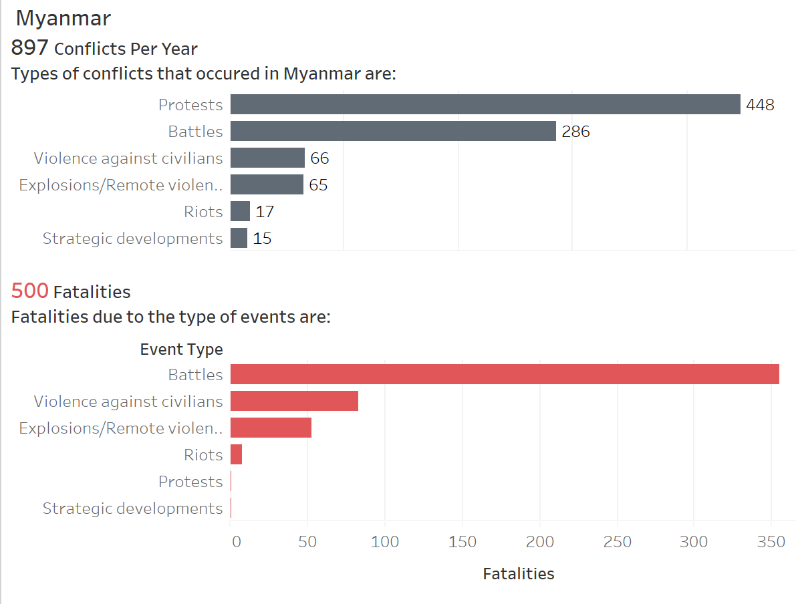

This is similarly repeated to show fatalities instead of total event count. As seen in the screenshot above, the measure Fatalities was selected instead of Records and the colour was changed to red. 

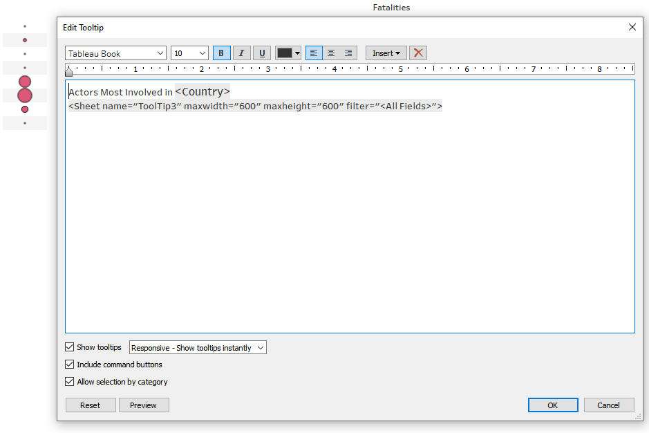

Finally we can start preparing the interactive tooltips. Click Tooltip under the Marks section in the Fatalities worksheet. You may use the formulation as seen in the screenshot above by selecting ‘Insert Sheets’. This will allow the chart you prepared earlier to appear as an interactive visualization when you mouseover this chart. 

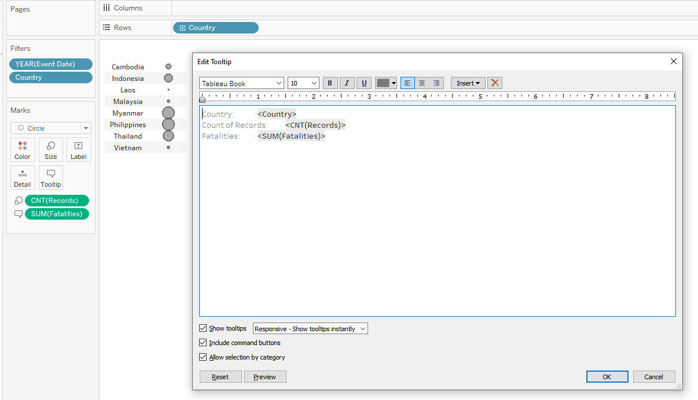

You may repeat this step for the Country Total worksheet with the tooltip formulation seen in the screenshot above. This will provide contextual information on the country selected, the total number of recorded events of armed conflict in the last decade as well as the sum total of fatalities involved. 

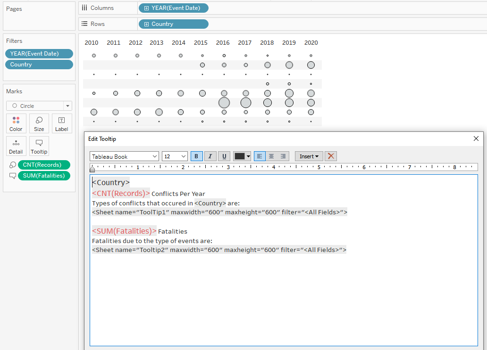

Lastly, repeat this step for the Year worksheet. This time, instead of linking / inserting 1 worksheet, we will insert the two other worksheets we prepared. This will show bar charts of the number and type of armed conflicts in the year as well as the fatalities due to the event type in that year. 

## 4.7 Event selection 

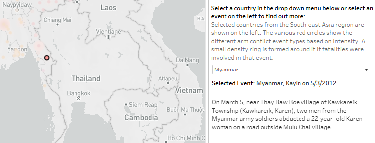

For the final part of the visualization, we will prepare a worksheet that would show the details of the event selected on the map. As seen in the map above, information about the user selected event, if any, will be taken from the Notes field of the data source. This section is aided by the work of [Paul Wachtler](https://public.tableau.com/profile/paul.wachtler#!/vizhome/WorkoutWednesdayWeek34-ACLED/DRCPoliticalViolence) 

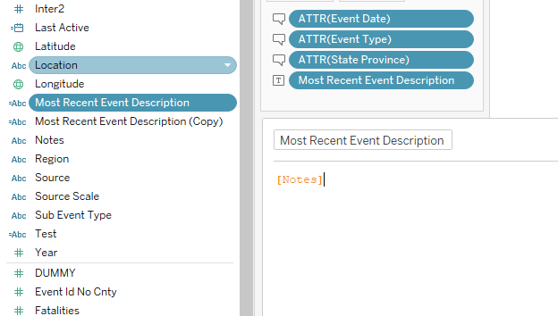

To do this, we will need to create one calculate field as seen in the screenshot above

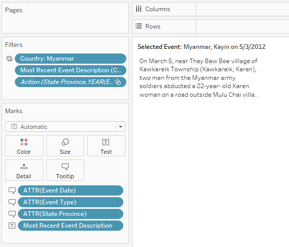

We will then drag the measures Country and Most Recent Event Description (just created) to filters. We will also drag the measures Event Date, Event Type, State Province to the tooltip as Attributes. The new calculated field, Most Recent Event Description will be dragged to the Text section under the Marks card. 
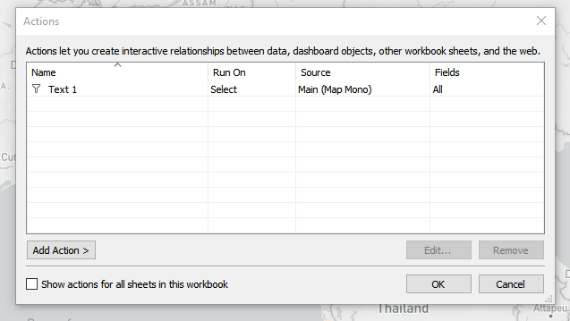 

At the dashboard tab, click on Dashboard on the toolbar and then select Actions. 

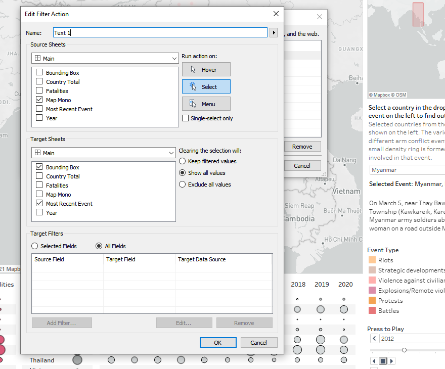

You can then select Add action in order to control the source and target sheets. Edit the settings so that they are similar to the screenshot above. This will allow readers to select an event on the map, and allow the target worksheet, ‘Most Recent Event’, draw the appropriate note for display.

## 4.8 Creating the Dashboard

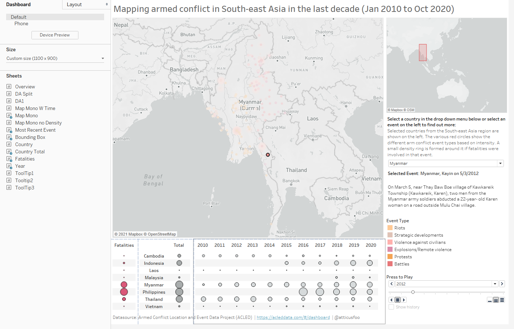

Finally to plot the dashboard, select “New dashboard’ and set the resolution to custom size (1100 X 900). We rarely want to exceed 1100 because most computer screens in the market are only at Full HD resolution – meaning a width of 1080 pixels only.  However, as the map is densely packed with data, we have picked 1100 for the width. 

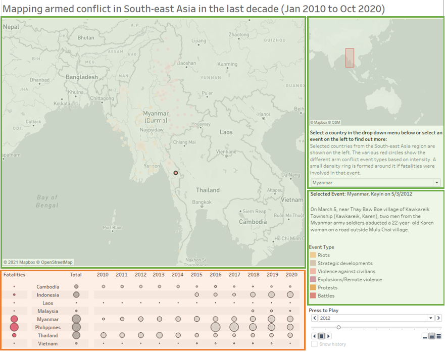

An important step to make is to ensure that all the worksheets are accurately linked so that the charts reflect the data relating to the question selected. In this case, the time series charts the bottom should not be linked to anything else while the main map, the overview map and country selection and selected event should be linked together. 

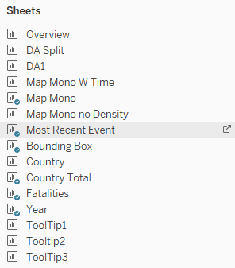

The worksheets used for the dashboards are as indicated in the screenshot above. Drag them onto the corresponding space on the dashboard – or as you see fit. 

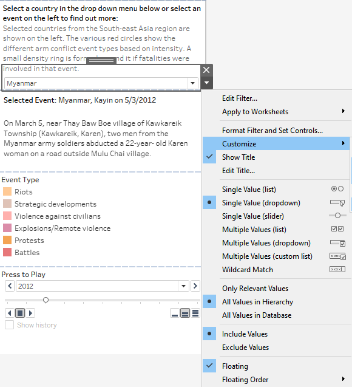

Only the legend for overviewmap should be floating.this is to allow it to appear integrated on the dashboard as a single value dropdown feature. Also deselect ‘All’ in the Customize section as this will greatly improve the speed and response of the dashboard. 

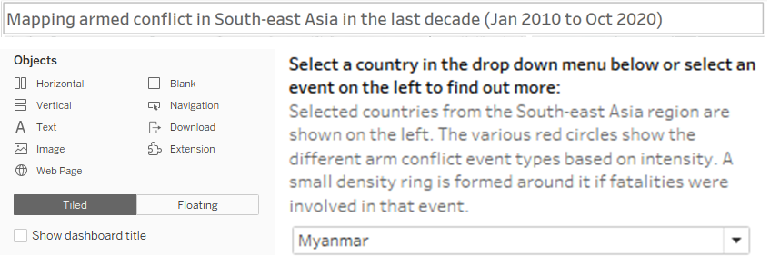

Lastly add two textboxes using the feature in the bottom left. This will be used for both the dashboard title and ‘instructions’ as seen in the screenshot above. 

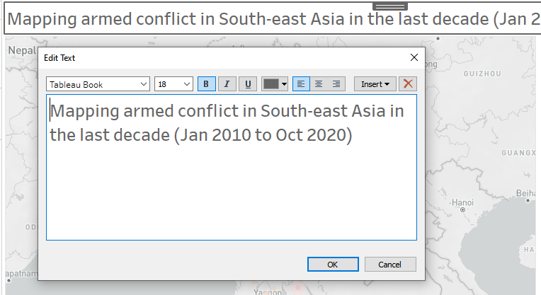

You may edit the textboxes by double clicking them like this. You can also use this feature to adjust the font size and colour. From here, cosmetic changes can also be made to the titles and legends by double clicking on them. 

# #5 Observations 

Before proceeding with the observations, we wanted to note that the data used for the visualisation is not complete. First the dataset is only up till October 2020 and not December 2020. Second, some countries such as Indonesia, Malaysia and Thailand have missing data before 2015. As such, our observations will be based on the limitations of this dataset. 

## 5.1 Conflict Trends in the region 

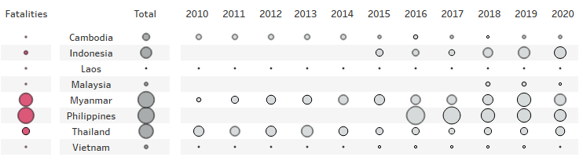

Based on the data collected, Phillippines and Myanmar observed the most number of armed conflict events in the last decade.  In general, armed conflict in Cambodia and Thailand has trended downwards. The opposite is observed in Myanmar with approximately 6.1x more instances of armed conflict in 2020 than in 2010. This is compared to Cambodia which has about 2.3x less instances of armed conflict in the same period observed. 

It is not possible to observe the same patterns in the Philippines as data is recorded only in the same year Rodrigo Duterte became president in 2016. However, in that short time, we observe that the number of armed conflicts has generally decreased from 3,194 in 2016 to 1,381 in 2020.

This is the reverse in Indonesia, where instances of armed conflict have increased from 599 in 2015 to 1,517 in after President Jokowi took charge as Indonesia President in 2014. 
Perhaps a better way to observe this trend would be to use a candlestick chart – so that we can observe the range of change better. 

##5.2 Patterns of conflict within Myanmar, Philippines and Thailand 

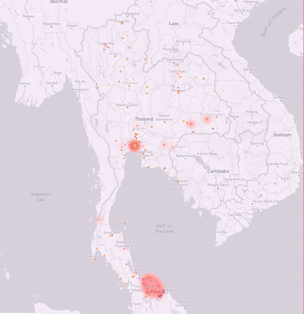

In the last decade, we observe that most of the armed conflicts have occurred in the southern region of Thailand with occasional clashes in the capital, Bangkok. South of Thailand shares the same border as Malaysia. Events of armed conflict that occur here are generally skirmishes (e.g. battles, explosions and violence against civilians) that lead to fatalities. This is different from Bangkok where the majority of incidents were protest and riots which rarely resulted in fatalities. 

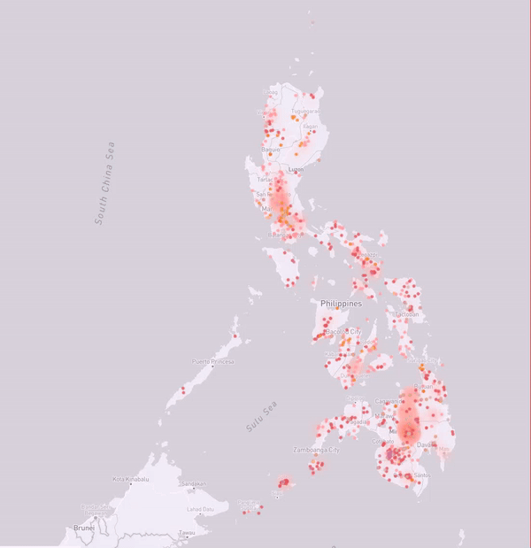

A similar patten can be observed in the Philippines with conflicts occurring most in the capital Manila and the southern islands of Mindanao. The nature of the conflicts in Manila is slightly different from that in Bangkok, with the majority of the events occurring due to ‘Violence against civilians’ resulting in a higher proportion of fatalities.  

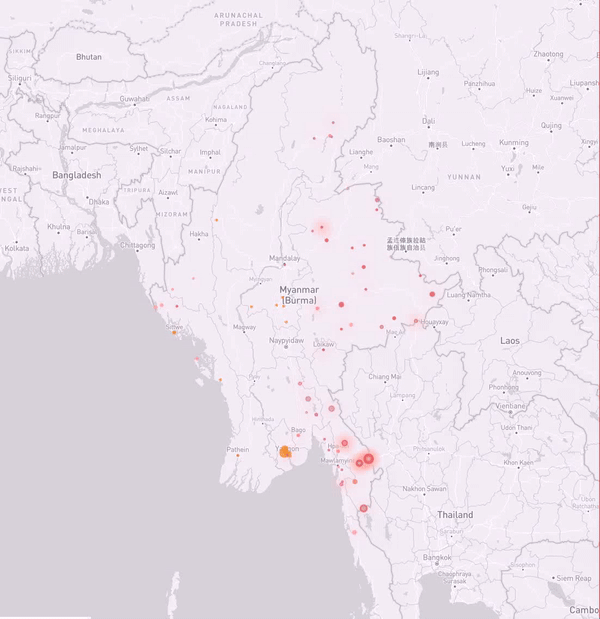

In Myanmar, armed conflict with casualties occur most consistently in the last decade in the Shan region. However, this changed in 2019 with a high concentration of incidents (‘Violence against civilians’) in the Rakhine region on the Western coast of Myanmar. This was often with fatalities. 

## 5.3 Differences between conflict types 

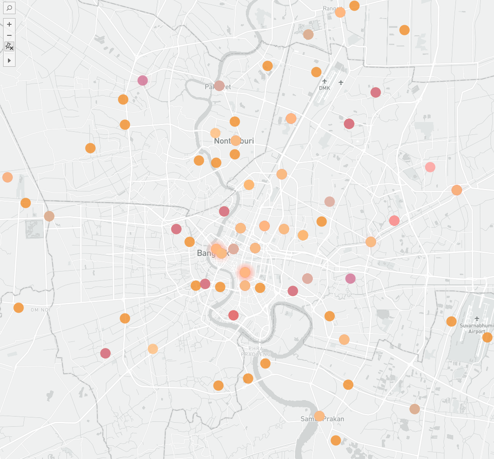

In general, it appears that incidents in cities tended to be Protests and Riots. This could be due to the presence of highly developed road and transportation networks, which allow for large masses of people to easily congregate at. The screenshot above shows the number of protests and riots in Bangkok from 2016 to 2020. 

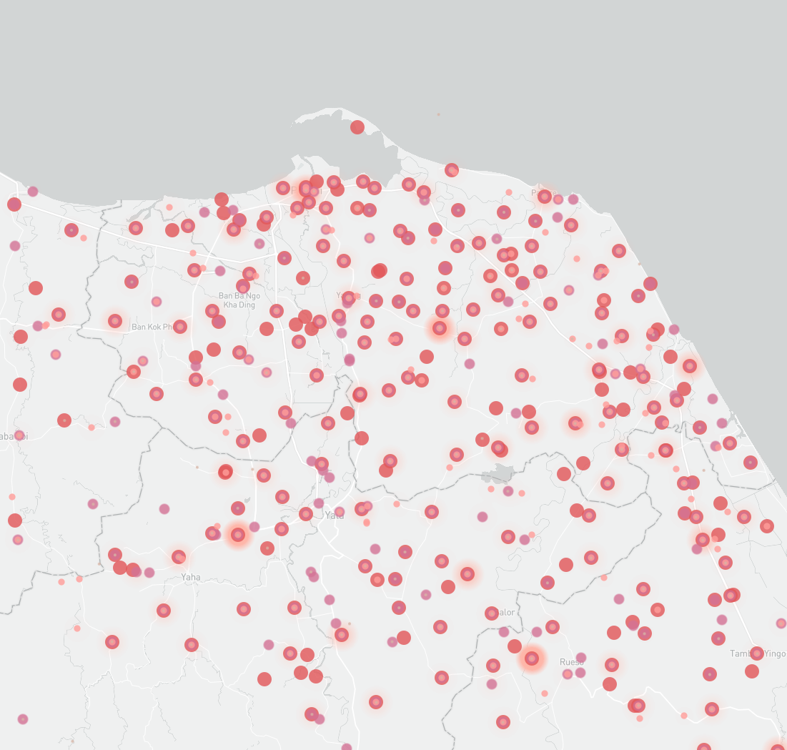 

This contrasts with the Southern Thailand where the majority of events were battles. Based on the screenshot above, we can observe that road networks were not as developed or as concentrated than that of Bangkok. This relates to the similar patterns seen as well in the Philippines. 

## 5.4 Difference between causes of fatalities

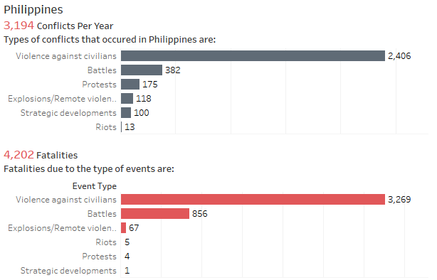

We are also able to observe the differences the causes of fatalities across these regions and are able to tell that the causes of fatalities are different. In the Philippines, the main causes of fatalities (4,088 in 2016) was due to ‘violence against civilians’. This is sub-categorized by ACLED as events of either sexual violence, attack or abduction. 

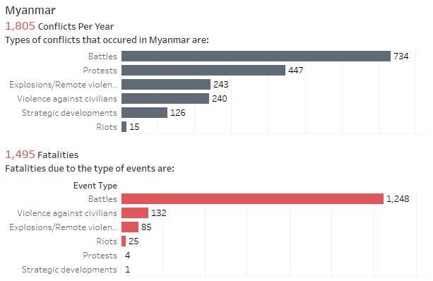

On the other hand, fatalities (1,495 in 2018) in Myanmar resulted most from battles. This is due to armed clashes between different actors, government forces or non-state actors trying gain control over a territory. We are also able to observe that compared to the Philippines (59.7%), Myanmar (11.2%) witnessed proportionally less ‘Violence on civilians’ type of incidents. 

## 5.5 Difference in Actors Involved

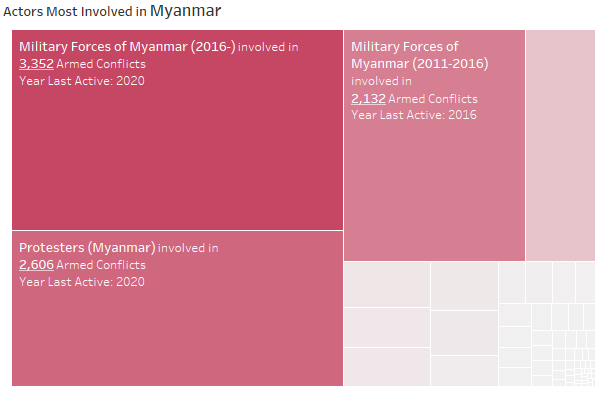

In the past decade, the Military Forces of Myanmar (from 2011 to 2016 and 2016 to present) was involved in 52.32% of the incidents of conflict within the country. Protestors on the other hand, were involved 24.86% of the time.

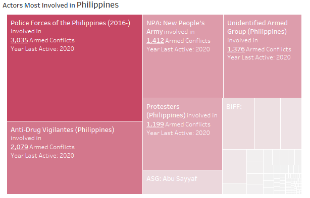

This contrasts with the Philippines where the majority of incidents involved the Police Forces of the Philippines (27.36%). Protestors were involved in a smaller percentage of incidents at 10.81%. Anti-Drug Vigilantes were involved in 18.74% of the incidents since 2016 and this has been criticized by HRW and Amnesty International https://www.amnesty.org.uk/philippines-president-duterte-war-on-drugs-thousands-killed as having been caused by Duterte’s ‘war n drugs’ campaign. This has led to approximately 7,000 killed between July 2016 and January 2017.  

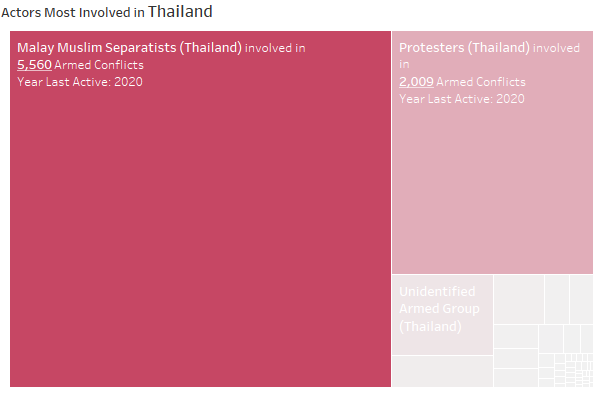

In Southern Thailand, where skirmishes were most rife, the Malay Muslim Separatists of Thailand were involved in 65.39% of incidents in the past decade. 

Again, we would caution that the observations made in this visualisation is confined to only publicly available data – and therefore has obvious limitations. Observations are also restricted mainly to the results of the quantitative data and does not include qualitative findings that can help to better understand the nature and context of conflicts in the region. 

# #6 References 
This data-makeover relied heavily on the makeovers found at Makeover Monday https://www.makeovermonday.co.uk/week-34-2018/ 

Thank you for reading up to this point! 

_This blog is a data visualization assignment for the MITB programme at the Singapore Management University._ 

