```{r setup, include=FALSE}
knitr::opts_chunk$set(echo = TRUE)
```

# **1. Introduction**


The Armed Conflict Location & Event Data Project (ACLED) is a non-governmental organization specializing in disaggregated conflict data collection, analysis, and crisis mapping. As of 2021, ACLED has recorded more than a million individual events across the word. The ACLED team conducts analysis to describe, explore, and test conflict scenarios, making both data and analysis open for use by the public.

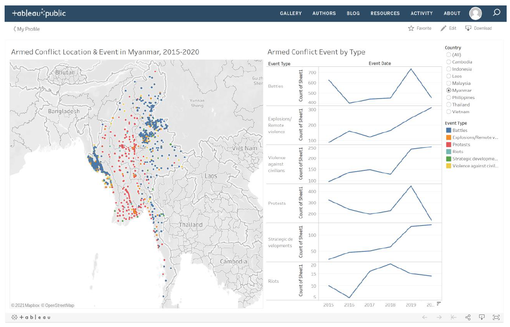

Based on the above visualisations, the task is to make a critque on the Clarity and Aesthetics of the charts, providing an alternative visualisation and listing down the steps to ensure repoducibility. 

***
# **2. Critque on Clarity and Aesthetics**


Clarity | Aesthetics
------------- | -------------
Each data point represents the count of event that occurred, however the title of the visualisation makes no indication of this.| Each event is too clustered, the reader is unable to distinguish how many events happened at that location due to overlapping of data points.
Visualisation on the left does not have a strong message. i.e A high number of battles occured, but theres no indication of severity or extent of damaged caused by event.| According to the legend,orange denotes 'Explosions/Remote Violence' events and red is used to denote 'Protest' events. The tones are too similar to each other thus the reader is unable to easily distinguish the events.
It its evident that certain locations within Myanmar are of interest due to the number of attacks, However there is no naming of the province or area, we are unable to further utilise the current visualisation to derive further insights or cross reference with external sources. This can be resolved by using the 'ADMIN' columns from the data set to allow for interactivity when a particular area is moused-over. | Since the locations are not clearly defined and resolution issues, the data points might cross the boundaries of where the event actually occurred. A chloropleth map with density of of events would be a better visualisation in this case.
Title indicates years of attack from 2015-2020, there is no indication of when each event took place. Reader is left to assume that the visualisation includes all events from that time period.| Since it is assumed that the left visualisation includes all events from 2015-2020, a trend line does not support the visualisation well because spikes and troughs represents the change in frequency of attacks. A better visualisation would be a running total of the number of events occurring through the years.
Title of the right visualisation has no indication that the line chart represent count of attacks by type and year.| Color legend to the immediate right of visualisation might confuse the reader as we would expect each line to be color coded according to the legend. However, this legend is used in reference to left most visualisation.
'Count of sheet 1' as y-axis title is confusing as we are left to assume through the line chart that there were many changes to 'sheet 1' through the years.|The y-axis scale is not standardised, thus,it might be misleading the reader to think that one event type occured more frequently than the other.

**Interactivity**

With respect to Interactivity, we are unable tell much about the functionality of the dashboard.

Visualisation has been filtered to display events occurring in Myanmar, uncertain if this allows for single values or multi-values. This might also cause difficulty in using the dashboard especially if choosing to display multiple countries for comparison, or if the reader would want to compare countries by attack type. 

A better solution to the dashboard would be to apply interactivity to toggle between multiple parameters. Interactivity would allow you to filter the different event types,by year or by the related parties.This is because the scale and intensity of these conflicts are different by geograpical region and you may not want to see them all at once.

We can include tooltips to reference other sheets or data values as well, for instance, adding a tooltip, we can see the main actors of conflict by each event,casualty inccured or a brief summary of the event that occured, allowing for a more conclusive story telling.


## **2.1 Proposed Design**

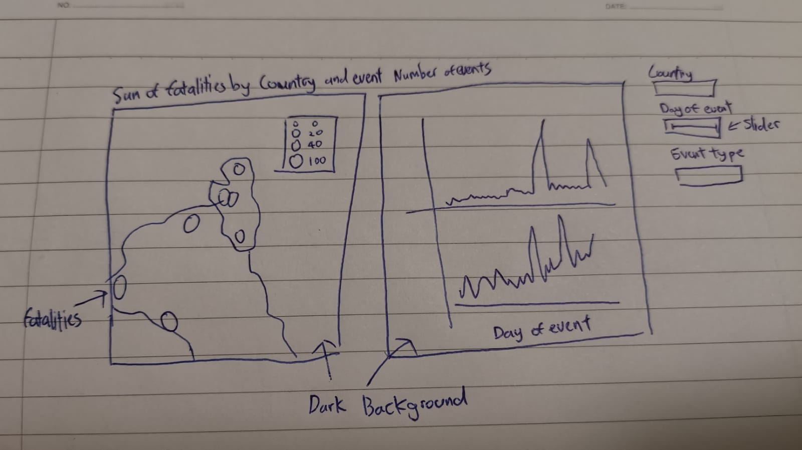

Taking reference from [fellow peers](https://www.makeovermonday.co.uk/week-34-2018/), specifically [Mike Cisneros](https://public.tableau.com/profile/mikevizneros#!/vizhome/MostDangerousPlaces/MostDangerousPlaces), the aesthetics of his visualisation are quite eye-catching to the reader. I have opted to adopt a similar approach to showcase the visualisation

The colour selection: red tones to signify the types of events occuring With a proper colour legend.Since Red is used, a dark background will compliment the reds to have a more significant impact in when conveying the repercussions of the conflict.

Properly spelled titles to give readers a sense of confidence in the researcher who prepared the presentation.

Filters added, giving the reader a choice on what data he/she would like to exclude for analysis,particularly important when dealing with daily time series data


# **3. Preparation **
The original source of the data can be found at [The Armed Conflict Location & Event Data Project](https://acleddata.com/data-export-tool/)


Steps | Data Preparation
------------- | -------------
After downloading the xlsx file, the file is imported into Tableau where we will verify the contents of the file together with the ACLED Codebook which contains identifiers for the columns.Dataset has been renamed to 'ACLED S.E.A 2010-2020' | 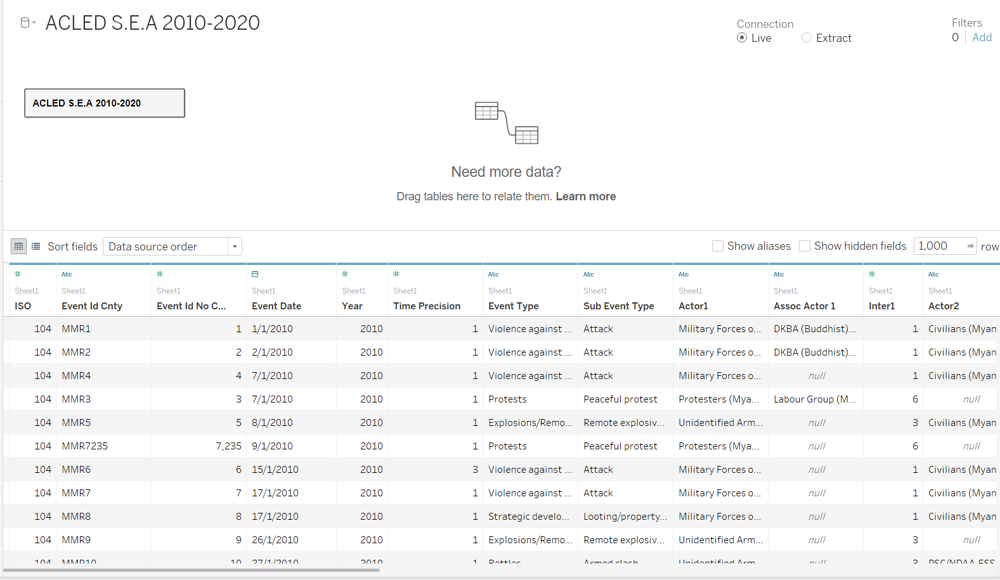{width=75%}
Since not all columns are useful for analysis, click on manage metadata button to display column headers in a list view. Selected columns unnecessary for analysis will be hidden.('ISO, EVENT_ID_CNTY, EVENT_ID_NO_CNTY, YEAR, TIME_PRECISION, ASSOC_ACTOR_1, INTER1, ASSOC_ACTOR_2, INTER2, REGION, ADMIN1,ADMIN2, ADMIN3,SOURCE, SOURCE SCALE, GEO_PRECISION, TIMESTAMP' columns have been hidden from analysis)|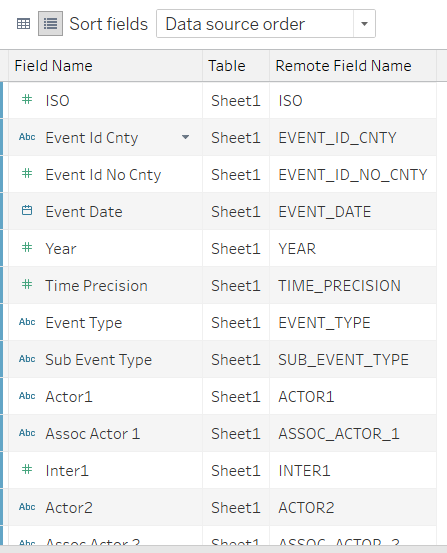{width=75%}{width=75%}
After the above steps, we will convert the data types to appropriate ones (eg. Location as Geographic role(County)). |{width=75%}
For the 'Interaction' Column, as the values are numerical, they have been converted to string data types for alias creation. Their numeric values are cross-referenced with the ACLED codebook.|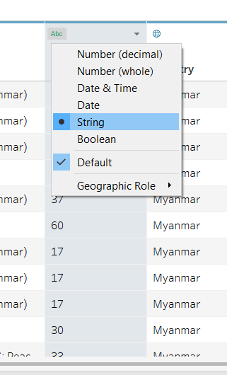{width=75%}
Of note, the codebook does not have a corresponding value for interaction id '70'.As such it has been coded to follow the the ACLED naming convention of 'SOLE CIVILIAN ACTION'.To note, all the string values are in uppercase, this will be changed through tableau coding in later steps.|{width=75%}{width=75%}
Based on the information in the codebook column 'Location'has their geographic types changed toto city geographic type|{width=75%}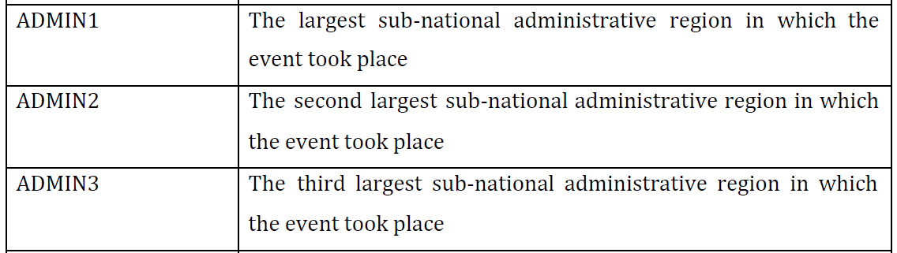{width=75%}
Next we extract the cleaned data for easier reference and rename it 'Cleaned_data.csv'|{width=75%}


## **3.1 World Map **
Steps | Visualisation for World Map
------------- | -------------
In a new sheet,I did a basic EDA to see which event type had highest number of fatalities, this would be used as a data point thus affecting visibility on the map visualisation.The data has been sorted in descending order.|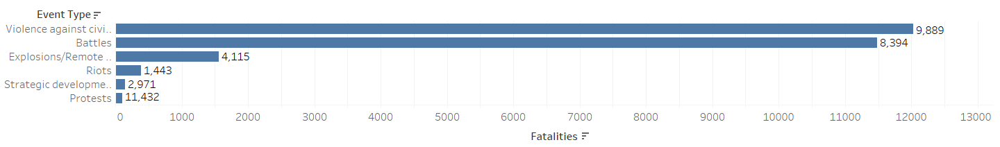{width=90%}
For the world map, we first create a hierarchy by dragging the 'Location' Measure name into 'Country'|{width=75%}
Longitude and Latitude measure values are dragged into the columns and row inputs.Since tableau detects them as values and are aggregated, we will turn off the 'Aggregate Measures' setting in the 'Analysis' Ribbon|{width=75%}
From the 'Map Layers' function, I adjusted the style from 'light' to 'Dark' and ticked the 'Country Names' and 'Country borders setting|{width=75%}
To populate the map with color and labels, the 'Fatalities' were added to the size and The 'event type' field is added into the color button.|{width=75%}
Based on the EDA done, I sorted the the event types based on descending order of fatalities.This is needed as there maybe data points that would overlap and thus not be visible|{width=75%}
Next, I adjusted the size of the circles to the 2nd interval as shown.This reflects the number of fatalities by size.|{width=75%}
Color of events have been adjusted according to this color scheme.|{width=75%}
Next, I added a date filter for a range of 'event dates' and the 'event types'.|{width=75%}{width=75%}
Next, I added a Country filter.Filter is displayed and changed to a drop down list of multiple values.|{width=75%}
Next, I edited the title of the fatalities legend.|{width=75%}
Next, I edited the title of the Visualisation as shown.|{width=75%}
We finally link the sheets that are using the data values shown.|{width=75%}

The World Map is finally visualised as seen here.


## **3.2 Analysis of Events **

Steps | Visualisation for Analysis
------------- | -------------
From the sheet used to create the EDA as mentioned earlier. I will use that sheet to visualise the number of events. |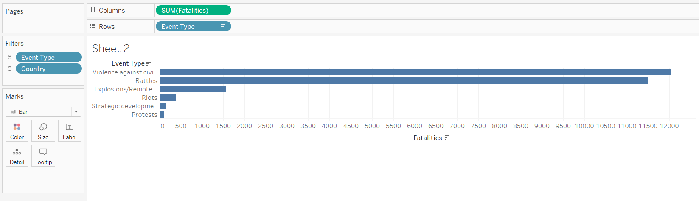{width=75%}
Drag the 'Event date' into column input,'Country' and 'count' into row input.'Event date' is changed to display by 'day' format |{width=75%}
Hold 'Ctrl' button on keyboard and drag the 'DAY(Event date)' from column values into filter.Show filter|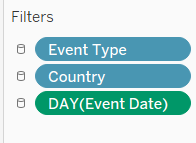{width=75%}
Next, Drag the 'count' of records into size button.|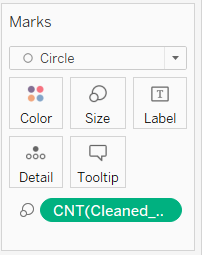{width=75%}
Next we edit the title of the visualisation to better represent the data displayed|{width=75%}
From above, the title will be used as the indicator in the dashboard.Thus, we will remove the axis labels|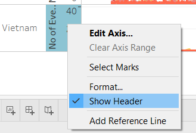{width=75%}
To match the dark layout of the map for the dashboard,I will format this sheet color to black.|{width=75%}
For the fonts, colour has been changed to Grey to allow it to be displayed clearly|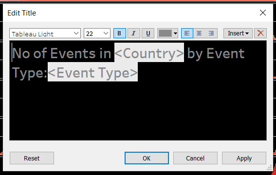{width=75%}

The Time Series analysis is finally visualised as seen here.

## **3.3 Treemap **

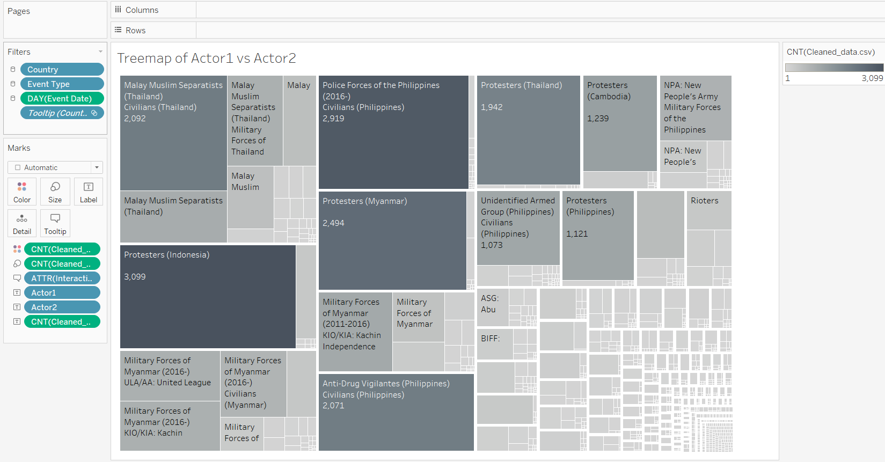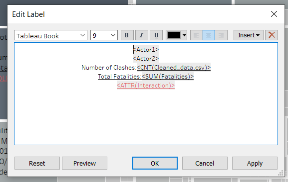

The next step is to include a treemap for visualising discrete variables vs discrete variables.In this case, this would be the 'Actor1' against 'Actor2'. This will help to visualise the main actors of conflicts through the countries. First, we drag the count of records into color and size buttons in the marks. Next we drag 'Actor1' and 'Actor2' into the text buttons. Grey has been chosen as the color of choice for this visualisation to reflect the sombre tone of conflict and death. The we include 'interaction','count' and 'sum of fatalities' to be represented in text.

## **3.4 Tooltip creation **

I will now go through the steps of adding the tooltips to each sheet for better presentation of information

Steps | Tooltip creation
------------- | -------------
In the sheet 'Fatalities by Countries and Event type', I placed 'notes','country' and 'location' into the tooltip button. |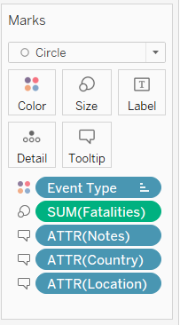{width=75%}
In the sheet 'No of Events in Country by Event Type' , i added a reference to sheet 'Treemap of Actor1 vs Actor2' into the tooltip|{width=75%}


## **3.5 Dashboard **

We are now ready to create our dashboard for analysis.

Steps | Dashboard Creation
------------- | -------------
From the dashboard sheet, we drag and drop the 'Fatalities by Countries and Event type' and 'No of Events in Country by Event Type'.|{width=75%}
Next, for the specific legends, we change it to floating type and drag it to the appropriate visualiastion it is used in.|{width=75%}


The Dashboard is finally visualised as seen here. 

***

# **4. Observations from Makeover Visualisation **

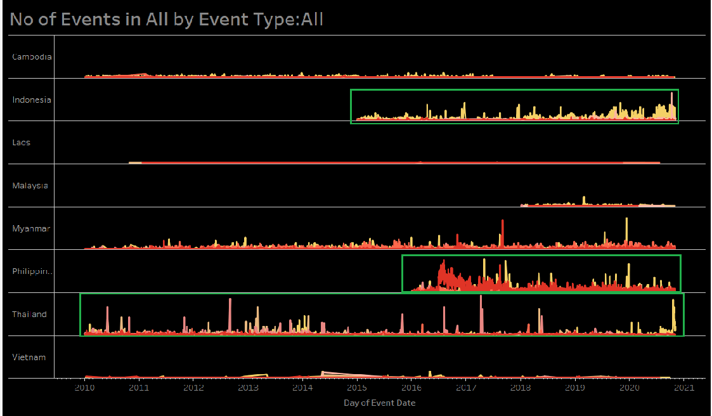
From the above graph, Countries Indonesia,Philippines and Thailand had higher numbers of events compared to the remaining countries. Of note, there seems to be unrecorded data for Philippines before 2016, and for Malaysia, before 2018. Since the data is missing we are unable to make a fair compairison in terms of relative safety and security across the countries

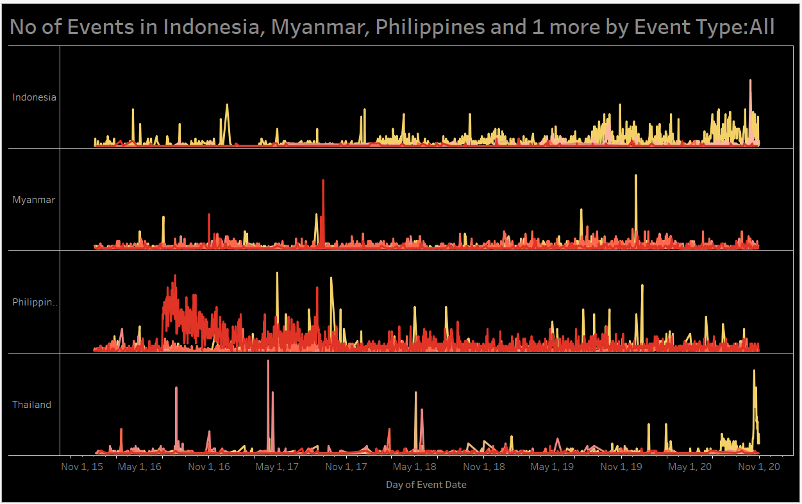
For a better comparison. I filter the years to start from 1st January 2016. From here, we can see the main bulk of Event types defer from country to country, Protests in Indonesia, Battles in Myanmar, Battles/Violence against Civilians/Protests in Philippines, Remote Violence and Protest in Thailand.


Within this time frame the Philippines had the highest number of fatalities followed by Myanmar. This could due to Philippines president Duterte's [war on drugs](https://www.bbc.com/news/world-asia-50236481). The fatalities in Myanmar were situatied in the Rohingya region.A northen region in myanmar. This was due to [Tensions between Muslims and Buddhists communities](https://www.cfr.org/global-conflict-tracker/conflict/rohingya-crisis-myanmar)


Within Philippines the main actors of conflicts were the police forces and anti-drug vigilantes. This is in stark contrast to Thailand where the main actors were Malay muslim seperatists followed by protestors


