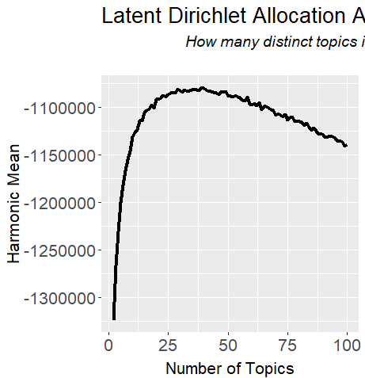
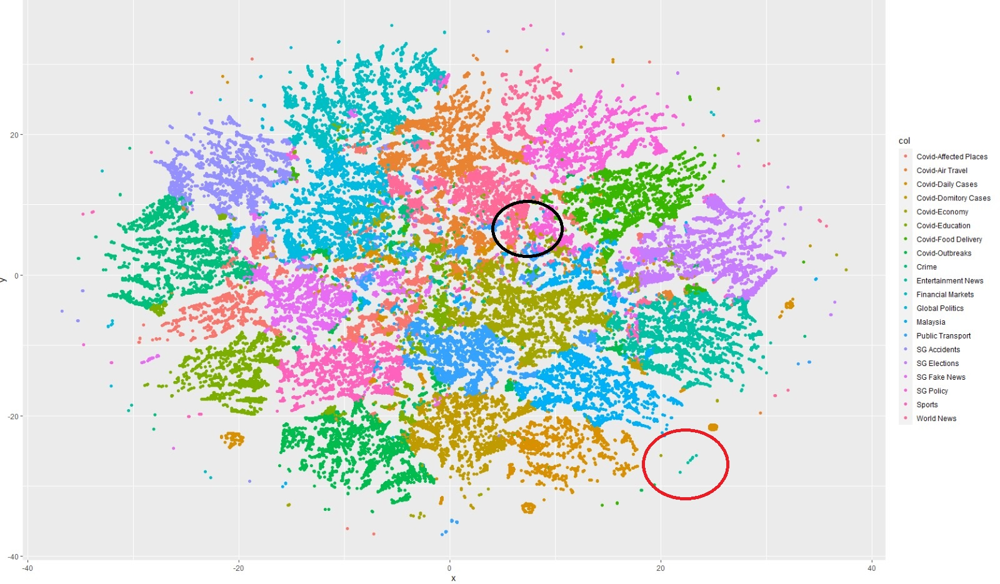
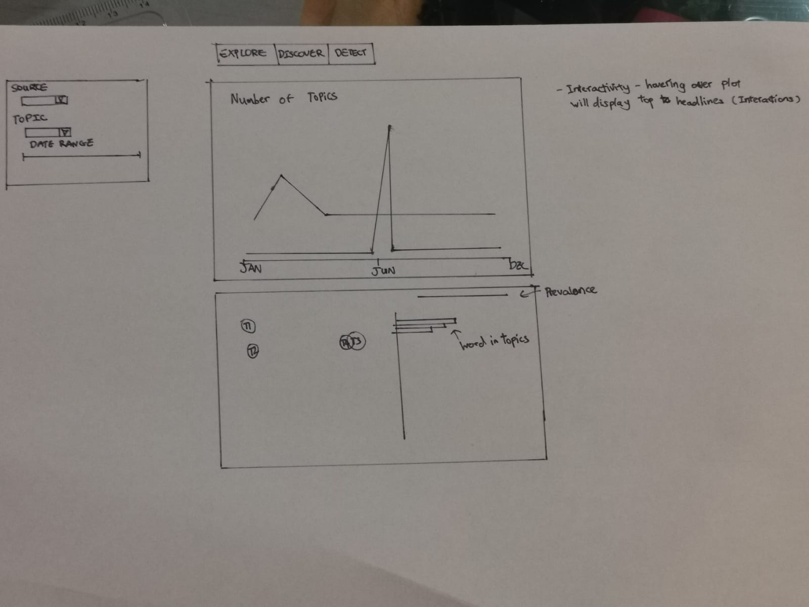

```{r setup, include=FALSE}
knitr::opts_chunk$set(echo = TRUE)
```


```{r include=FALSE}
knitr::opts_chunk$set(echo= TRUE,
                      eval = TRUE,
                      message = FALSE,
                      warning = FALSE)

```


## **1. Overview**

On a daily basis, singaporeans consume media from both traditional and online sources(Qi, Dunsford, & Nair, 2020).Media reporting can contribute to the public’s understanding of safe distancing measures during COVID-19. As such, analysing news headlines would be a quick and  useful in understanding current affairs. However, making sense of the news is extremely difficult
because (1) huge volumes of articles are published from multiple media
sources, (2) extracting topics and information from each article is not easy, (3) the
importance of what people think and what the media think can be different. 

The following blogpost will elaborate further our project’s objectives, explore current practices, and prototype methods in order to help readers navigate the digital news landscape.
This project aims to analyse local news headlines published in 2020 and provide
readers with useful snapshots of news trend. The scope of this project is to
visualise the trends of published headlines over time by topics and by media sites. 


Analysing engagement metrics (the number of Likes, Shares, and Comments in
social media) from each article would be helpful to understand the interests of the public and what the 'hot topic is.

## **2. Analysing News Headlines**

Dataset extracted from Prrt contains date of publishing,news headlines, site lnks, and Facebook Engagement metrics (Likes, Shares and Comments) for the time frame 1
January 2020 to 31 December 2020. These news articles were published by local
media sites, a mix of mainstream (Straits Times, Channel News Asia, AsiaOne) and
non-mainstream (Mothership, MustShareNews, The Independent) sites.

From the
raw data (224k articles), we decided to filter out articles whose engagement
was lower than 10 interactions. Doing this reduces the number of articles in the
dataset and removes articles that were: (1) removed
quickly after A/B testing, (2) removed quickly after editorial corrections, and (3)
republished from international news wire agencies and therefore had low to no
engagement Finally, 93,166 articles will be used for further analysis.


### **2.1 Importing Data**

Before we can begin text processing, we will need to employ text cleaning to reduce noise to optimize results. Examples of [‘noise’](https://towardsdatascience.com/text-cleaning-methods-for-natural-language-processing-f2fc1796e8c7) include **special characters**, **punctuation**, **common words** and **typographical errors**. 

#### **Installing and Lauching R packages**
```{r}
packages <- c("tidyverse","tidytext","dplyr","ggplot2","broom","stringr","LDAvis","textclean","textmineR","stopwords")

for (p in packages){
  if(!require(p, character.only = T)){
    install.packages(p)
  }
  library(p, character.only = T)
}

```

#### **Importing dataset into R using readr from tidyverse**
```{r eval=FALSE}
#reading All_media data set
test <- read_csv("data/All_media.csv")


#formatting date and adding/renaming columns
test$Published<-as.Date(test$Published, format="%d/%m/%Y")
test<-test%>%
  add_column(Doc_ID=1:nrow(test),.before = 'Published')%>%
  rename(`Total`=`Facebook Interactions`,`Likes`=`Facebook Likes`,`Shares`=`Facebook Shares`,`Comments`=`Facebook Comments`)
head(test,10)

```


### **2.2 Text Analysis**

Before we can begin text processing, we will need to employ text cleaning to reduce noise to optimize results. Examples of [‘noise’](https://towardsdatascience.com/text-cleaning-methods-for-natural-language-processing-f2fc1796e8c7) include **special characters**, **punctuation**, **common words** and **typographical errors**.


As most packages for cleaning text data are built around lowercase characters, the order of the cleaning process is important.
(To note, News Headlines are formal in nature. However, depending on the news source, informal language might be used to create a eye-catching headline. Thus line 3 of the below code chunk is included)

#### **Using "stringr" and "textclean" package for cleaning and adding to new column in data frame**
```{r eval=FALSE}

test$Cleaned<-tolower(test$Headline)%>%#convert to lowercase
  replace_contraction() %>% #lengthening words (eg,isn't -> is not)
  replace_word_elongation() %>% #reducing informal writing (eg,heyyyyyyy -> hey)
  str_replace_all("[0-9]", " ") %>% #removing numbers
  str_replace_all("[^[:alnum:]]"," ")%>%#remove punctuation/symbols
  str_replace_all("covid|wuhan virus","coronavirus")%>%#word substitution to a recognisable word
  str_replace_all("\\b[[:alpha:]]\\b"," ")%>%#remove single letter
  str_squish()%>% #reduce repeated whitespace 
  str_trim#removes whitespace from start and end of string
head(test$Cleaned,15)

# Create own set of stopwords
stopwords_mod<-c(stopwords('en'),c('covid','virus','coronavirus','singapore',"singapore's",'spore','first',
                                   'second', 'one', 'two', 'three', 'four', 'another','get','gets', 'got',
                                   'last', 'least', 'just', 'will', 'week','weeks',
                                   'ago', 'day', 'days', 'night', 'nights', 'month','months',
                                   'years', 'year', 'next', 'now', 'today','yesterday','according',
                                   'back', 'say', 'says','said', 'make', 'made', 'reuters', 'monday',
                                   'tuesday','wednesday', 'thursday', 'friday',
                                   'saturday','sunday','quite','via','use',
                                   'go','still','pore'))


#remove stopwords and paste into column
test$Cleaned<-unlist(lapply(test$Cleaned,
                            function(x){
                              paste(unlist(strsplit(x, " "))[!(unlist(strsplit(x, " ")) %in% stopwords_mod)],
                                    collapse=" ")}
))

#writing the cleaned data to a new CSV
#write_csv(test,"data/All_media_cleaned.csv")

```

```{r eval=TRUE}


test <- read_csv("data/All_media_cleaned.csv")
#creating df for headlines with above 10 interactions
df_10<-test%>%
  filter(Total>=10)
head(df_10)
```


#### **Using "tm"/"textmineR" package for creating the Document-Term Matrix and LDA model**
Here, we use the Latent Dirichlet Allocation (LDA) algorithim to indentify topics.
LDA is a generative probabilistic model of a corpus. The idea behind LDA is that (1)every document is a mixture of topics (2)every topic is a mixture of words.

A simplified explanatation of point (1) would be that a document may consists of 30% economics, 60% politics, and 10% social topic and a higher probability means that the document can be represented by the topic.

According to the point (2), a topic is a mixture of words, where a certain words have a strong association with a certain topic. For example, the word President have a strong signal that it belong to the topic of politics, or the word Loan and Interest have a strong signal toward economics topic. Just as a document has a probability distribution for each topic, a topic also has a probability distribution for each words/terms. 

LDA assume that a document is a bag of words, thus we do not care about the word sequence.Thus, we can apply this unsupervised model to find latent topics.

However, we would need to determine the number of topics for analysis. Work has been done by [David Meza](https://knowledger.rbind.io/post/topic-modeling-using-r/) determine k number of topics using harmonic mean. Harmonic mean is often used as an aggregated performance score for the evaluation of algorithms and systems: the F-score (or F-measure).

In our case, we will calculate the harmonic mean based on the log-likelihood function calculated by the LDA algorithim of the 'tm' package.The likelihood function measures the goodness of fit of a statistical model to a sample of data for given values of unknown parameters.It is formed from the joint probability distribution of the sample,it describes a hypersurface whose peak, if it exists, represents the combination of model parameter values that maximize the probability of obtaining the most probable sample.

Since logarithm equations are increasing functions, maximising the likelihood values is similar to maximising log-likelihood values as recorded by the LDA function. Thus this would be applicable to finding out the number of topics our model should have.

```{r eval=FALSE}

library(tm)

#creating the corpus for casting into document term matrix
corpus <- Corpus(VectorSource(df_10$Cleaned), readerControl=list(language="en"))#variable will be diff


# compute document term matrix with terms >= minimumFrequency
minimumFrequency <- 1
DTM <- DocumentTermMatrix(corpus, control = list(bounds = list(global = c(minimumFrequency, Inf))))
# have a look at the number of documents and terms in the matrix
dim(DTM)

# due to vocabulary pruning, we have empty rows in our DTM
# LDA does not like this. So we remove those docs from the
# DTM and the metadata
sel_idx <- row_sums(DTM) > 0
DTM <- DTM[sel_idx, ]

#find ideal k 
harmonicMean <- function(logLikelihoods, precision = 2000L) {
  llMed <- median(logLikelihoods)
  as.double(llMed - log(mean(exp(-mpfr(logLikelihoods,
                                       prec = precision) + llMed))))
}
# creating sequence of 2 to 100 by 1 step interval
#using a burn in of 500 and iterating 5000 times. `Keep’ indicates that every keep iteration the log-likelihood is evaluated and stored. The log-likelihood values are then determined by first fitting the model. This returns all log-likelihood values including burn-in, i.e., these need to be omitted before calculating the harmonic mean:
seqk <- seq(2, 100, 1)
burnin <- 500
iter <- 500
keep <- 50

#displaying time taken for running models (Approximately 10hours on 2.3GHz quad core computer with 16gb ram)
system.time(fitted_many <- lapply(seqk, function(k) LDA(DTM, k = k,
                                                                     method = "Gibbs",control = list(burnin = burnin,
                                                                                                     iter = iter, keep = keep) )))

# extract logliks from each topic
logLiks_many <- lapply(fitted_many, function(L)  L@logLiks[-c(1:(burnin/keep))])
logLiks_many
# compute harmonic means
hm_many <- sapply(logLiks_many, function(h) harmonicMean(h))
hm_many

#plotting of harmonic means for modelling
ldaplot <- ggplot(data.frame(seqk, hm_many), aes(x=seqk, y=hm_many)) + geom_path(lwd=1.5) +
  theme(text = element_text(family= NULL),
        axis.title.y=element_text(vjust=1, size=16),
        axis.title.x=element_text(vjust=-.5, size=16),
        axis.text=element_text(size=16),
        plot.title=element_text(size=20)) +
  xlab('Number of Topics') +
  ylab('Harmonic Mean') +
  ggtitle(expression(atop("Latent Dirichlet Allocation Analysis of News Topics", atop(italic("How many distinct topics in the headlines?"), ""))))
ldaplot

#finding max value
seqk[which.max(hm_many)]
```
{width=75%}


From the plot, our function determined that 39 topics would be ideal. However it would be time consuming and impractical. Thus we chose to do 20 topics instead. 

#### **Using "textmineR" package for creating the Document-Term Matrix and LDA model**

Based on the code above the sparse document term matrix was created. The 'tm' package dtm function will create a sparse matrix for the tokens in each topic by the count. However since the matrix is 100% sparse (meaning some rows have 0 values likely due to the cleaning process), we will use the 'textmineR' package for its dtm and lda functions

```{r eval=FALSE,cache=TRUE}
#create dtm
dtm<- CreateDtm(df_10$Cleaned)

#set seed to get consistent results
set.seed(2021)
lda<- FitLdaModel(dtm,k=20,iterations = 500)

SummarizeTopics(lda)
```

Based on the model run, a visualisation can be created for the lda model using the 'LDAvis' package. The below code and HTML embedding showcases how to use this tool. However due to a [discrepancy](https://github.com/cpsievert/LDAvis/issues/97) between 'textmineR' and 'LDAvis' indexing, the topics 't_1' does not correspond to 'Topic 1' of 'LDAvis'. For the final shinyapp, we will look into how to rectify this issue as there is still value in how this app shows prevalent words in the topics


```{r eval=FALSE}
textmineR2LDAvis <- function(model){
  if ("lda_topic_model" %in% class(model)){
    if (ncol(model$theta) < 3) stop("The model must contain > 2 topics")
    ldavis <- LDAvis::createJSON(
      phi = model$phi, 
      theta = model$theta,
      vocab = colnames(model$phi),
      doc.length = slam::row_sums(model$data, na.rm = TRUE),
      term.frequency = slam::col_sums(model$data, na.rm = TRUE))
  } else if ("LDA_VEM" %in% class(model)){ #Taken from https://gist.github.com/trinker/477d7ae65ff6ca73cace
    post <- topicmodels::posterior(model)
    if (ncol(post[["topics"]]) < 3) stop("The model must contain > 2 topics")
    mat <- model@wordassignments
    ldavis <- LDAvis::createJSON(
      phi = post[["terms"]], 
      theta = post[["topics"]],
      vocab = colnames(post[["terms"]]),
      doc.length = slam::row_sums(mat, na.rm = TRUE),
      term.frequency = slam::col_sums(mat, na.rm = TRUE))
  } else {
    stop("Class of topic model not recognised. Must be of class LDA_VEM or lda_topic_model")
  }
  return(ldavis)
}

LDAvis::serVis(textmineR2LDAvis(lda))
```


```{r echo=F}
htmltools::tags$iframe(title= "test",src="data/LDAvis.html", width="1000",height="1000") 
```

#### **Finding the top 30 terms of each topic** 

After the results of the LDA modeling, we will 'eye-ball' the top 30 words in each topic to make sense of what the model has presented. For example, 'Topic 1' has been classified as Covid-education.

```{r eval=FALSE}
#Top 30 words by phi (Probability token found in document)
top30words <- GetTopTerms(lda$phi, 30) %>% 
  as.data.frame() %>% 
  set_names(paste("Topic", 1:20))
top30words
#write to csv
#write_csv(top30words,"data/top_30_words.csv")
```

```{r}
top30words<-read_csv("data/top_30_words.csv")
glimpse(top30words)
```

#### **Finding the most probable topic of each document** 
Based on the model, we are also able to determine the topic based on the theta values generated by the model. Since there is a probability of the multiple topics existing within the document, we will pick the **most probable** topic by the max theta value. We will add the top topics into the data frame, combined with our 'eye power', we will label the topics accordingly and create a new .csv .

```{r eval=FALSE}

#finding topic of document by theta (Probabilty of topic in document)
# get the top topic for each document
top_topics <- apply(lda$theta, 1, function(x) names(x)[which.max(x)][1])
top_topics <- data.frame(document = names(top_topics), Topic = top_topics, stringsAsFactors = FALSE)


# merge together. Now each document has a label from its top topic
df_10_updated <- df_10%>%
  mutate(top_topics[2])

df_10_updated$Topic[df_10_updated$Topic=="t_1"]<-"Covid-Education"
df_10_updated$Topic[df_10_updated$Topic=="t_2"]<-"Malaysia"
df_10_updated$Topic[df_10_updated$Topic=="t_3"]<-"Public Transport"
df_10_updated$Topic[df_10_updated$Topic=="t_4"]<-"Covid-Economy"
df_10_updated$Topic[df_10_updated$Topic=="t_5"]<-"Covid-Affected Places"
df_10_updated$Topic[df_10_updated$Topic=="t_6"]<-"World News"
df_10_updated$Topic[df_10_updated$Topic=="t_7"]<-"Covid-Air Travel"
df_10_updated$Topic[df_10_updated$Topic=="t_8"]<-"Covid-Outbreaks"
df_10_updated$Topic[df_10_updated$Topic=="t_9"]<-"Covid-Daily Cases"
df_10_updated$Topic[df_10_updated$Topic=="t_10"]<-"Global Politics"
df_10_updated$Topic[df_10_updated$Topic=="t_11"]<-"Covid-Food Delivery"
df_10_updated$Topic[df_10_updated$Topic=="t_12"]<-"SG Elections"
df_10_updated$Topic[df_10_updated$Topic=="t_13"]<-"SG Fake News"
df_10_updated$Topic[df_10_updated$Topic=="t_14"]<-"SG Policy"
df_10_updated$Topic[df_10_updated$Topic=="t_15"]<-"Crime"
df_10_updated$Topic[df_10_updated$Topic=="t_16"]<-"Financial Markets"
df_10_updated$Topic[df_10_updated$Topic=="t_17"]<-"Sports"
df_10_updated$Topic[df_10_updated$Topic=="t_18"]<-"SG Accidents"
df_10_updated$Topic[df_10_updated$Topic=="t_19"]<-"Entertainment News"
df_10_updated$Topic[df_10_updated$Topic=="t_20"]<-"Covid-Domitory Cases"


df_10_updated

#write_csv(df_10_updated,"data/zeroten.csv")

```


From the model run and the most probable topics identified, we are also able to visualise the topic clusters using t-Distributed stochastic neighbor embedding **(t-SNE)**. It is a [statistical method](https://jmlr.org/papers/volume9/vandermaaten08a/vandermaaten08a.pdf) for visualizing high-dimensional data by giving each data point a location in a two or three-dimensional map.

Here, our data used will be the theta values generated from the LDA model to visualise the 'clusters' of topics. From the plot, we can see that some documents of a certain topic are closely overlapped with documents from another topic. Also there are topics that identified as a topic but are far from the cluster. 

This tallies with the use of the LDA algorithim as they are based off generative probabilities

```{r eval=FALSE}
library(Rtsne)
g<-Rtsne(lda$theta,check_duplicates = F)

tsne_plot <- data.frame(x = g$Y[,1], y = g$Y[,2], col = df_10_updated$Topic)
ggplot(tsne_plot) + geom_point(aes(x=x, y=y, color=col))
```




### **2.3 Discovering the Text**

Now we can begin to visualise the topics through different parameters. But first, MOARRR CLEANING!!

```{r}

library(lubridate)
library(ggpubr)
library(ggplot2)
library(plotly)

analysis <- read_csv("data/zeroten.csv")

#creating Month column
analysis<-analysis%>%
  mutate(Month=ymd(Published))%>%
  mutate_at(vars(Month),funs(month))

```

```{r}


#Count of Topics
Topic_dist<-analysis%>%
  group_by(Topic)%>%
  count(Topic)
Topic_dist
#plotting the distributi
ggplot(Topic_dist, aes(x=Topic,y=n,fill=Topic))+
  geom_col()+
  coord_flip()+
  labs(title="Plot of Topic Distribution",
       x ="Topic", y = "Count")
```

```{r}
#analysis of Number of headlines by Published date,Source,Topic
analysis_PST<-analysis%>%
  select(Published,Source,Topic)%>%
  group_by(Published,Source,Topic)%>%
  count()
analysis_PST


ggplot(analysis_PST,aes(x=Published, y=n, color=Source))+
  geom_line()+
  facet_wrap(~Topic)+
  theme_minimal()+
  labs(title="Plot of Daily Headlines",
       x ="Date Published", y = "Count")


```

Since Faceting by Topics, makes the plot less visible we will do an analysis by source by using the filter option and selecting Channel News Asia as a media source for example.


```{r}
#analysis of Number of headlines by Published date,Month,Topic, Source = Channel news Asia
analysis_CNA<-analysis%>%
  select(Published,Source,Topic)%>%
  group_by(Published,Source,Topic)%>%
  filter(Source== 'Channel News Asia')%>%
  count()
analysis_CNA

ggplot(analysis_CNA,aes(x=Published, y=n, color=Source))+
  geom_line()+
  facet_wrap(~Topic)+
  theme_minimal()+
  labs(title="Plot of Daily Headlines by Channel News Asia",
       x ="Date Published", y = "Count")

```

Here we see a spike in the GE2020 topic. Thus we will look further in to this plot by filtering out the other topics and analyse it against other sources.


```{r}

analysis_PST_GE<-analysis_PST%>%
  filter(Topic == 'SG Elections')

ggplot(analysis_PST_GE,aes(x=Published, y=n, color=Source))+
  geom_line()+
  theme_minimal()+
  labs(title="Plot of SG Election Headlines by Source",
       x ="Date Published", y = "Count")


```


## **3. Proposed Visualisation**

These are some visualisations of our dataset. In our shinyapp, we will explore further through more visualisations and greater interactivity using
other packages like 'vistime'. Below is the proposed visualisation that will be used. 

The interactive module will include the LDAvis output and allow for the user to view the Topic distributions by filtering through the Source and timeline. Hovering over the plot will display the Headline data so viewers can see importants Headlines.



## **4.Conclusion**

From the work done, Text Analysis is a relatively difficult field due to machine learning algorithms are unable to understand the way semantics behind every word. The data cleaning might make the headlines lose its meaning and prove diffcult to model the topics after. The t-SNE plot also shows the limitation of using LDA for topic modeling as there may be multiple topics that exist within the document.

The purpose of the this module is to discover topics through the different headlines and will be used in conjunction with my fellow gods amongst
men [Nam Jihun]() and [Atticus Foo]() who will cover detection of news through interactions and exploring the corpus of text and word n_grams
respectively. Many packages have been considered during the process of creating the app, however we were limited in its selection due to the
deployment in Rshiny.

